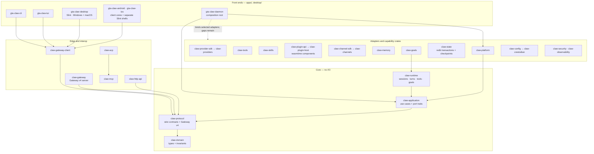

# GTA-Claw

> A pure-Rust agent platform. A root Cargo workspace of 32 library crates and 6 application
> members, plus independent Slint desktop, Android and iOS workspaces.

📖 **Usage guides / 使用教程**

- [English usage guide](docs/usage-guide-en.md)
- [中文使用指南](docs/usage-guide-zh.md)

Further reading: [Project plan and architecture](docs/PROJECT_PLAN.md) ·
[Development and migration checklist](docs/DEVELOPMENT_CHECKLIST.md) ·
[Implementation status](docs/PROGRESS.md) ·
[Legacy Node port obligations](docs/legacy-node-port-obligations.md)

## What this repository contains

Four Cargo workspaces and one legacy service that is being retired:

| Tree | Contents |
|---|---|
| `crates/` + `apps/` (root workspace) | 32 library crates and 6 application members. Edition 2024, `resolver = "3"`. |
| `desktop/` (separate workspace) | `gta-claw-desktop`, a native Slint UI for Windows and macOS. |
| `android/` and `ios/` (two separate workspaces) | Native Slint connection-and-status shells over the root client cores, not complete product clients. |
| `src/`, `Dockerfile`, `package.json`, `tsconfig.json` | The legacy Node/TypeScript service. It remains during migration while the Rust daemon's named gaps and compatibility-evidence obligations are closed. |

The root workspace excludes all three UI workspaces (`exclude = ["android", "desktop", "ios"]`),
so a root `cargo build` never resolves Slint. Metadata isolation remains a local validation requirement.
GitHub Actions intentionally keeps only [dependency checks](.github/workflows/dependencies.yml):
Rust/npm vulnerability audits and Rust dependency license, version and source policy. Dependency
Graph and Dependabot alerts remain enabled; build, product-test, packaging and publishing workflows
were removed on 2026-09-16. Removing those workflows does not replace local product verification or
change supported platforms.

**Status caveat, stated up front:** `gta-claw-daemon` is a real but partial production composition.
Its `main` path binds the 17-route main HTTP API, legacy HTTP facade, Gateway and a separate loopback
MCP listener, and conditionally activates a GitHub Copilot provider, explicitly configured native
OpenAI-compatible/Anthropic clients, and configured Teams, Telegram, Discord and WhatsApp channels.
Production wiring supplies the MCP listener with
dedicated MCP credentials only when `GTA_CLAW_MCP_OWNER_TOKEN` and/or `GTA_CLAW_MCP_TOKEN`
are explicitly configured; otherwise it fails closed. Native sessions, turns and context checkpoints
now use redb, and Gateway approvals are connected to Rust CLI and Slint desktop clients. Plugin
tools require explicit approval, and HTTP write scope no longer implies owner identity.
Gateway ingress/result notifications and session ownership are durable. Policy-gated filesystem
and fixed-program process tools are composed with bound approval and durable audit. Process cwd
confinement is not an OS sandbox. Full transactional recovery, channel identity/delivery, network
transport modes, bundled skill ports and frozen legacy replay remain incomplete. Explicit native,
fixed-address GET and signed-Wasm skills now share the tool approval path. Fixed-address GET/HEAD
is separately opt-in and refuses unsupported proxy routing. Explicit identity-scoped notes can be
enabled separately with `GTA_CLAW_MEMORY_POLICY`; list/get/search/save/delete/export/import use the
same bound approval and durable audit path. CLI, TUI and Slint memory commands use capability-checked,
model-free durable tool runs with a persistent device profile. The TUI has typed palette actions,
bounded memory input and original-key reconciliation; see the [terminal guide](docs/usage-guide-en.md#46-explicit-memory).
The desktop Session view has explicit memory fields, complete scrollable results and original-key
retry; see the [desktop guide](docs/usage-guide-en.md#64-explicit-memory).
The CLI can collect approved archive pages into a verified age-encrypted file and import an encrypted
archive within its existing command bound; see [memory files](apps/gta-claw-cli/README.md#encrypted-memory-files).
They are lexical, caller-supplied memory, not automatic semantic
recall or complete erasure of past conversations and backups. See
[implementation status](docs/PROGRESS.md) and [the current incremental record](docs/ledger/native-followup-20260914.md).

Telegram now checkpoints credential-scoped poll cursors after deferred batch processing, restores
them before polling and expires idle offsets without clearing durable execution/delivery claims.
This does not make unknown replies retryable or complete dormant-queue recovery;
see the [Telegram recovery record](docs/ledger/native-telegram-cursor-20260914.json).
Discord also persists credential/configuration-bound resume checkpoints after ordered host processing,
restores only currently trusted resume addresses and retains unknown deliveries without replay;
see the [Discord recovery record](docs/ledger/native-discord-resume-20260914.json).
Telegram and Discord persist confirmed segment IDs and content digests before sending the next
segment. The existing read-only recovery query exposes bounded receipt pages without reply content;
see the [segment receipt record](docs/ledger/native-channel-receipts-20260914.json).
Configured Telegram/Discord account IDs are now credential-scoped instead of sharing `default`.
Token changes create a separate partition without adopting or deleting old history; current IDs
are reported under `runtime.configuredChannelAccounts.partitions` in authenticated Admin status.
Teams and WhatsApp now retain verified account/sender/message identities into native scoped
execution and durable input claims. Teams additionally partitions by app and tenant; display names
cannot substitute for sender IDs. Native WhatsApp webhook replies now use durable delivery claims
and strict per-segment Cloud receipts. Teams message, command and welcome replies also use durable
claims and validated resource receipts. Verified WhatsApp status callbacks now retain separate
sent/delivered/read/failed facts for known account/recipient receipts without settling unknown
claims or running pending messages; see the [callback record](docs/ledger/native-whatsapp-status-20260914.json).
Native WhatsApp text replies also require a valid provider timestamp within a conservative
24-hour window, checked before execution and each send; expiration never triggers a template
fallback. See the [reply-window record](docs/ledger/native-whatsapp-window-20260914.json).
The original provider time is part of the immutable native input; replay cannot replace or remove
it, including after restart. See the [timestamp binding record](docs/ledger/native-whatsapp-provenance-20260914.json).
Template workflows, full remote reconciliation and real-account acceptance remain open.

The authenticated HTTP MCP endpoint now tracks active tool calls and routes cancellation by
credential subject and typed request ID, with bounded capacity and no cross-credential cancellation.
See the [MCP cancellation record](docs/ledger/native-mcp-cancellation-20260914.json).
Initialize now issues a bounded, credential-bound `Mcp-Session-Id`; session calls, cancellation,
GET event streams and DELETE closure are isolated from other sessions and legacy stateless calls.
The native MCP client has been tested against an owned daemon for discovery, read-only refusal
and independent closure. See the [MCP session record](docs/ledger/native-mcp-session-20260914.json).
Session handshakes now validate client metadata, require the initialized notification before tool
use, pin the negotiated version and reject duplicate JSON keys before dispatch. Simplified legacy
initialization remains stateless; see the [MCP handshake record](docs/ledger/native-mcp-handshake-20260914.json).
Daemon drain now revokes MCP sessions, calls and streams before waiting for HTTP shutdown; slow
tool discovery is cancellable as well. See the [MCP drain record](docs/ledger/native-mcp-drain-20260914.json).
Explicit `GTA_CLAW_MCP_TOOL_POLICY` now publishes reviewed loopback HTTP MCP tools through the same
model/HTTP/MCP approval and audit path. Discovery and connection occur only after approval, changed
descriptors are refused, and expired sessions cannot automatically replay calls. See the
[outbound MCP record and policy example](docs/ledger/native-mcp-outbound-20260914.json) and
[configuration details](docs/ledger/native-followup-20260914.md#native-outbound-mcp-tools).
Catalog changes now revoke the whole configured server review durably. Restart or restoring the
old descriptor does not republish it; a deliberately new `reviewRevision` requires fresh approval.
See the [MCP revocation record](docs/ledger/native-mcp-revocation-20260914.json).
Windows stdio MCP backends now use explicit launch approval, fixed executable SHA256/arguments,
isolated environment and a pinned working directory. Children retain host OS permissions, which
must be explicitly accepted in policy. See the [stdio record](docs/ledger/native-mcp-stdio-20260914.json)
and [launch requirements](docs/ledger/native-followup-20260914.md#native-windows-mcp-stdio).
Remote HTTPS MCP tools now require an explicitly enrolled loopback HTTP CONNECT proxy via
`httpProxy`; the endpoint and proxy are approval-bound, with no ambient proxy selection or direct
fallback. See the [HTTPS route record](docs/ledger/native-mcp-https-20260914.json).
OAuth, other-platform stdio acceptance, live remote-service validation and complete ACP integration remain open.
Reviewed resource and prompt entries can now be exposed with `kind: resource` or `kind: prompt`
in the same MCP policy. Reads require approval, keep their target fixed and return bounded untrusted
data without automatic context injection. See the [resource/prompt record](docs/ledger/native-mcp-data-20260914.json).
MCP HTTP credentials may now use an origin/server-bound native keyring `tokenRef` instead of
`tokenEnv`. Credential removal or rotation invalidates the cached approval before further calls;
see the [keyring record](docs/ledger/native-mcp-keyring-20260914.json).
The native CLI now exposes local MCP credential reference/status and explicitly confirmed
stdin write/delete operations, without contacting a backend or completing an OAuth login.
See the [CLI credential guide](apps/gta-claw-cli/README.md#local-mcp-credentials) and
[credential CLI record](docs/ledger/native-mcp-credential-cli-20260915.json).
The MCP OAuth library now seals expiring, single-use authorization requests and fences uncertain
refreshes within each client. These guards do not constitute a browser login or durable OAuth
provisioning workflow; see the [OAuth guard record](docs/ledger/native-mcp-oauth-guards-20260915.json).
OAuth also provides an explicit, bounded per-URL route constructor, reusing the native MCP
loopback/CONNECT policy without ambient proxy fallback. The compatibility constructor is unchanged;
see the [OAuth route record](docs/ledger/native-mcp-oauth-routes-20260915.json).
Reviewed Windows stdio servers also accept executable-bound native keyring `environmentRefs`,
managed by the same CLI with `--program-sha256` and `--environment-name`. The child still runs
with its reviewed host permissions; see the [stdio credential guide](apps/gta-claw-cli/README.md#stdio-secrets)
and [stdio credential record](docs/ledger/native-mcp-stdio-credentials-20260915.json).
The OAuth library now retains issuer/client/resource-bound token records in a separate native
store and records pending updates before token requests. Interrupted operations require new
authorization after reopening. Product login wiring and cross-process coordination remain open;
see the [native OAuth store record](docs/ledger/native-mcp-oauth-store-20260915.json).
Local `mcp oauth reference/status/logout` commands now inspect or explicitly remove those records
without token disclosure, refresh, browser activity or remote revocation. See the
[OAuth CLI guide](apps/gta-claw-cli/README.md#oauth-records) and [record](docs/ledger/native-mcp-oauth-cli-20260915.json).
Explicit `mcp oauth login` now supports reviewed public-client PKCE authorization using a manually
opened URL, bounded loopback callback and native token persistence. Local protocol fixtures pass;
real-account/browser acceptance and daemon OAuth consumption remain open. See the
[login guide](apps/gta-claw-cli/README.md#public-client-login) and [login record](docs/ledger/native-mcp-oauth-login-20260915.json).
The daemon can now explicitly enroll those public-client OAuth records for approved MCP calls,
rechecking complete credential generations without automatic refresh. See the
[enrollment guide](apps/gta-claw-cli/README.md#daemon-oauth-enrollment) and [daemon OAuth record](docs/ledger/native-mcp-oauth-daemon-20260915.json).
Explicit `mcp oauth refresh --confirm-refresh` renews the reviewed native record once, without a
browser or automatic replay. Daemon re-enrollment remains explicit; see the
[refresh guide](apps/gta-claw-cli/README.md#explicit-refresh) and [record](docs/ledger/native-mcp-oauth-refresh-20260915.json).
Reviewed MCP `resource_template` entries now expand bounded string arguments with RFC 6570,
bind the exact target into approval, and verify the returned resource URI. See the
[template record](docs/ledger/native-mcp-templates-20260915.json).
Approved `resource_watch` entries now observe one fixed resource for a bounded interval, return
coalesced update counts without reading content, then unsubscribe and close. SDK notifications are
filtered by confirmed per-connection subscriptions; see the [observation record](docs/ledger/native-mcp-observation-20260915.json).
Inbound MCP idle sessions now expire without waiting for another request. A single deadline-driven
worker cancels their calls and SSE streams while permits remain held until actual release;
see the [active-expiry record](docs/ledger/native-mcp-expiry-20260915.json).
MCP activity timestamps now remain monotonic when concurrent requests acquire the session lock
out of sampling order; an older sample no longer expires a newer session. The original idle TTL
and cancellation/permit rules are unchanged; see the [ordering fix](docs/ledger/native-mcp-activity-order-20260915.json).
OAuth login/refresh/logout now use a per-profile process lock for cooperating CLI instances,
including callback waits. External keyring writers remain outside that lock;
see the [coordination record](docs/ledger/native-oauth-coordination-20260915.json).

Native OpenAI policy now accepts explicit `completionApi: "responses"`, retaining Chat Completions
as the default. Responses uses stateless `store:false` requests, bounded text/image/function mapping
and validated stream terminals; no automatic dialect fallback or paid-request retry is introduced.
See the [configuration and limits](docs/ledger/native-followup-20260914.md#native-openai-responses)
and [Responses record](docs/ledger/native-provider-responses-20260915.json). Reasoning continuation,
full model/usage workflows and real-account acceptance remain open.
Chat completion streams also reject response/model/choice changes and reused or changed function
IDs, without completing or replaying a partial tool round. See the
[Chat identity record](docs/ledger/native-chat-identity-20260915.json), which also retains an
unresolved intermittent native-credential test failure and its subsequent diagnostic checks.
Anthropic streams now require a complete message lifecycle, validate content-block ownership and
defer function completion until message_stop. Input usage includes cache reads and rejects counter
regression/overflow; see the [Anthropic record](docs/ledger/native-anthropic-lifecycle-20260915.json).
Chat also validates total/subset usage and bounded cumulative output, retains partial events on
errors, and releases transport on DONE; see the [Chat budget record](docs/ledger/native-chat-budget-20260915.json).
The native provider adapter now refuses incomplete/unknown terminals before the HTTP port can
relabel them as success, and holds streamed tools until terminal confirmation. This gate currently
returns an error rather than a lossless partial result; see the [adapter record](docs/ledger/native-generation-terminal-20260915.json).
The subsequent [partial-result increment](docs/ledger/native-partial-generation-20260915.json)
supersedes that blanket error gate for known no-tool length/filter outcomes: HTTP retains partial
text, usage and terminal reason. Runtime failures retain partial text in durable turn records without
completing tools; Gateway unknown-effect protection remains. The later accounting increment below
adds terminal usage records without claiming crash-safe per-round journaling or settled costs.
Owned terminal runs now expose bounded visible partial-text pages through `agent.wait`, with a
read-only `gateway partial-run` CLI command. Reads require the exact revision and content-pinned
continuation cursor, never ACK or rerun work; see the [guide](apps/gta-claw-cli/README.md#retained-partial-text)
and [page record](docs/ledger/native-partial-pages-20260915.json).
Native model tool rounds now preserve original call IDs and structured assistant/tool messages
through persistent context into Chat, Responses and Anthropic. Retrieved/tool-derived data is not
promoted to system instructions; see the [tool-history record](docs/ledger/native-tool-history-20260915.json).
Interrupted tool groups can now be retained as explicitly unconfirmed data for a new request,
without replaying old work or inventing results. Final projected context stays within its configured
heuristic budget; see the [recovery record](docs/ledger/native-tool-history-recovery-20260915.json).
Native turns now retain bounded per-round provider/model/response identity, terminal reason and
reported token counts, distinguishing unreported, partial and explicitly reported zero counters.
Owned `gateway run` results expose checked `providerAccounting` totals, never a monetary bill or
permission to retry unknown work. The initial terminal-only increment is documented in the
[accounting record](docs/ledger/native-provider-accounting-20260915.json)
and [CLI limits](apps/gta-claw-cli/README.md#recorded-provider-usage). That record retains unresolved
native-credential and stdio fixture failures despite subsequent successful regressions.
SDK streaming usage now also carries explicit primary-field coverage. Chat and Anthropic retain
split counter reports and explicit zeroes; Responses uses its validated terminal coverage. Legacy
counter-only events remain partial, and missing usage stays unknown. Native HTTP stream summaries
preserve this distinction; see the [stream usage record](docs/ledger/native-stream-usage-20260915.json).
This does not add automatic HTTP-stream persistence or monetary settlement.
Native runtime now separately journals each provider intent before constructing the request, then
the first confirmed report before consuming its output. CAS prevents replayed attempts or changed
reports; terminal turns atomically seal the journal. An owned recovered run can read this journal
even without a terminal turn. An intent may never have been sent and is not a bill or retry permit;
see the [journal record](docs/ledger/native-provider-journal-20260915.json). Response loss before its
journal commit remains unknown, and earlier MCP/credential fixture failures remain unresolved.
Native OpenAI/Anthropic startup policy can optionally set `maxObservedTurnTokens`: a per-turn
stop threshold for additional runtime model rounds. Missing prior primary usage prevents another
budgeted round; zero blocks the first one. It is not a hard per-request or monetary cap, a global
quota, or a standalone HTTP limit; see the [threshold record](docs/ledger/native-observed-budget-20260915.json).
`gateway export-partial` now collects all bounded visible partial-text pages on one authenticated
connection, pins run/revision and page identity, and verifies the whole SHA256 before creating a
new local file. It never ACKs or reruns work and never overwrites an existing destination. The file
is untrusted, incomplete plaintext; see the [export guide](apps/gta-claw-cli/README.md#retained-partial-text)
and [export record](docs/ledger/native-partial-export-20260915.json) for limits and local-write failures.
Native OAuth write verification now distinguishes a missing record from changed content or a read
failure without disclosing values. A new owned-key concurrency regression observed one unresolved
Windows deletion-readback failure before later passes; see the [readback record](docs/ledger/native-keyring-readback-20260915.json).
This is diagnostic coverage, not a native credential-store fix.
Operator `status` now exposes `runtime.nativeMcp.activeInvocations` and `allInvocationsDrained`.
Cancellation may return an unknown result while the owned MCP task is still closing its transport;
the task count reports that distinction. It is a point-in-time observation, not a maintenance lock,
remote-effect reconciliation or permission to replay; see the [drain record](docs/ledger/native-mcp-drain-20260915.json).
The native TUI now supports explicit `partial` and `partial-next` commands for the selected terminal
run. Each bounded page stays tied to its connection, session, turn, revision, state and digest, is
labeled unconfirmed, and does not enter the result ACK queue. See the
[TUI guide](docs/usage-guide-en.md#44-command-palette) and [page-view record](docs/ledger/native-tui-partial-20260915.json).

The revised plan targets OpenClaw `v2026.9.4`; the sealed local compatibility baseline remains
`2026.7.2`. A planning target is not a claim that the newer version is already supported.

## Rust migration ratchet

The root Node service remains during the evidence-backed migration while the partial Rust production
service is completed. Repository policy permits only the exact audited legacy paths and rejects
every new JavaScript/TypeScript source, package manifest, lockfile, dependency directory, or
repository-owned Node workflow. The allowed surface may shrink but may not grow.

`crates/claw-repo-policy` enforces this as a test. It rejects new source files with the extensions
`js`, `jsx`, `mjs`, `cjs`, `ts`, `tsx`, `mts`, `cts` and `node`; the manifests `package.json`,
`package-lock.json`, `npm-shrinkwrap.json`, `yarn.lock`, `pnpm-lock.yaml`, `bun.lock`, `bun.lockb`,
`deno.json` and `deno.jsonc`; the directories `node_modules`, `.yarn` and `.pnpm-store`; and the
commands `node`, `npm`, `npx`, `pnpm`, `yarn`, `bun`, `deno` and `corepack` in workflows.
Twenty-two legacy paths are grandfathered by an explicit inventory with a TypeScript ceiling of 18
files that may only ever be lowered.

```sh
cargo test -p claw-repo-policy
```

See [Legacy Node port obligations](docs/legacy-node-port-obligations.md) for the per-module deletion
checklist and current Rust ownership. In particular, `@github/copilot-sdk` is temporary legacy
production code; the final provider must use pure-Rust HTTPS/OAuth and must not carry that package
architecture into the Rust dependency graph. `isolated-vm` and `node:vm` are a **deliberate
removal**: no embedded JavaScript engine is ever added to the Rust product. Plugins are WebAssembly
components instead.

## Architecture

Solid arrows are real Cargo dependencies. The dashed arrow marks the daemon's adapter composition.
Durable run/state recovery, bound approvals and policy-gated native filesystem/process tools are connected.
Full recovery, general network transports, bundled skill ports and compatibility evidence remain open.
See the [current implementation evidence and startup policies](docs/ledger/native-followup-20260914.md).



The direction is enforced by the manifests, not by convention: `claw-domain` depends on nothing in
the workspace, `claw-protocol` depends only on `claw-domain`, `claw-application` depends only on
those two, and `claw-runtime` reaches the outside world exclusively through the port traits in
`claw_application::ports`. Capability crates such as `claw-tools`, `claw-skills`, `claw-memory`,
`claw-providers` and `claw-worker` deliberately do not depend on the core at all; they are typed,
independently testable units that a composition root adapts to a port.

## Crate map

### Core

| Crate | What it is |
|---|---|
| `claw-domain` | Core domain types and invariants shared by every runtime. No workspace dependencies. |
| `claw-protocol` | Versioned commands and events at process boundaries, plus the OpenClaw Gateway v4 wire contract, negotiation, method/event catalogs and authorization. |
| `claw-application` | Headless use cases and the port traits adapters must satisfy (`ProviderPort`, `ToolPort`, `StatePort`, `GoalStorePort`, `ApprovalPort`, `ClockPort`, `ContextEnginePort`). |
| `claw-runtime` | The agent execution runtime: session/turn state machine, provider stream assembly, tool invocation behind an approval broker, goals, suspension, workers. Contains no I/O of its own. |

### Model providers

| Crate | What it is |
|---|---|
| `claw-provider-sdk` | Typed provider trait, streaming decoder, closed error taxonomy, retry/circuit-breaker/concurrency policies, credential port. Transport is `hyper` over `rustls`. |
| `claw-providers` | The frozen 78-provider registry (`FROZEN_PROVIDER_COUNT = 78`). Real clients for the OpenAI-compatible dialect, Anthropic `/v1/messages`, and GitHub Copilot via a pure-Rust RFC 8628 device flow; every other descriptor honestly reports `RegistrationOnly`. |

### Capabilities

| Crate | What it is |
|---|---|
| `claw-tools` | The agent tool surface. Closed parameter schemas, deny-by-default capability grants, and authorization minted per invocation. |
| `claw-skills` | Rust-native skill loading and execution over a 51-entry bundled registry. Native handlers, a declarative HTTP port, or the Wasm host — never JavaScript. |
| `claw-plugin-api` | The WebAssembly plugin contract: ABI version, capability model, resource limits, manifest schema, trust/signature policy, and all 137 frozen upstream plugin descriptors. |
| `claw-plugin-host` | A wasmtime Component Model host. No WASI at all, only the nine interfaces of `gta-claw:plugin@1.0.0`; fuel, epoch, memory limits and a bounded host-call gate; one `Store` per plugin for crash isolation. |
| `claw-memory` | Conversation memory and deterministic token-budget context assembly. Anchors are never silently dropped. |
| `claw-goals` | The durable on-disk adapter behind `GoalStorePort`, plus budgets and the compaction anchor. |
| `claw-state` | Pure-Rust redb 4.2.0 adapter: bounded CAS transactions, schema validation, session/turn high-water state and context checkpoints. Production-composed, with Windows process-interruption and restart tests; not a complete ingress/outbox or cross-platform recovery implementation. |

### Transports and interop

| Crate | What it is |
|---|---|
| `claw-gateway` | The Gateway v4 WebSocket server: transport and upgrade, phase-aware frame limits, connection lifecycle, method dispatch, an event bus with per-connection sequence numbers, and role/scope authorization. |
| `claw-gateway-client` | The bounded pure-Rust `ws://`/`wss://` client. Transport and lifecycle only — no server, RPC handlers or GUI. |
| `claw-http-api` | The frozen 18-route OpenClaw HTTP/SSE surface on Axum: 17 routes on the main router plus a separate `/mcp` route, with providers, Gateway, persistence and pairing behind narrow ports. |
| `claw-mcp` | Model Context Protocol: server, stdio/streamable-HTTP/legacy-SSE clients, OAuth authorization, configured-server lifecycle. |
| `claw-acp` | Agent Client Protocol interoperability. |
| `claw-channel-sdk` | Transport-neutral messaging contracts. Owns no network client and no credential persistence. |
| `claw-channels` | The 29-entry official channel registry with Rust-native adapters. `ImplementationStatus` keeps registry coverage separate from executable behavior. |
| `claw-relay` | Authenticated Chrome-extension relay and policy-bounded CDP bridge; transport independent. |
| `claw-worker` | The closed worker admission protocol. The ordinary Gateway handshake refuses the `worker` role on purpose; workers redeem a single-use ticket instead. |
| `claw-clients` | Host-side compatibility contracts (connection profiles, capability negotiation, session projections) for the frozen upstream client inventory. |

### Platform, configuration and governance

| Crate | What it is |
|---|---|
| `claw-platform` | Native implementations of the application core's ports. |
| `claw-config` | Strict JSON5 configuration over 47 frozen top-level domains, generated JSON Schemas, atomic writes with rollback, layered resolution and tear-free typed reload. Converts the frozen legacy environment contract without reading process environment state. |
| `claw-crestodian` | Backup-first first-run setup, deterministic remote rescue and configuration recovery, restricted to a single ring-zero authority tool. |
| `claw-security` | Transport- and storage-independent security primitives: device identity, roles, scopes. No network client, TLS terminator, database or keyring of its own. |
| `claw-observability` | Transport-neutral telemetry, metrics, audit records and redaction, with security evidence kept off the lossy logging path. |
| `claw-migrate` | Transactional, npm-free migration providers for Claude, Codex, Hermes and legacy GTA-Claw state, with verified backups and rollback. |
| `claw-discovery` | Wire-format and fail-closed policy oracles for discovery and fleet (DNS-SD codec and friends). No network runtime, process spawning or container client. |
| `claw-conformance` | The data-driven parity harness over the frozen `compat/upstream` artifacts. Verifies that cited Rust tests actually exist before accepting an implementation claim. |
| `claw-repo-policy` | Repository-wide architecture policy gates, including the JavaScript/TypeScript ratchet described above. |

## Applications

| Binary | What it does today |
|---|---|
| `gta-claw-cli` | Local health/version, the unchanged schema-v2 Gateway health diagnostic, and native session/history/send/abort/approval commands with exact minimum scopes and schema-v1 JSON results. Sends require an idempotency key; identity remains ephemeral and paired-device persistence is unfinished. See [CLI guide](apps/gta-claw-cli/README.md). |
| `gta-claw-tui` | A Crossterm terminal client over `claw-gateway-client` with Sessions, Workspace, Runs, Diff, Artifacts and Help screens, a command palette, and a non-TTY `--plain` snapshot mode. |
| `gta-claw-daemon` | Partial native service with four listeners, durable state/run/delivery, device-scoped Gateway events, bound native/plugin/skill approvals and separate MCP credentials. Explicit native/GET/signed-Wasm skills reuse configured tools. Full multi-store recovery, bundled ports and compatibility acceptance remain open. |
| `gta-claw-updater` | A standalone signed, resumable, rollback-safe updater. On Linux it refuses and defers to the system package manager. |
| `gta-claw-android` | The Android client core: endpoint/credential intake, Gateway identity, attempt lifecycle. A separate Slint connection shell exists; it is not the complete product UI. See [android/README.md](android/README.md). |
| `gta-claw-ios` | The iOS client core with a separate Slint connection shell. Platform lifecycle/network callbacks, Keychain and complete chat workflows remain outstanding. See [ios/README.md](ios/README.md). |
| `gta-claw-desktop` | Slint 1.17.1 native chat/history and complete approval-preview client, with empty production state and generation/epoch-fenced requests/events. Settings, workspace trust, platform credential storage and full user workflows remain partial. Windows/macOS only; Linux GUI rejection remains policy. |

## Toolchain

| Item | Value |
|---|---|
| Pinned toolchain | `1.98.1` (`rust-toolchain.toml`, with `clippy` and `rustfmt`); verified local stable on 2026-09-14 |
| MSRV | `1.94.0` (`rust-version`); unchanged, not freshly verified for this development increment |
| Edition | 2024 |
| Resolver | `3` |
| Lints | `unsafe_code = "forbid"` in the root workspace (`deny` in `desktop/`, where Slint's generated macros allow their own audited internals), `missing_docs`, `unreachable_pub`, and clippy `all`/`pedantic`/`nursery` as warnings promoted to errors in CI |

The protected packaging trust policy and release builders still pin Rust 1.97.1. They were not
modified to accept this development tree. Native release packaging is blocked on a separately
reviewed policy/toolchain/digest update; local tests are not release authorization.

## Build and test

Root workspace:

```sh
cargo build --workspace
cargo test --workspace
cargo fmt --all -- --check
cargo clippy --workspace --all-targets --locked -- -D warnings
```

Desktop workspace — it is not a member of the root workspace, so it needs its own manifest path:

```sh
cargo build --manifest-path desktop/Cargo.toml --workspace
cargo test  --manifest-path desktop/Cargo.toml --workspace
cargo clippy --manifest-path desktop/Cargo.toml --workspace --all-targets --locked -- -D warnings
```

A single crate:

```sh
cargo test -p claw-gateway-client
cargo test -p claw-repo-policy
```

## Configuration

There is no single environment-variable service configuration in the Rust product. `claw-config`
is the strict boundary: UTF-8 JSON5 into immutable typed snapshots, unknown envelope and field
names rejected, secrets persisted only as validated environment or platform-store *references*,
and layered resolution in the order built-in → system → user → workspace → frozen legacy
environment → command line.

Selected variables read by shipped Rust binaries:

| Variable | Read by | Meaning |
|---|---|---|
| `GTA_CLAW_GATEWAY_URL` | `gta-claw-tui` | Gateway endpoint. Defaults to `ws://127.0.0.1:18789`; `--gateway` overrides it. |
| `GTA_CLAW_GATEWAY_TOKEN` | `gta-claw-tui`, `gta-claw-daemon` | Shared Gateway token; the daemon uses it as the Gateway credential policy when set. |
| `GTA_CLAW_CONFIG` | `gta-claw-daemon` | Configuration file fallback when `--config` is absent. |
| `GTA_CLAW_STATE_DIR` | `gta-claw-daemon` | State-directory fallback when `--state-dir` is absent; otherwise `$HOME/.gta-claw`. |
| `GTA_CLAW_ADMIN_TOKEN` | `gta-claw-daemon` | Overrides the configured admin bearer token. It authenticates the main API's six protected model/tool routes and `POST /api/v1/admin/rpc`, and its presence registers the legacy `/admin/*` routes. It does not authenticate `/mcp` or legacy `/chat`; legacy `/admin/system` and `/admin/exec` also trust a loopback peer. |
| `NO_COLOR` | `gta-claw-tui` | Monochrome rendering, same as `--no-color`. |
| `TERM` | `gta-claw-tui` | `TERM=dumb` is treated as non-interactive. |
| `GTA_CLAW_CREDENTIALS_DIR` | `claw-provider-sdk` file secret store | Overrides the credential root. Otherwise `$XDG_DATA_HOME/gta-claw/credentials`, else `$HOME`(or `%USERPROFILE%`)`/.local/share/gta-claw/credentials`. |
| `CREDENTIALS_DIRECTORY` | `claw-provider-sdk` file secret store | The systemd credentials directory. |
| `GTA_CLAW_ACPX_LEASE_ID`, `GTA_CLAW_ACPX_SESSION_KEY` | `claw-acp` | ACP extension lease and session key. |
| `CODEX_HOME`, `XDG_CONFIG_HOME`, `XDG_DATA_HOME`, `APPDATA`, `LOCALAPPDATA`, `HOME`, `USERPROFILE` | `claw-migrate`, `gta-claw-updater` | Source and state directory discovery. |
| `GTA_CLAW_LOG`, `GTA_CLAW_LOG_FORMAT` | `gta-claw-daemon` | Tracing filter and `human`/`json` format for the subscriber installed on the serving path; output goes to standard error unless `--log-file` is set. |

`claw-provider-sdk`'s environment secret store derives a variable name from a credential key by
uppercasing `SERVICE_ACCOUNT` and replacing non-alphanumeric characters with `_`. It is a store
implementation, not a fixed list of documented variables.

`.env.example`, `deploy/run.sh` and `deploy/conf/` are **legacy Node service** artifacts, not the
authoritative Rust configuration surface. The daemon can translate the frozen subset of legacy
process environment through its audited migration path; use typed JSON5 for new deployments.

## Continuous integration

`.github/workflows/rust.yml`:

| Job | What it proves |
|---|---|
| Headless (matrix) | `cargo fmt --check`, `cargo check --workspace --all-targets --locked`, `cargo clippy … -D warnings`, `cargo test --workspace --all-targets --locked`, and that root `cargo metadata` contains no Slint. |
| MSRV (1.94.0) | `cargo +1.94.0 check --workspace --all-targets --locked`. |
| Gateway synchronization stress | Repeated deterministic `claw-gateway-client` regressions on `macos-15-intel`. |
| Desktop (matrix) | fmt, check, clippy, test and build through `--manifest-path desktop/Cargo.toml` on Windows and macOS. |
| Desktop rejects Linux | Asserts the Linux desktop dependency graph excludes Slint *and* that `cargo check` on Linux fails. |
| Supply chain | `cargo-audit` on both lockfiles and `cargo-deny` lock/exception policy, plus per-target desktop dependency policy for Windows x64/ARM64 and macOS Intel/ARM64. |

Packaging lives in `packaging/` and runs from `linux-packaging.yml`, `macos-packaging.yml` and
`windows-packaging.yml`. `docker-publish.yml` still builds the **legacy Node image** and is part of
the deletion checklist, not the Rust product.

**Linux packaging blocker:** the current `packaging/linux/systemd/gta-claw-daemon.service`, consumed
by the Debian and RPM prototypes, is incompatible with production serving and must not be deployed
unchanged. `RestrictAddressFamilies=AF_UNIX` prevents the daemon from creating its required
`AF_INET`/`AF_INET6` TCP listeners, while `IPAddressDeny=any` blocks required IP ingress and egress.
This remains pending a packaging fix.

## Security posture

- `unsafe_code = "forbid"` across the root workspace.
- Plugins are WebAssembly components in a deny-by-default wasmtime sandbox with no WASI, bounded by
  fuel, epoch deadlines, a memory limiter and a host-call gate. There is no script engine anywhere
  in the Rust graph.
- Tools are deny-by-default: a tool cannot run without an authorization minted for the exact
  capability and resource at the moment of the call.
- Transport is rustls-only; the Gateway client applies 64 KiB pre-authentication and 25 MiB
  authenticated frame caps from the frame header onwards, offers no compression, and rejects any
  negotiated extension. Remote plaintext `ws://` requires an explicit opt-in.
- Secrets are typed values that redact themselves in `Debug`, `Display` and Serde output. No CLI
  accepts a token as a command-line argument.

## License

MIT. See the workspace `license` field and the per-package notices in `packaging/`.
