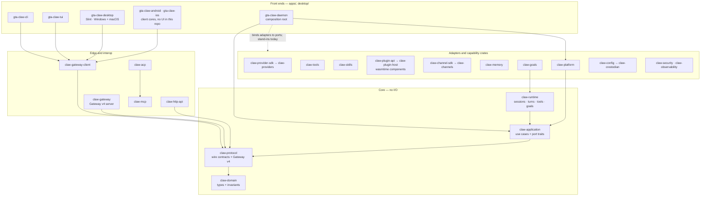

# GTA-Claw

> A pure-Rust agent platform. One Cargo workspace of 31 library crates and 6 binaries, plus a
> separate native desktop workspace built on Slint.

📖 **Usage guides / 使用教程**

- [English usage guide](docs/usage-guide-en.md)
- [中文使用指南](docs/usage-guide-zh.md)

Further reading: [Project plan and architecture](docs/PROJECT_PLAN.md) ·
[Implementation status](docs/PROGRESS.md) ·
[Legacy Node port obligations](docs/legacy-node-port-obligations.md)

## What this repository contains

Two Cargo workspaces and one legacy service that is being retired:

| Tree | Contents |
|---|---|
| `crates/` + `apps/` (root workspace) | 31 library crates and 6 binaries. Edition 2024, `resolver = "3"`. |
| `desktop/` (separate workspace) | `gta-claw-desktop`, a native Slint UI for Windows and macOS. |
| `src/`, `Dockerfile`, `package.json`, `tsconfig.json` | The legacy Node/TypeScript service. Still the only fully composed production service; being deleted module by module. |

The root workspace excludes `desktop/` (`exclude = ["android", "desktop", "ios"]`), so a root
`cargo build` never resolves Slint. CI asserts this with `cargo metadata`.

**Status caveat, stated up front:** the Rust crates are substantially implemented and tested, but
`gta-claw-daemon` is a composition root whose subsystem adapters are still deterministic stand-ins
(see its crate docs and [`docs/PROGRESS.md`](docs/PROGRESS.md)). Do not read this README as a claim
that a complete Rust production service ships today.

## Rust migration ratchet

The root Node service remains the load-bearing container runtime while its Rust replacement is
completed. Repository policy permits only the exact audited legacy paths and rejects every new
JavaScript/TypeScript source, package manifest, lockfile, dependency directory, or repository-owned
Node workflow. The allowed surface may shrink but may not grow.

`crates/claw-repo-policy` enforces this as a test. It rejects new source files with the extensions
`js`, `jsx`, `mjs`, `cjs`, `ts`, `tsx`, `mts`, `cts` and `node`; the manifests `package.json`,
`package-lock.json`, `npm-shrinkwrap.json`, `yarn.lock`, `pnpm-lock.yaml`, `bun.lock`, `bun.lockb`,
`deno.json` and `deno.jsonc`; the directories `node_modules`, `.yarn` and `.pnpm-store`; and the
commands `node`, `npm`, `npx`, `pnpm`, `yarn`, `bun`, `deno` and `corepack` in workflows.
Twenty-two legacy paths are grandfathered by an explicit inventory with a TypeScript ceiling of 18
files that may only ever be lowered.

```sh
cargo test -p claw-repo-policy
```

See [Legacy Node port obligations](docs/legacy-node-port-obligations.md) for the per-module deletion
checklist and current Rust ownership. In particular, `@github/copilot-sdk` is temporary legacy
production code; the final provider must use pure-Rust HTTPS/OAuth and must not carry that package
architecture into the Rust dependency graph. `isolated-vm` and `node:vm` are a **deliberate
removal**: no embedded JavaScript engine is ever added to the Rust product. Plugins are WebAssembly
components instead.

## Architecture

Solid arrows are real Cargo dependencies. The dashed arrow is the composition seam: the daemon is
what binds concrete adapters to the runtime's ports, and that binding is the work still outstanding.



The direction is enforced by the manifests, not by convention: `claw-domain` depends on nothing in
the workspace, `claw-protocol` depends only on `claw-domain`, `claw-application` depends only on
those two, and `claw-runtime` reaches the outside world exclusively through the port traits in
`claw_application::ports`. Capability crates such as `claw-tools`, `claw-skills`, `claw-memory`,
`claw-providers` and `claw-worker` deliberately do not depend on the core at all; they are typed,
independently testable units that a composition root adapts to a port.

## Crate map

### Core

| Crate | What it is |
|---|---|
| `claw-domain` | Core domain types and invariants shared by every runtime. No workspace dependencies. |
| `claw-protocol` | Versioned commands and events at process boundaries, plus the OpenClaw Gateway v4 wire contract, negotiation, method/event catalogs and authorization. |
| `claw-application` | Headless use cases and the port traits adapters must satisfy (`ProviderPort`, `ToolPort`, `StatePort`, `GoalStorePort`, `ApprovalPort`, `ClockPort`, `ContextEnginePort`). |
| `claw-runtime` | The agent execution runtime: session/turn state machine, provider stream assembly, tool invocation behind an approval broker, goals, suspension, workers. Contains no I/O of its own. |

### Model providers

| Crate | What it is |
|---|---|
| `claw-provider-sdk` | Typed provider trait, streaming decoder, closed error taxonomy, retry/circuit-breaker/concurrency policies, credential port. Transport is `hyper` over `rustls`. |
| `claw-providers` | The frozen 78-provider registry (`FROZEN_PROVIDER_COUNT = 78`). Real clients for the OpenAI-compatible dialect, Anthropic `/v1/messages`, and GitHub Copilot via a pure-Rust RFC 8628 device flow; every other descriptor honestly reports `RegistrationOnly`. |

### Capabilities

| Crate | What it is |
|---|---|
| `claw-tools` | The agent tool surface. Closed parameter schemas, deny-by-default capability grants, and authorization minted per invocation. |
| `claw-skills` | Rust-native skill loading and execution over a 51-entry bundled registry. Native handlers, a declarative HTTP port, or the Wasm host — never JavaScript. |
| `claw-plugin-api` | The WebAssembly plugin contract: ABI version, capability model, resource limits, manifest schema, trust/signature policy, and all 137 frozen upstream plugin descriptors. |
| `claw-plugin-host` | A wasmtime Component Model host. No WASI at all, only the nine interfaces of `gta-claw:plugin@1.0.0`; fuel, epoch, memory limits and a bounded host-call gate; one `Store` per plugin for crash isolation. |
| `claw-memory` | Conversation memory and deterministic token-budget context assembly. Anchors are never silently dropped. |
| `claw-goals` | The durable on-disk adapter behind `GoalStorePort`, plus budgets and the compaction anchor. |

### Transports and interop

| Crate | What it is |
|---|---|
| `claw-gateway` | The Gateway v4 WebSocket server: transport and upgrade, phase-aware frame limits, connection lifecycle, method dispatch, an event bus with per-connection sequence numbers, and role/scope authorization. |
| `claw-gateway-client` | The bounded pure-Rust `ws://`/`wss://` client. Transport and lifecycle only — no server, RPC handlers or GUI. |
| `claw-http-api` | The frozen 18-route OpenClaw HTTP/SSE surface on Axum, with providers, Gateway, persistence and pairing behind narrow ports. |
| `claw-mcp` | Model Context Protocol: server, stdio/streamable-HTTP/legacy-SSE clients, OAuth authorization, configured-server lifecycle. |
| `claw-acp` | Agent Client Protocol interoperability. |
| `claw-channel-sdk` | Transport-neutral messaging contracts. Owns no network client and no credential persistence. |
| `claw-channels` | The 29-entry official channel registry with Rust-native adapters. `ImplementationStatus` keeps registry coverage separate from executable behavior. |
| `claw-relay` | Authenticated Chrome-extension relay and policy-bounded CDP bridge; transport independent. |
| `claw-worker` | The closed worker admission protocol. The ordinary Gateway handshake refuses the `worker` role on purpose; workers redeem a single-use ticket instead. |
| `claw-clients` | Host-side compatibility contracts (connection profiles, capability negotiation, session projections) for the frozen upstream client inventory. |

### Platform, configuration and governance

| Crate | What it is |
|---|---|
| `claw-platform` | Native implementations of the application core's ports. |
| `claw-config` | Strict JSON5 configuration over 47 frozen top-level domains, generated JSON Schemas, atomic writes with rollback, layered resolution and tear-free typed reload. Converts the frozen legacy environment contract without reading process environment state. |
| `claw-crestodian` | Backup-first first-run setup, deterministic remote rescue and configuration recovery, restricted to a single ring-zero authority tool. |
| `claw-security` | Transport- and storage-independent security primitives: device identity, roles, scopes. No network client, TLS terminator, database or keyring of its own. |
| `claw-observability` | Transport-neutral telemetry, metrics, audit records and redaction, with security evidence kept off the lossy logging path. |
| `claw-migrate` | Transactional, npm-free migration providers for Claude, Codex, Hermes and legacy GTA-Claw state, with verified backups and rollback. |
| `claw-discovery` | Wire-format and fail-closed policy oracles for discovery and fleet (DNS-SD codec and friends). No network runtime, process spawning or container client. |
| `claw-conformance` | The data-driven parity harness over the frozen `compat/upstream` artifacts. Verifies that cited Rust tests actually exist before accepting an implementation claim. |
| `claw-repo-policy` | Repository-wide architecture policy gates, including the JavaScript/TypeScript ratchet described above. |

## Applications

| Binary | What it does today |
|---|---|
| `gta-claw-cli` | `--version`, `--help`/`-h`, local `health`, a deliberately unsupported `send`, and `gateway health` — one real authenticated Gateway v4 connection, one `health` RPC, bounded shutdown, typed exit codes and an optional `--json` report. See [`apps/gta-claw-cli/README.md`](apps/gta-claw-cli/README.md). |
| `gta-claw-tui` | A Crossterm terminal client over `claw-gateway-client` with Sessions, Workspace, Runs, Diff, Artifacts and Help screens, a command palette, and a non-TTY `--plain` snapshot mode. |
| `gta-claw-daemon` | The composition root: `--probe` for a one-shot health line, otherwise serve until `SIGTERM`/`SIGINT` (or Windows Ctrl-C/Break/Close/Shutdown) or a `shutdown` line on the control channel, then report a provable drain summary. Its subsystem adapters are still stand-ins. |
| `gta-claw-updater` | A standalone signed, resumable, rollback-safe updater. On Linux it refuses and defers to the system package manager. |
| `gta-claw-android` | The Android client core: endpoint/credential intake, Gateway identity, attempt lifecycle. **No Android UI exists in this repository** — see [`apps/gta-claw-android/README.md`](apps/gta-claw-android/README.md). |
| `gta-claw-ios` | The iOS client core, on the same terms. See [`apps/gta-claw-ios/README.md`](apps/gta-claw-ios/README.md). |
| `gta-claw-desktop` | The native Slint 1.17.1 shell in `desktop/`. Windows and macOS only; the manifest gates every dependency on those targets and CI asserts that a Linux build is rejected. |

## Toolchain

| Item | Value |
|---|---|
| Pinned toolchain | `1.97.1` (`rust-toolchain.toml`, with `clippy` and `rustfmt`) |
| MSRV | `1.94.0` (`rust-version`, verified by a dedicated CI job) |
| Edition | 2024 |
| Resolver | `3` |
| Lints | `unsafe_code = "forbid"` in the root workspace (`deny` in `desktop/`, where Slint's generated macros allow their own audited internals), `missing_docs`, `unreachable_pub`, and clippy `all`/`pedantic`/`nursery` as warnings promoted to errors in CI |

## Build and test

Root workspace:

```sh
cargo build --workspace
cargo test --workspace
cargo fmt --all -- --check
cargo clippy --workspace --all-targets --locked -- -D warnings
```

Desktop workspace — it is not a member of the root workspace, so it needs its own manifest path:

```sh
cargo build --manifest-path desktop/Cargo.toml --workspace
cargo test  --manifest-path desktop/Cargo.toml --workspace
cargo clippy --manifest-path desktop/Cargo.toml --workspace --all-targets --locked -- -D warnings
```

A single crate:

```sh
cargo test -p claw-gateway-client
cargo test -p claw-repo-policy
```

## Configuration

There is no single environment-variable service configuration in the Rust product. `claw-config`
is the strict boundary: UTF-8 JSON5 into immutable typed snapshots, unknown envelope and field
names rejected, secrets persisted only as validated environment or platform-store *references*,
and layered resolution in the order built-in → system → user → workspace → frozen legacy
environment → command line.

The variables the shipped Rust binaries actually read:

| Variable | Read by | Meaning |
|---|---|---|
| `GTA_CLAW_GATEWAY_URL` | `gta-claw-tui` | Gateway endpoint. Defaults to `ws://127.0.0.1:18789`; `--gateway` overrides it. |
| `GTA_CLAW_GATEWAY_TOKEN` | `gta-claw-tui` | Shared Gateway token. |
| `NO_COLOR` | `gta-claw-tui` | Monochrome rendering, same as `--no-color`. |
| `TERM` | `gta-claw-tui` | `TERM=dumb` is treated as non-interactive. |
| `GTA_CLAW_CREDENTIALS_DIR` | `claw-provider-sdk` file secret store | Overrides the credential root. Otherwise `$XDG_DATA_HOME/gta-claw/credentials`, else `$HOME`(or `%USERPROFILE%`)`/.local/share/gta-claw/credentials`. |
| `CREDENTIALS_DIRECTORY` | `claw-provider-sdk` file secret store | The systemd credentials directory. |
| `GTA_CLAW_ACPX_LEASE_ID`, `GTA_CLAW_ACPX_SESSION_KEY` | `claw-acp` | ACP extension lease and session key. |
| `CODEX_HOME`, `XDG_CONFIG_HOME`, `XDG_DATA_HOME`, `APPDATA`, `LOCALAPPDATA`, `HOME`, `USERPROFILE` | `claw-migrate`, `gta-claw-updater` | Source and state directory discovery. |
| `GTA_CLAW_LOG` | `claw-observability` default | The tracing filter variable in `TelemetryConfig::default()`. No shipped binary installs that subscriber yet. |

`claw-provider-sdk`'s environment secret store derives a variable name from a credential key by
uppercasing `SERVICE_ACCOUNT` and replacing non-alphanumeric characters with `_`. It is a store
implementation, not a fixed list of documented variables.

`.env.example`, `deploy/run.sh` and `deploy/conf/` belong to the **legacy Node service**, not to the
Rust binaries. They are documented in the legacy obligations checklist and will be deleted with it.

## Continuous integration

`.github/workflows/rust.yml`:

| Job | What it proves |
|---|---|
| Headless (matrix) | `cargo fmt --check`, `cargo check --workspace --all-targets --locked`, `cargo clippy … -D warnings`, `cargo test --workspace --all-targets --locked`, and that root `cargo metadata` contains no Slint. |
| MSRV (1.94.0) | `cargo +1.94.0 check --workspace --all-targets --locked`. |
| Gateway synchronization stress | Repeated deterministic `claw-gateway-client` regressions on `macos-15-intel`. |
| Desktop (matrix) | fmt, check, clippy, test and build through `--manifest-path desktop/Cargo.toml` on Windows and macOS. |
| Desktop rejects Linux | Asserts the Linux desktop dependency graph excludes Slint *and* that `cargo check` on Linux fails. |
| Supply chain | `cargo-audit` on both lockfiles and `cargo-deny` lock/exception policy, plus per-target desktop dependency policy for Windows x64/ARM64 and macOS Intel/ARM64. |

Packaging lives in `packaging/` and runs from `linux-packaging.yml`, `macos-packaging.yml` and
`windows-packaging.yml`. `docker-publish.yml` still builds the **legacy Node image** and is part of
the deletion checklist, not the Rust product.

## Security posture

- `unsafe_code = "forbid"` across the root workspace.
- Plugins are WebAssembly components in a deny-by-default wasmtime sandbox with no WASI, bounded by
  fuel, epoch deadlines, a memory limiter and a host-call gate. There is no script engine anywhere
  in the Rust graph.
- Tools are deny-by-default: a tool cannot run without an authorization minted for the exact
  capability and resource at the moment of the call.
- Transport is rustls-only; the Gateway client applies 64 KiB pre-authentication and 25 MiB
  authenticated frame caps from the frame header onwards, offers no compression, and rejects any
  negotiated extension. Remote plaintext `ws://` requires an explicit opt-in.
- Secrets are typed values that redact themselves in `Debug`, `Display` and Serde output. No CLI
  accepts a token as a command-line argument.

## License

MIT. See the workspace `license` field and the per-package notices in `packaging/`.
