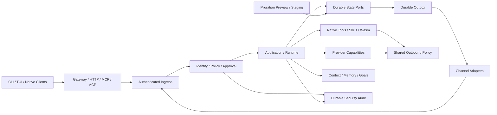
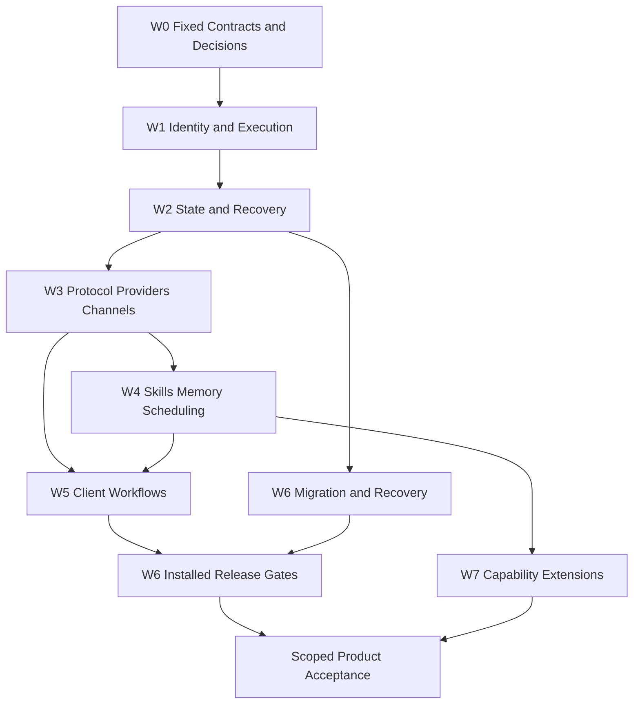

# GTA-Claw 开发与迁移方案

详细化修订: 2026-09-14。本文件负责产品范围、模块设计、依赖、验证和交付策略；
[DEVELOPMENT_CHECKLIST.md](DEVELOPMENT_CHECKLIST.md) 负责逐项执行和证据核销。
一级任务 ID 沿用 M0-M7，已有实现和历史验收保留；详细化不表示重新从零开发，
也不表示新增子项已通过。本次文档修订不执行产品构建、真实账号、设备或部署操作。

阅读顺序：第 1-4 节看范围、现状、技术边界与拥有者；第 5-8 节看状态、里程碑、迁移和
验收；第 11 节查逐模块工程规格；第 12 节按执行波次推进；第 13 节选验证命令/场景；
第 14 节用于风险、估算与下一次开发交接。具体主/子任务以 checklist 为唯一勾选入口。

## 范围与完成口径

本方案于 2026-09-14 由主助手独立重新核查，不使用子 agent，也不把此前汇总结论
作为验收证据。随后按用户要求开始 Rust 1.98.1 / Slint 1.17.1 原生开发；实际代码、
Windows 本地验证及限制见 [当前开发记录](ledger/native-followup-20260914.md)，
[基础记录](ledger/native-foundation-20260914.md) 保留为历史证据。
没有执行真实产品迁移、部署、发布或删除旧实现。源码阅读与本地夹具不等于实机验收。

必须分别管理两条迁移线: 仓库内旧 GTA-Claw Node 服务退役，以及 OpenClaw 用户的
配置、会话、凭据引用和扩展迁入。完成其中一条不代表另一条完成。

任务只有在实现、生产装配、正反向测试和验收证据齐全后才能勾选；编写方案本身
不能使工程任务变成已完成。现有库存和旧基线测试不自动继承到新版兼容声明。

## 当前规划基线 (2026-09-14)

本轮重新规划以 OpenClaw 最新稳定发布 `v2026.9.4` 为目标，而不是持续漂移的 `main`。
GitHub 官方 release API 经本轮独立查询返回该版本，发布时间为 `2026-09-11T03:46:22Z`；
发布说明记录的源码提交为 `3a9d69db306cd7f081e06254cb89c4bcc14a7107`。
这是规划目标，不代表 GTA-Claw 已兼容，也不代表本轮已验证上游发布签名。
发布记录并非不可变资产，且仍列有 Android 原生验证失败、部分验证豁免及发布收尾
待办；不能把“稳定版”理解为所有平台或功能已通过验证。

- 官方发布: <https://github.com/openclaw/openclaw/releases/tag/v2026.9.4>
- 官方查询: <https://api.github.com/repos/openclaw/openclaw/releases/latest>
- 目标源码: <https://github.com/openclaw/openclaw/tree/3a9d69db306cd7f081e06254cb89c4bcc14a7107>
- 官方变更入口: <https://raw.githubusercontent.com/openclaw/openclaw/main/CHANGELOG/2026.9.4.md>。
  此入口可更新，具体兼容合同必须从上述固定提交提取，不能直接以 `main` 生成。
- 当前已封存的本地基线仍是 [baseline.json](../compat/upstream/baseline.json) 中的
  `2026.7.2` / `b43e832fcc8000ed7287c7accc54e381db607f85`，本轮不修改任何封存文件。

开发主线调整为: **安全的真实服务闭环 -> 持久化与故障恢复 -> 版本化协议兼容 ->
完整客户端工作流 -> 可回滚迁移与原生交付 -> 扩展能力**。
保留纯 Rust、无 npm 产品依赖、禁止嵌入式 JavaScript、Wasm 能力隔离和现有 workspace 边界。
不能把 registry 数量、单 crate 测试或监听端口成功当作产品验收。

当前优先收敛的实现缺口:

1. 插件及原生工具已接入认证主体、单次参数/发布/资源/generation 绑定审批，CLI/TUI/Slint
  共用完整预览合同；设备撤权、原生文件/目标/固定程序及插件持久审计已验证。渠道/多租户与插件完整能力同意仍有缺口。`SilentApprovalPort`
  只丢通知的原始结论不变，不能把它误称自动批准器。
2. `claw-state` 已替换生产内存 StatePort，持久化会话、回合和上下文检查点；
  Gateway run/outbox/ACK 已持久化，未知提交有写入栅栏；跨对象统一事务、完整归档与恢复仍未完成。
3. MCP owner/只读专用凭据、显式策略下的原生文件/固定程序/固定地址网络读取及 OpenAI/Anthropic 已装配；通用 DNS/代理网络、技能、完整 MCP 和统一出站仍有缺口。当前窄验证见 [原生增量记录](ledger/native-followup-20260914.md)。
4. 新版 Gateway 必须验证 payload、错误、事件与权限，不仅验证方法名称。
5. 用真实绑定的 daemon 回放旧合同，满足原有删除义务后才能替换 Node 镜像。

本轮已实现的控制路径与剩余要求:

| 事实 | 直接控制行为的源码 | 规划后果 |
|---|---|---|
| 插件与原生工具使用认证主体、发布/资源绑定；目标由 runtime 保有写权限 | [agent_runtime.rs](../apps/gta-claw-daemon/src/adapters/agent_runtime.rs) | 复用已有 Gateway/Telegram/Discord 会话所有权和插件审计；补 Teams/WhatsApp 身份、完整能力同意及全入口矩阵 |
| broker 拒绝过期/取消/撤权/重复批准，写入中断报告未知 | [tool.rs](../crates/claw-runtime/src/tool.rs)；[approval.rs](../crates/claw-runtime/src/approval.rs) | 继续完成政策矩阵和其他执行能力；不可自动重试未知效果 |
| redb StatePort 和有界 LRU 检查点已接入 | [runtime.rs](../crates/claw-state/src/runtime.rs)；[persistent_context.rs](../apps/gta-claw-daemon/src/adapters/persistent_context.rs) | 完整跨对象事务、历史归档和故障恢复仍是实现任务 |
| MCP 有独立凭据集合，已按显式配置接入；未配置时拒绝 | [config.rs](../crates/claw-http-api/src/config.rs#L127)；[mcp.rs](../crates/claw-http-api/src/mcp.rs#L90) | 保留已完成的 owner/non-owner 鉴权；完整 MCP 装配另行开发，不能称根因是缺 JWT |
| 服务可配置独立 MCP owner/只读凭据 | [production.rs](../apps/gta-claw-daemon/src/production.rs) | 不复用主 HTTP 凭据，后续迁入 SecretRef/平台存储 |

执行清单见 [DEVELOPMENT_CHECKLIST.md](DEVELOPMENT_CHECKLIST.md)。现有实现记录见
[PROGRESS.md](PROGRESS.md)，旧服务删除义务仍由
[legacy-node-port-obligations.md](legacy-node-port-obligations.md) 管理。本方案替换旧开发
路线；实际实现状态随证据更新，但不改变封存合同或仓库政策。

2026-09-15 用量工作流增量：M3-05/M3-08/M5-01/M5-02 已增加完整 CLI 用量快照导出、
TUI/Slint 逐轮查看及共享严格协议校验，保留既有服务端 v1 字段顺序与结果 ACK 语义。
本地四包 486 项通过/5 项既有忽略，桌面 88 项通过、严格 lint 和根全目标 check 通过，
见[用量工作流记录](ledger/native-accounting-workflow-20260915.json)。这不是货币预算、
定价或发票核销，也不关闭统一模型配置、真实账号、迁移、移动产品及发布门槛。
联合测试中原生凭据写后跨进程 status 曾返回缺失；仅增加脱敏诊断，复验通过不算根因修复。

## 1. 产品目标与兼容范围

2026-09-16 配置增量：M3-06.01 已完成原生主配置 provider/model/SecretRef/base URL/origin/
timeout 及来源诊断，保留旧显式环境策略且拒绝混用；CLI 可按源 SHA 查看并生成新候选，
不会覆盖或热应用。新增配置分层重复字段拒绝、跨 provider 凭据不继承及显式 disabled，
六种真实进程来源/方言、十种静态检查和实际 reload 代次保护通过；三包 457 项通过/5 项
既有忽略、严格 lint 和根全目标 check 通过，见[统一配置记录](ledger/native-provider-config-20260916.json)。
完整在线切换/退役、真实账号及图形配置编辑仍未关闭，旧凭据异常无根因修复声明。

同日模型目录增量：新增有界缓存详情页和显式刷新，保留 SDK 声明能力、来源/观察时间及
默认选择；目录唯一性/上限/描述校验在发布前执行，失败刷新和并发切换不覆盖旧目录。
Gateway/CLI 读取与刷新权限分开，后者只重新列模型、不推理或切换。四包最终 533 项通过/
5 项既有忽略、严格 lint/根 check 通过，见[目录记录](ledger/native-model-catalogue-20260916.json)。
初轮 OAuth 独立原生状态查询失败仍保持未定位，不能以目录工作完成关闭凭据可靠性问题。
后续同毫秒/同目录实例替换回归又证明摘要须绑定 provider 代次；已加入代次、同锁核验/捕获
和刷新回执原SHA验证，最终四包534项通过/5项既有忽略、严格lint/根check通过，追加证据
仍在同一目录记录内。代次非跨进程持久身份，不扩大真实账号或完整M3-07完成声明。

随后完成 TUI 独立 Models 视图与 Slint Models 设置页的缓存展示/续页/显式刷新，连接和
请求归属、失败保留、刷新后失效、无聊天 ACK 均有真实 WS 和多尺寸渲染回归。最终原生
六包869项通过/7项忽略，桌面91项通过，严格lint与根编译通过；新增测试专用原生凭据
父子进程探针五阶段通过，但并未复现/修复旧 OAuth 间歇失败。模型选择、配置应用及真实
账号/平台验收仍开放，所有追加证据归同一[目录记录](ledger/native-model-catalogue-20260916.json)。

本次继续补齐精确模型候选、Windows 显式离线配置应用及损坏源恢复，复用共用平台文件服务。
Slint 可按已检查本地源和当前目录页选择精确模型生成新候选；保存/应用/重启明确分开，
图形候选不证明本地文件属于远端 Gateway。应用先同步并验读备份，再在独占句柄写源，
是非原子维护流程而非热切换；3 个真实进程退出点及保留残留的恢复、20 种文件场景验证通过。
九种 daemon 来源/方言和三种 CLI 到 daemon 新进程启动链路通过；最终原生八包1087项通过/
11项忽略、桌面96项通过、双workspace严格lint及根编译通过，见[配置应用记录](ledger/native-provider-application-20260916.json)。
原 OAuth 损坏记录状态测试在初轮再次异常，最终通过不算根因修复；全部实号、完整在线退役、
其他平台维护与项目级交付门槛仍开放，不新增主项完成声明。

随后在真实 provider 调用前增加模型级能力准入：已声明能力与提供方能力共同限制完成、
流式、工具、图像、JSON 和嵌入请求，精确模型不存在或显式输出上限越界时拒绝，不自动
回落。空逐模型声明保持未知；文本模型不接收可选宿主工具，但明确客户端工具和已有类型化
历史不能丢弃。计数型零调用/零事件、真实 HTTP/SSE 拒绝及九种方言/来源回归通过；
三包617项通过/5项忽略、严格lint/根check通过，见[能力准入记录](ledger/native-model-admission-20260916.json)。
这不是实时每账号能力探测或完整token上下文计费，也不关闭M3-07整体或旧凭据异常。

本地模型客户端后续：TUI新增封闭JSON的 `config-provider` 检查/候选命令，固定已检查源SHA、
当前目录provider/model与精确目标ID；路径不发给Gateway，单个本地任务跨断线保留，取消等待
不丢句柄，正常退出等任务结束。共用映射修正配置 `copilot` 与SDK `github-copilot` 的区别。
TUI/配置库192项、桌面97项通过，双workspace严格lint和根编译通过；十包联合1460项通过、
1项原有MCP凭据撤销测试失败、11项忽略。单项复验通过不是根因修复或联合全绿，失败日志保留。
证据追加到[配置应用记录](ledger/native-provider-application-20260916.json)，此前TUI候选缺口已覆盖；
图形直接应用、在线退役、真实账号/平台和项目交付仍开放。

显式模型别名后续：增加同provider的大小写敏感、单跳精确ID表，拒绝碰撞、链式、保留命名空间
和缺失目标；启动/刷新发布前校验，HTTP按显式别名解析后仍执行固定模型及能力准入。目录摘要
覆盖配置别名，编码页限16KiB，TUI/Slint分开展示而候选仍保存精确ID。十二种来源/方言、
十三种CLI页场景及刷新冲突通过；原生七包1015项通过/9项既有忽略、桌面97项通过，双workspace
严格lint和根check通过，见[别名记录](ledger/native-model-aliases-20260916.json)。旧严格客户端
不保证接受别名页；真实账号、完整在线退役及原凭据异常仍开放，不新增任务完成声明。

完整目录导出后续：CLI新增 `gateway export-models`，单连接只读收齐固定目录摘要、provider
代次及选择，完整校验跨页ID/别名、总量和原有顺序摘要后才独占新建明文快照；无刷新/推理/ACK。
十三种真实CLI/WebSocket场景及三种真实daemon方言通过；相关三包441项通过/7项既有忽略，
另行执行一项三方言生产链路通过，严格lint和根check通过，见
[目录导出记录](ledger/native-model-export-20260916.json)。写入未知需保留输出，目录断电耐久、
GUI导出、实号和完整M3/M5仍开放；既有别名记录作为历史快照保留。

模型生命周期状态后续：显式目录状态区分禁用、等待认证、未初始化及已关闭；普通目录报文
不变，CLI `models --availability`、TUI `models-status` 与桌面独立按钮只读查询。禁用/关闭
在启动提供方前拒绝，计数测试确认零调用；未知原因/旧服务器拒绝不伪造状态。原生四包525项
通过/7项既有忽略、桌面98项通过，双workspace严格lint、后续生命周期测试和根check通过，见
[状态记录](ledger/native-model-status-20260916.json)。缓存过期、真实账号、完整在线退役及原凭据
异常仍开放，不新增任务完成声明。

**推荐方向: 保留 Rust 核心和原生客户端，按可运行的用户工作流重组开发顺序。**
不是重新抄一遍 OpenClaw，也不是给旧 Node 服务换名字。兼容的是可观察行为、协议与
可迁移数据；上游 Node 插件 ABI、任意 JavaScript 执行和包管理器自更新不属于自动继承项。

| 交付层级 | 必须能够完成的事情 | 不得声称 |
|---|---|---|
| 内部 Alpha，M0-M3 | 登录一个真实模型，CLI/HTTP/Gateway 发起会话，审批工具，看到最终结果，重启后找回记录 | 全渠道、全插件、完整客户端或可替换生产 |
| 迁移候选 Beta，M0-M6 | 常用能力、原生客户端、安装升级、两条迁移演练，以及选定范围的完整合同证据 | 任意 OpenClaw 配置或 JS 插件都能无损迁移 |
| 扩展交付，M7 | 按新版能力矩阵逐项扩大 provider、渠道、媒体和设备能力 | 用“全部功能”掩盖未支持项或政策限制 |

每项能力记录两个独立维度: **实现层级**（未实现/库实现/已装配/已端到端验证）和
**兼容结论**（精确兼容/适配兼容/经批准的差异/不支持/未验证）。只有第一维到达端到端
验证、第二维有明确结论，才能进入发布范围。注册数量不参与完成率计算。

默认是单用户或互相信任的操作者使用一个 Gateway，多账号必须隔离权限与会话。
当前不宣称具备面向不可信租户的 SaaS 隔离；多租户应另立威胁模型和验收，不由角色名推导。

## 2. 本次独立核查及上游影响

### 2.1 版本证据

2026-09-14 再次运行 `git ls-remote` 的结果:

| 对象 | 实际值 | 用法 |
|---|---|---|
| 稳定标签对象 | `8bec206f3c1f787e1e9c45cfd34d3de2a78c7b8e` | 记录标签身份，不能把它当作源码 commit |
| 稳定标签解引用提交 | `3a9d69db306cd7f081e06254cb89c4bcc14a7107` | 新版合同的唯一源码基线 |
| 查询时 main | `e2b0038cafd54c552874381e9026ae99b202f53f` | 仅用于变更观察和本次发布文档快照 |
| 本地旧合同 | `b43e832fcc8000ed7287c7accc54e381db607f85` | 保留旧回归，不伪装成新版合同 |

上游将发布说明拆分到了后续文档树，稳定源码提交下的独立 changelog 页面返回 404。
因此本次阅读的发布说明固定在查询时 main 的提交，而协议、迁移和插件架构读取稳定
源码提交。两种出处明确分开，发布说明不能替代对应版本的源码/合同测试。

### 2.2 对开发顺序有影响的变化

以下是选出的高影响项，不声称已经完成从七月到九月的全部语义 diff；完整新增、修改、
删除项盘点属于 M0，既不能只看最近一次 release，也不能机械更新旧库存的数量。

| 编号 | 上游已核查事实 | GTA-Claw 必须做什么 | 阶段 |
|---|---|---|---|
| U01 | Gateway 仍为 v4；普通客户端最低 v4，认证 node 和 probe 有 v3 窗口 | 分角色验证握手、payload、scope、错误和事件；内部 headless v1 不跟着改号 | M0/M3 |
| U02 | 配置以外，还有共享及 per-agent SQLite、凭据目录和外部 workspace；源码文档包含 state schema 17 | 读取实际 schema 和布局，做 WAL 感知快照；未知版本停止；程序降级不能冒充数据恢复 | M0/M2/M6 |
| U03 | 官方 native 插件在 Gateway 进程内加载 JS/TS；能力注册与元数据发现分离 | 建立 Rust/Wasm 能力映射和人工移植证据；禁止把 npm 包直接认作可执行 Wasm | M0/M4/M7 |
| U04 | 命令自动审查允许 allow/deny/ask；运行时空 `toolsAllow` 表示全拒绝，而配置空 `allow` 不是同一含义 | 保留字段出处、缺失/空值语义；deny 不能偷偷转成 ask；高风险动作仍需人审 | M1/M3 |
| U05 | 自定义模型 endpoint、精确 ID、账号和能力必须随选择保留；刷新与发现分开 | 复用三类已装配 provider，补统一配置、Responses、取消、用量及安全重试 | M3/M7 |
| U06 | 不确定投递不能盲目重发；最终文本恢复不应重执行已完成工具 | 持久化 inbox/outbox、执行凭据和结果，显式呈现 outcome unknown | M2/M3 |
| U07 | 记忆删除与会话删除分开，压缩/重载/取消必须保留尚在使用的资源 | 定义记忆生命周期、来源、索引重建和资源退役语义 | M2/M4 |
| U08 | Skills/ClawHub、插件详情、安装同意和 Workshop 是完整工作流；`video-frames` bundled skill 已退役 | 区分指令内容、安装物与可执行能力；退役项给替代，不让旧 registry 继续承诺存在 | M4/M5/M7 |
| U09 | 原生端强调真实聊天就绪、发送状态、附件、重连、折叠屏及平台授权；还有 Linux companion | 不能以连接成功验收聊天；保留现有 UI 边界，把 Linux GUI 差异单列 | M5/M7 |
| U10 | 只读受管配置、备份 include 文件、插件版本固定及升级后的数据兼容都是明确语义 | 区分保存/应用/重启，配置 readonly 不等于会话只读；升级前验证恢复入口 | M0/M2/M6 |
| U11 | Cron/heartbeat、受控任务、远端/云 worker、浏览器和媒体均有独立生命周期与成本 | 先持久化和权限，再增加能力；不自动创建付费资源，不自动重放外部副作用 | M4/M7 |

### 2.3 当前仓库的可复用基础和真实缺口

| 范围 | 本轮源码/清单核查 | 重设计结论 |
|---|---|---|
| 核心与 workspace | 新增 claw-state 后为 32 个库、6 个应用成员，排除 android/desktop/ios | 保留分层，不为迁移做全仓重构 |
| 生产路径 | daemon 调用 production 装配；不是旧 compose 测试 stand-in | 在真实生产入口增加测试，不能只证明替身图 |
| 工具 | 文件、固定程序和固定地址 GET/HEAD 已按工作区策略接入；目标工具和指令经过认证与审计 | 完成通用网络/代理与执行隔离支持矩阵；固定程序的 cwd 限制不是 OS 沙箱，无策略不暴露原生工具 |
| 技能 | 生产启动读取 registry 数量，插件激活数被当作 active skill 数 | 独立统计 skill discovered/validated/active/executable，不用插件数代替执行证明 |
| Provider | 生产可选择 Copilot 或显式策略下的 OpenAI-compatible/Anthropic；smoke 为独立测试路径 | 完成统一配置、能力目录和真实账号验证；底层协议客户端覆盖与产品接入分别记录 |
| MCP | HTTP facade 已有独立 owner/只读凭据；`claw-mcp` 不是 daemon 依赖 | 继续统一 MCP 配置、完整生命周期与工具授权 |
| 出站网络 | 插件使用独立 PinnedHttpTransport；Discord WSS/更新器还存在代理限制 | 分协议建立出站能力表，代理不支持应可见；不能仅凭传入 policy 宣称代理已支持 |
| 迁移 | 已有 Claude/Codex/Hermes 适配、legacy 合同工具和 Rust CLI OpenClaw 有界只读预览 | 完成精确 schema、SQLite/WAL 快照、导入与恢复；文件迁入不等于继承源产品执行能力 |
| 桌面及移动 | Windows/macOS Slint 已接原生聊天/历史/审批，android/ios 仍是连接壳 | 桌面完整工作流、移动平台桥接和密钥存储仍需交付 |
| 交付 | 根容器仍是旧 Node 服务，原生打包流程与产品替换是两回事 | 容器切换和旧文件删除放在迁移验收之后 |

规划阶段的静态核查不是全仓逐行审计；后续已执行选定核心、CLI 和桌面本地测试及
严格 lint，准确命令和范围见开发记录。没有运行完整跨平台 CI，也不据此取消安全工作。

### 2.4 OpenClaw / Hermes 能力差距追踪

2026-09-14 的能力对比现纳入开发范围和 checklist，不作为新增实现或验收证据。
OpenClaw 的协议目标仍是上述固定 `v2026.9.4` 源码；另以 NousResearch
**Hermes Agent `v2026.9.11`**（发布标题 `v0.21.2`）作为产品工作流参考，
来源为 [版本化 README](https://github.com/NousResearch/hermes-agent/blob/v2026.9.11/README.md)
和 [发布页面](https://github.com/NousResearch/hermes-agent/releases/tag/v2026.9.11)。
Hermes 不指同名模型；官方功能描述不等于本项目已实测，也不形成 Hermes 协议兼容声明。
逐项冻结来源、适用配置和差异属于 M0-05；不自动继承其 Python/Node 运行时或第三方服务。

| 差距 | 当前事实及下一项交付 | 对应 checklist |
|---|---|---|
| 聊天、会话与恢复 | 原生聊天/历史/审批及持久 run 已接通；补完整流式、快照协调、跨对象恢复与固定版本互操作 | M2-02、M2-03、M3-02、M3-03、M3-04、M5-01、M5-08 |
| 模型接入 | 78 条描述符分为 28 个 `Implemented`、38 个 `EndpointRequired`、12 个 `RegistrationOnly`；补统一选择、模型能力及真实账号验证，不声称 78 家全功能可用 | M0-05、M3-06、M3-07、M3-08、M7-02 |
| 执行工具与联网 | 固定程序/参数和固定地址读取已装配；补通用工具、浏览器、MCP 与本机/隔离/远端后端支持矩阵，不能把 cwd 当 OS 沙箱 | M1-03、M1-07、M1-08、M1-09、M3-10、M7-05、M7-07、M7-09 |
| 长期记忆与偏好 | 已有显式身份隔离笔记、关键词检索、CAS 纠正/删除及模型工具调用；继续完成语义/自动召回、完整来源/客户端与备份遗忘语义 | M4-01、M4-02 |
| 技能和插件生态 | 51 条技能目录未形成完整生产分发；137 个上游插件描述符仍是未移植项；补实际任务调用、安装同意及可审核的经验提炼/技能改进 | M4-03、M4-04、M4-05、M4-06、M4-07、M7-03、M7-04 |
| 定时任务和多 Agent | 补 Cron/heartbeat 的持久调度与结果投递，以及独立身份、预算、取消和恢复的协作流程；存在 worker 合同不等于产品已能委派任务 | M4-08、M7-07、M7-08、M7-09 |
| 消息渠道 | 29 条目录中四条路径部分装配；Telegram/Discord 已增加持久接收、去重和投递状态，仍缺完整 cursor/resume、恢复流程及真实账号验证；其他渠道单独交付 | M2-04、M2-05、M3-11、M3-12、M3-13、M3-14、M7-01 |
| 客户端与设备 | CLI/TUI/Slint 的完整工作流、移动聊天/附件/审批和平台授权仍需验收；Web/Linux GUI/扩展不绕过现有政策 | M5-01、M5-02、M5-03、M5-04、M5-05、M5-06、M5-07、M5-09、M5-10、M7-06、M7-10 |
| 迁移和原生交付 | OpenClaw 预览不是导入；旧 Node 容器与 Rust 开发版分别管理；补快照、恢复、安装升级和受审查的发布工具链升级 | M6-04、M6-05、M6-06、M6-07、M6-08、M6-14、M6-15、M6-16、M6-18、M6-20 |

提供商分类来源为 [registry.rs](../crates/claw-providers/src/registry.rs#L616) 与
[状态定义](../crates/claw-providers/src/descriptor.rs#L66)：前两类都有协议客户端，区别是
是否带已确认的默认端点，不是 66 家真实账号验收。技能装配见
[production.rs](../apps/gta-claw-daemon/src/production.rs#L804)，插件移植边界见
[compat.rs](../crates/claw-plugin-api/src/compat.rs#L26)。这些数字是本次源码快照，不是新版上游总量。

优先完成可复现的用户流程：**真实模型 -> 审批后的工具/技能 -> 可检索记忆 ->
定时执行 -> 可靠投递结果 -> 重启后核对**。M1-M3 的权限和状态前置仍须满足；
M4 验证任务/记忆/调度，M5/M6 从实际客户端与安装制品复现，M7 分别扩展后端和生态。
拒绝或撤权时实际执行为零，未知效果不自动重跑；不能把多个模块分别通过当作整条流程通过。
同模型、同输入、同权限和预算的成功率/成本/时延/恢复比较归 M0-10；未实测前不报告
整体追平百分比，也不由 Rust/Slint 推导更安全、更快或更聪明。

## 3. 目标架构和不变约束

### 3.1 保留的边界

- Rust 2024，根 workspace 不引入 Slint；开发工具链已更新到 `1.98.1`，Slint 固定 `1.17.1`。
  MSRV `1.94.0` 不变。受保护发布策略仍固定 `1.97.1`，其升级需独立审查，不修改校验器放行。
- `claw-domain -> claw-protocol -> claw-application -> claw-runtime` 保持向内依赖；runtime
  不直接进行网络、数据库或平台 I/O。daemon 负责选择、装配和关闭适配器。
- 保留 hyper/rustls、结构化错误、SecretRef、Wasm Component Model、签名验证、无 WASI、
  插件 fuel/内存/并发预算。插件签名证明来源，不证明业务安全或用户已批准当前动作。
- 禁止嵌入式 JS，包括把 JS 解释器藏进 Wasm；不引入 `@github/copilot-sdk` 或 Copilot CLI
  子进程作为 provider。OpenClaw Code Mode 的 JS 执行不做透明兼容。
- 旧 JS/TS 仅保留在批准的 legacy inventory，不能为迁移脚本、测试或 UI 扩大白名单。
- 不通过修改受保护的 supply-chain validator 或它的历史 fixture 让检查通过。
- 传递已验证的绑定对象及配置 generation，不能在执行时换一个同名资源重新解析。
- 所有服务任务可取消、可追踪、有背压；终端结果、持久化成功、资源清理成功分别报告。

### 3.2 目标数据流

下图表示目标装配，不表示所有连线已经实现。



已经增加必要的 `claw-state` 所有者，复用现有 ports 和迁移 engine；只有实际职责无法
放入现有 crate 时才拆新 crate。不开微服务、不新增常驻消息队列、不为目录整齐重命名全仓。

### 3.3 必须先收敛的设计决策

| 决策 | 推荐方案 | 在什么条件下才能关闭 |
|---|---|---|
| D01 兼容范围 | 以稳定源码建立逐能力矩阵，七月回归并存；长尾能力分批交付 | 每项有版本、源证据、owner、差异与可运行测试；不支持项得到明确处置 |
| D02 主状态库 | `claw-state` 已采用 redb `4.2.0` 并装配生产，D02 验收仍开放 | 已验证 Windows 事务/进程中断；实际 MSRV、备份、完整恢复和其他平台验证后才能关闭 |
| D03 SQLite 输入 | OpenClaw SQLite 是外部格式，不要求 GTA-Claw 内部同库同表；导入层独立 | 经验证的读取库，或源系统规范化导出能覆盖全部选定数据；不能把备份归档当作已解析数据 |
| D04 JS 插件 | Rust 原生移植、受限声明式 HTTP、Wasm 组件三选一，指令型内容另行分类 | 每个移植物有来源、能力映射、签名、正反向测试；不存在“自动装 npm 即兼容” |
| D05 客户端范围 | 先完成现有四个 workspace；Linux 先 server/CLI/TUI；Web、扩展及 Linux GUI 单列 | 扩大 UI/JS/平台边界必须获批准并更新政策，不能只删除 CI 拒绝断言 |
| D06 安全差异 | 新模式默认严格授权/显式出站策略；旧合同要求不同的行为单独登记 | 安全差异有迁移提示和审批，不篡改 legacy oracle，也不静默放宽权限 |

redb `4.2.0` 已是精确锁定依赖，不代表完整持久化方案已验收。SQLite 的 C 实现/FFI 若不满足纯 Rust 政策，不能偷偷
引入；读取方案未获验证就阻塞对应 OpenClaw 导入验收，不阻塞其他已独立具备条件的开发。

## 4. 全模块开发归属

| 能力 | 首要归属 | 下一项可验收产物 |
|---|---|---|
| 领域、协议、用例 | `claw-domain` / `claw-protocol` / `claw-application` | 不受传输污染的版本化输入、权限上下文与持久化事务端口 |
| 执行、恢复、目标 | `claw-runtime` / `claw-goals` / `claw-state` | 会话/回合/工具/目标一致恢复，取消不复活，失败不伪装成功 |
| 模型与鉴权 | `claw-provider-sdk` / `claw-providers` | Copilot、OpenAI-compatible、Anthropic 的可切换真实生产适配 |
| 工具与扩展 | `claw-tools` / `claw-skills` / `claw-plugin-api` / `claw-plugin-host` | 一个授权目录贯通模型、HTTP、MCP；技能可执行状态可查询 |
| 记忆与上下文 | `claw-memory` | 可追溯检索、压缩锚点、预算、导入/导出/删除/重建索引 |
| 网关与客户端合同 | `claw-gateway` / `claw-gateway-client` / `claw-clients` | 固定版本双向互操作与权限隔离、事件缺口恢复 |
| HTTP 与开放集成 | `claw-http-api` / `claw-mcp` / `claw-acp` | HTTP/SSE、MCP server/client、ACP 生命周期贯通 |
| 渠道 | `claw-channel-sdk` / `claw-channels` | 先完成四个旧渠道的收发/重连/鉴权/幂等验收，再补 Slack、Feishu 等 |
| 配置、迁移、恢复 | `claw-config` / `claw-migrate` / `claw-crestodian` | readonly-aware 配置迁移、可预览导入、已验证备份及受限 doctor |
| 安全与平台 | `claw-security` / `claw-platform` | 调用者身份贯穿、平台凭据存储、进程/文件边界和降权执行 |
| 观测 | `claw-observability` | request/session/run/tool/delivery 关联，脱敏日志、审计、成本和恢复指标 |
| 浏览器、设备与远端任务 | `claw-relay` / `claw-worker` / `claw-discovery` | 从协议 oracle 走向受控生产适配；先本机，再独立远端，再云 |
| 验收与政策 | `claw-conformance` / `claw-repo-policy` | 双基线合同、证据可达性、覆盖状态及政策不回退 |
| 产品入口 | daemon / CLI / TUI / updater / desktop / Android / iOS | 同一核心状态、真实用户工作流、分平台安装与恢复 |

上述为未来职责和下一步产物，不给任一现有库追加“已通过”的声明。

## 5. 持久化和运行语义

### 5.1 需要持久化的对象

| 对象 | 一致性/恢复要求 |
|---|---|
| Session、消息、turn、上下文 checkpoint、goal | 同一版本快照可重建；并发写使用 revision；内存 LRU 不能等同于删除历史 |
| Tool invocation、审批、结果与副作用状态 | 绑定主体、参数摘要、工具版本和权限 generation；旧许可不因重启自动重新有效 |
| Inbox、outbox、渠道 cursor、dedupe key | 接收确认必须在持久化后；去重按 gateway/账号/渠道/会话划分 |
| Cron、heartbeat、task、lease | 时区/DST、错过执行、重载、取消、租约到期都有确定语义 |
| 配置、插件版本、导入批次、迁移日志 | 数据 schema 与产品版本分别管理；升级失败保存原因及恢复位置 |
| 媒体、artifact、记忆来源 | 字节文件和索引分别管理；哈希、引用归属、配额、保留/删除策略可追踪 |

### 5.2 不可妥协的事务边界

1. 验证身份、配置版本和幂等键，事务性保存 ingress 与待处理 run 后才能返回“已接收”。
2. 执行前按当前策略生成一次性能力；审批通过不解除插件沙箱、工作区或网络限制。
3. 工具结果、turn 状态和待投递记录以一致事务发布；文件产物采用 staging 与提交记录恢复。
4. 外部系统无法参与本地事务，因此不承诺全局 exactly-once。已确认未发送才能自动重试；
   发送后未获回执记为 `outcome_unknown`，交由查询、幂等外部 API 或人工处置。
5. 崩溃后恢复排队工作和可证明安全的读取；执行中写操作不自动重跑。补最终文字与重新
   执行工具是两个不同动作。取消后的迟到结果不能重新激活 run。
6. shutdown 先停止接收，再撤销权限、取消/等待任务、持久化结算和关闭资源。强制退出
   必须记录未结算状态，不能用“端口已关”冒充数据已落盘。

Windows、Unix 的原子替换和断电持久性分别验证；进程重启测试不能证明断电不丢数据。
schema 太新、空间不足、权限丢失或数据库损坏时停止写入并给出恢复路径，不创建空库
覆盖原库。主状态、goal 和审计不能拥有互相矛盾的成功口径。

## 6. 八个开发里程碑

默认按下面顺序单一主执行者推进，不使用子 agent 分工。阶段可做独立准备，但不能绕过
前置退出条件发布。详细可勾选项以 checklist 的 ID 为准。

| 阶段 | 前置条件 | 交付与退出条件 |
|---|---|---|
| M0 基线与设计收敛 | 无 | 新旧合同边界、全量差异盘点、D01-D06、平台矩阵和测试预算明确；冻结原始状态快照 |
| M1 安全执行闭环 | M0 | 工具风险/身份正确，原生工具接入，允许/拒绝/请求人审均生效；所有出站适配被盘点并受策略控制 |
| M2 持久化与恢复 | M1 的权限/对象合同确定 | 状态库、事务、inbox/outbox、审计与恢复装配完成；崩溃演练无已确认数据丢失、无未授权重放 |
| M3 协议、模型与接入 | M1/M2 | 最小 CLI 聊天与 HTTP/Gateway 实际闭环；三类 provider、MCP、ACP 和四个旧渠道逐一验收 |
| M4 Agent 工作能力 | M2/M3 | 记忆、技能、Wasm 生命周期、workspace/artifact、cron/heartbeat、目标恢复能完成真实任务 |
| M5 多端产品化 | M3 的会话/审批合同稳定，M4 的选定功能可用 | CLI/TUI、Windows/macOS、Android/iOS 各走完整使用流程；缺失的设备能力明确禁用 |
| M6 迁移与原生交付 | M0-M5 的发布范围通过 | Node 退役和 OpenClaw 导入分别演练；可安装、可升级、可恢复；用户批准后才实际切换 |
| M7 完整能力扩展 | 核心安全、存储和交付门槛持续满足 | 长尾 provider/渠道、ClawHub 移植目录、媒体、浏览器、设备和远端任务逐项交付并维护差异 |

### M0: 建立可维护的新基线

保留现有 `compat/upstream/` 和 `compat/legacy/` 字节不变。建议在独立、版本化的
`compat/releases/` 下生成候选数据，包含源码 SHA、schema、方法/事件/能力、来源、
license 和 digest。已创建九月候选身份元数据及双基线读取器；完整新版合同尚未提取，
读取器明确报告 `complete_contract: false`，不把元数据当兼容验收。

扩展现有 conformance harness 同时读取旧基线和新版本，不直接改旧常量“追平数量”。
ledger 至少包含 feature ID、源路径/版本、Rust owner、生产入口、测试、实现层级、
兼容结论、差异理由、证据。新增/删除/行为变更都必须有处置，弃用项不能继续假装可用。

### M1: 先修授权，再开放工具

消除工具桥接中统一 false 和 owner=true 的假定；统一原生、插件、HTTP、MCP 工具入口。
策略明确 allow/deny/ask；无人回答、断开、撤权、超时一律不得转成允许。重载后重新核验
仍在等待的审批，旧连接和其他账号不得批准当前请求。无界面的服务也要有可用的
CLI/TUI 审批通道，而不是仅发一个无人消费的事件。

把 provider、角色/技能获取、插件 HTTP、渠道 REST/WSS、MCP 和更新下载列入同一出站
审计。保留已验证 IP/目标与 TLS 名称约束，覆盖重定向、DNS 重绑定、IPv4-mapped IPv6
及云元数据地址。显式严格代理模式不得静默直连；不支持的协议显示拒绝原因。

### M2: 让成功结果真的留得住

生产 StatePort 已使用 redb，继续完善事务端口和崩溃点测试；统一恢复所需的 goal、记忆
checkpoint、审批终态和投递记录。用确定性时钟验证 TTL、LRU、cron 和重试，区分会话
卸载、历史归档、用户删除及记忆遗忘。分页、配额和备份必须一起设计，不能无限加载历史。

### M3: 从端口连通到协议互操作

先实现新版最小闭环的 session/chat/abort/history/approval/health/model/config 合同，再
扩大 Gateway method group。精确核查默认值、null/缺失、分页游标、错误码、事件顺序、
订阅断线后的缺口恢复。没有验证的 upstream 客户端不能因为握手成功就标为兼容。

Provider 按显式配置选择现有三类实现；OpenAI Chat Completions 和 Responses 不混称，
Anthropic 和 Copilot 分别测试工具参数、流尾、限流、OAuth 过期、取消和不可安全重试。
模型列表是能力声明，不应在只读列表操作时偷偷发起推理或登录。

MCP 先装配独立 owner/non-owner 凭据及只读策略，再复用 `claw-mcp` 完成客户端、OAuth、
工具发现及取消清理；不能靠添加一个 JWT 验证器宣称根因已解决。ACP 的协议版本另行
锁定，并对不支持的外部执行后端诚实报错。

四个旧渠道逐一证明鉴权、入站归一化、会话隔离、分片计数单位、限流/重连及持久化
去重。WhatsApp Cloud API/webhook 与个人账号配对不是同一种适配，不能共用一个
“WhatsApp 已迁移”的完成项。

### M4: 让 Agent 完成一项有结果的工作

工作流包括读取受信工作区、检索记忆、调用允许的工具、生成 artifact、报告失败和恢复。
指令型技能可先导入内容并标注不可信来源；技能引用的脚本不因此获执行权。补上有界
远程获取、稳定输入顺序、部分失败诊断及签名移植证据入口。

插件目录区分 discovered/validated/installed/loaded/active/failed；只有实际能力注册和
调用通过才算可用。保留 metadata generation、执行 authority 与资源 lifetime 的区别：
撤销能力应立即生效，但未完成的清理仍可保留必要资源，不得把资源活着当作权限有效。

Cron、heartbeat 与可恢复任务使用成熟调度库，不自写 cron 解析器。先完成单机目标、
配额、时区和停用语义，再考虑远端 worker；任何历史任务导入后默认暂停。

### M5: 多端共用状态，不共用虚假就绪

| 平台 | 现有基础 | 交付条件 |
|---|---|---|
| CLI/TUI | 原生发送/查询/取消/审批、profile、TUI 输入与结果恢复已有 | 完整 onboarding/流式/快照协调、模型和任务工作流；JSON stdout 不混日志 |
| Windows/macOS | 独立 Slint 已接聊天/历史/审批与 OS profile | 完整设置/工作区信任、身份/结果恢复、签名安装及真实平台工作流 |
| Android | 独立 NativeActivity Slint 壳 | Keystore、网络回调、配对、聊天/附件/审批、生命周期及进程死亡恢复；当前主要目标 arm64 |
| iOS/iPadOS | 独立 Slint 壳、进程内凭据 | Keychain、UIKit/NWPathMonitor 桥接、配对、聊天/审批、回前台恢复与签名分发 |
| Linux | server/CLI/TUI；desktop 仍由平台代码明确拒绝 | 先验证原生服务和软件包；新增 Linux GUI 需 D05 决策，清理 CI 不改变支持范围 |
| Web/浏览器扩展 | API/协议及 relay 基础，不是已交付 UI | 作为明确差异/扩展项；不在本轮擅自增加 Node 前端或 JS 例外 |

首屏进入可用工作流；状态必须区分 Gateway connected、provider authenticated、chat ready、
queued、sent、delivery unknown。缓存按 Gateway/账号/设备身份隔离，不能展示另一个
Gateway 的私有聊天。离线缓存可读不意味着离线操作已经发送。

视觉工作沿用现有 Slint 风格，优先中文/英文、键盘与屏幕阅读器、字体缩放、窄屏、
折叠屏、安全区和附件加载状态。推送、相机、语音、屏幕控制逐项授权并分批启用；不
承诺移动系统允许后台永久运行 Gateway。

### M6: 两条迁移线分别验收

见下一节。先用复制数据和独立入口演练，之后才讨论真实服务切换。发布的是经过验收
的原生候选，不是将所有未测试功能默认启用。

### M7: 按使用价值补齐长尾

先扩展高使用频率的渠道与 provider，再补媒体理解/生成、语音、浏览器/CDP、设备节点、
受控多 Agent/worker、discovery/fleet 和云会话。产品支持多 Agent 的规划不授权本助手
使用子 agent；本次及后续开发执行仍遵守用户的禁止委派要求。

为每个 vendor 注册独立能力，不用 text provider 成功推导 image/embedding/voice 成功。
ClawHub 只作为来源与发现入口，展示 GTA-Claw 移植/兼容状态；catalog 里找得到不等于
可以安装运行。任何待批准的平台或技术边界都继续显示阻塞，不通过修改完成率隐藏。

## 7. 迁移设计和切换手册

### 7.1 A 线: 旧 GTA-Claw Node 服务退役

1. 盘点实际使用的配置、路由、四个渠道、角色/技能源及部署环境，保存未修改的快照。
2. 在现有 daemon 生产测试基础上，使用真实 bound listeners 回放 legacy 正常、负向、
   超时、TTL、reload-race、持久化和 shutdown 合同；只在外部模型/渠道服务处使用受控替身。
3. 为 JS 执行、自更新和其他安全差异附明确处置记录，不修改 fixture 来消除差异。
4. 构建独立 Rust 候选镜像，验证非 root、只读程序目录、独立状态卷、health、限额和退出。
5. 用户批准后暂停旧服务接收新任务，结算/登记未完成项，做最终一致备份；切换唯一入口。
6. 验证渠道凭据、队列和游标，确保同一账号没有两个消费者或两个副作用写入者。
7. 观察窗口通过后，才在同一变更中删除旧源码与对应 inventory 项，最终移除 Node 清单
   和容器入口。冻结合同和已验证的回退制品保留；不能先删文件再补替换证据。

影子运行仅允许无副作用回放或受控模拟出站；不能把真实消息同时交给两个 Agent 发信、
运行命令或重复消耗付费模型额度。旧实现本来不持久化的数据不得虚构为“已迁移”。

### 7.2 B 线: OpenClaw 用户迁入 GTA-Claw

只支持已识别且有 fixture 的输入版本；首先交付固定稳定版，旧版本和其他布局逐项扩展。
不在用户原目录运行 doctor、不自动升级源系统、不就地修改源 SQLite、不共享活动数据库。

| 数据类别 | 导入规则 | 验收重点 |
|---|---|---|
| 配置、profiles、环境和 include | 解析全部来源，输出逐字段映射及 unknown/manual-required；保持只读受管配置语义 | endpoint、默认值、空列表、路径和渠道账号不被偷偷替换 |
| Workspace、指令、技能内容 | 默认复制到 staging，保留哈希与来源；外部根逐项授权 | Windows 大小写/保留名、路径穿越、symlink/junction、重名冲突、文件权限 |
| 共享及 per-agent SQLite | 验证来源 schema、WAL 一致性、agent 归属及外部注册路径，规范化后写入目标库 | 会话/消息/call ID、顺序、时间戳、附件、归档与绑定引用完整 |
| API key/凭据引用 | 默认只迁引用；复制实际密钥必须明确 opt-in，写入目标平台 secret store | 报告、日志、diff、源码和普通配置中不得出现密钥 |
| OAuth、设备、渠道配对 | 保留来源说明；要求与目标身份相容，必要时重新登录/配对 | 不复制成永久 owner；不双用会轮换的 refresh token 或渠道棘轮状态 |
| Memory/检索索引 | 先迁源文档和来源信息；索引默认重建 | embedding provider/model/dimension 一致，删除与遗忘语义可见 |
| 插件和 hook | 只导入审核后的配置/内容映射，执行物走原生/Wasm 移植 | 未支持的 npm、shell/JS hook、Code Mode 明确阻断，绝不静默执行 |
| Cron、任务、投递和 worker | 迁历史与可解释终态；定时任务/旧投递默认暂停 | 不重执行历史副作用；云资源清理归原系统管理，不丢失费用风险说明 |

标准迁移状态机:

```text
detect -> preview -> consistent-backup -> stage -> validate
       -> explicit-activation -> observe -> finalize
                            \-> rollback / manual-recovery
```

- `preview`: 不写目标、不执行插件、不连接付费服务；按数据类别报告数量、冲突、损失、
  手动操作和拒绝原因。Rust CLI 已有有界只读预览；其余迁移阶段的产品命令仍待实现，
  不把上述状态名当成已有可执行命令。
- `consistent-backup`: 由用户批准停写，或使用源系统验证过的快照机制；保留 DB/WAL、
  workspace、配置 include 和凭据的完整备份。备份受访问控制，敏感材料加密存储和传输。
- `stage`: 每个输入有来源指纹，目标隔离；同一 fingerprint 重试幂等，记录已提交与未完成
  阶段。已有同名目标默认拒绝或要求明确 merge 策略，不擅自覆盖。
- `validate`: 核对数量、哈希、引用和权限，检查不可迁项；运行代表性用户流程。仅备份
  校验通过不能证明内容已成功导入。
- `activate`: 配置与数据先原子发布，之后再明确批准外部登录、频道消费和服务切换。
  不可逆外部动作不伪装成可回滚事务。
- `finalize`: 保留迁移报告、源快照和回退制品，验证可恢复后由用户决定保留期限和清理。

### 7.3 回滚门槛

| 触发条件 | 必须执行的处置 |
|---|---|
| schema/哈希/引用验证失败，或空间/权限不足 | 保留源目录不变，停止激活，保存 staging 与失败报告 |
| 鉴权放宽、跨账号泄漏、工具误执行、重复消费 | 立即停止候选接收新工作并撤销该候选权限，保留审计；不得继续试运行 |
| 仅新程序失败，数据仍与旧程序兼容 | 由所有权校验后的更新器恢复已验证旧制品，并验证数据可读 |
| 数据 schema 已前迁 | 停止全部相关写入者，保存候选新增数据，向独立目录恢复迁移前备份；不能降低版本号骗旧程序读取 |
| 切换后已有新消息/外部副作用 | 单独导出、核对和补偿；回退旧快照会失去快照后的本地变化，不承诺零损失自动回滚 |
| 渠道配对/云资源状态已变化 | 在相应服务确认当前状态，必要时重新配对或人工清理；本地恢复不等于远端恢复 |

每次切换都记录唯一操作者/进程所有权、入口、源/目标指纹、最后已确认 cursor、schema、
恢复路径及验证结果。迁移工具不得停掉无关进程或改动机器上的生产代理。

## 8. 测试、发布和完成定义

### 8.1 复用现有验证入口

2026-09-16 按用户明确要求，GitHub 仅保留
[依赖检查](../.github/workflows/dependencies.yml)与自动 Dependency Graph/Dependabot 告警。
构建、普通测试、打包、发布、参考网关及政策自测工作流已移除；CodeQL 默认扫描已关闭，
单独的旧必需桌面工作流规则已解除，禁止删分支和强推的保护不变。仅 CI 清理提交
`30f97d0` 已发布，不包含进行中的应用开发。四个 Rust workspace 的漏洞、许可证/依赖策略
和历史 npm 锁审计仍执行，失败不降级为成功。源码测试、手动脚本、封存政策和历史证据保留。
首轮实际发现三个客户端锁中的 `webbrowser 1.2.1` 参数注入漏洞；安全补丁提交 `8c3abff`
只发布三处 `1.2.2` 锁条目，原生应用开发未夹带。修复后GitHub四个Rust锁及npm漏洞审计均通过，
许可证/重复版本/通配依赖政策债务仍失败，未加豁免，见[依赖CI记录](ledger/dependency-only-ci-20260916.json)。
以下是未来代码变更的验证入口，不表示本轮已执行这些构建或测试:

```powershell
cargo fmt --all -- --check
cargo check --workspace --all-targets --locked
cargo clippy --workspace --all-targets --locked -- -D warnings
cargo test --workspace --all-targets --locked
cargo doc --workspace --no-deps --locked
cargo +1.94.0 check --workspace --all-targets --locked
cargo test -p claw-repo-policy --locked
cargo test -p claw-conformance --locked
cargo test -p gta-claw-daemon --test production_composition --locked
./compat/upstream/validate.ps1
```

先跑触及 crate 的窄测试，再跑关联生产装配、兼容合同和必要 CI。复用现有测试文件及
helpers；新 crate/新职责确有需要才加测试目录。拒绝借文档检查通过宣称 Rust 编译成功。

desktop 命令必须带 `--manifest-path desktop/Cargo.toml`，在 Windows/macOS 验证；保留
Linux 明确拒绝测试。移动端分别运行现有 android/ios scripts；iOS 构建/分发
需要 macOS、完整 Xcode 和适当签名身份，Windows 本机检查不能替代。

保留根图无 Slint、受保护 base SHA 的供给链验证、各 workspace lock/deny/audit、SBOM、
provenance 和精确依赖校验；不要在规划变更中顺便升级依赖或重生成 lockfile。

### 8.2 必须增加的产品级验收

| 类别 | 可否定实现的检查 |
|---|---|
| 安全 | deny/超时/撤销下工具实际执行次数为 0；跨账号/工作区越权为 0；机密日志泄漏为 0 |
| 持久化 | 在接收、审批、工具完成、投递及迁移发布前后注入崩溃，已确认记录不丢失，未知副作用不重放 |
| 协议 | Rust 客户端对固定上游、参考客户端对 Rust 服务双向验证；字段、事件、错误和权限均有比较结果 |
| 模型/渠道 | 确定性本地替身验证错误分支；独立测试账号验证真实授权、收发和撤销，记录版本与运行证据 |
| 迁移 | 新装、空输入、正常输入、缺凭据、旧/未来 schema、损坏 WAL、外部根、失败重试、冲突、回滚矩阵 |
| 客户端 | 连接与聊天就绪区分；长中文、窄窗口、缩放、折叠屏、软键盘、失网、进程死亡、缓存身份隔离 |
| 生命周期 | 资源撤权和清理分开验证，迟到回调不复活；shutdown 有未结算任务时不能报 clean |
| 打包 | 安装后的真实二进制验收，不只测源码；签名/篡改拒绝、升级中断、配置保留和卸载不删用户数据 |

参考上游测试若需要 Node，只能使用经批准的隔离参考环境；依赖 CI 中的历史 npm 锁审计
不安装包或执行安装脚本，不构建 Node 产品。不得打包 Node 运行时或把外部测试工具混入 Rust 产品。
真实账号、付费模型、推送和设备测试
要单独明确授权、预算和数据范围；本轮没有进行这些操作。

### 8.3 建议的首轮发布门槛

以下为规划目标，M0 固定测试机、样本、配置和阈值后执行，未测量前不宣传性能优势。

- 功能: 发布范围内全部必需合同通过，无未解释的 `RegistrationOnly` 或 `NotImplemented`。
- 可靠性: 至少 100 次受控进程中断恢复和 24 小时 soak；已确认本地事务 RPO=0。
- 恢复: 代表性固定数据集下重启恢复目标不超过 60 秒；不包含人工配对和云服务恢复。
- 响应: 用本地确定性 provider 隔离模型时间，10 活跃会话/100 连接下 Gateway 附加
  p95 延迟候选门槛 100ms；不得把模型 TTFT 与网关开销混算。
- 资源: M0 记录启动耗时、空闲 RSS、增长斜率、FD/句柄数、队列峰值与安装体积，冻结预算；
  Wasm、媒体、移动后台分别建场景，不能测完后通过放宽阈值“变成通过”。
- 安全和恢复缺陷阻止发布，不以平台签名成功、安装包存在或上游稳定标签豁免。

每个勾选项需要: 对应版本的源证据、生产调用入口、测试名称/命令、输入与制品指纹、
结果和限制说明。测试跳过、仅库测试或平台无法运行都记为 pending/blocked，不能记 pass。

## 9. 推进顺序、风险与维护

下一开发周期按第 12 节执行波次处理：先核对当前增量证据与合同，再收敛剩余身份/出站、
跨对象恢复及渠道 cursor/resume，继而完善模型配置/流式、技能/记忆/调度和客户端流程。
现有审批、CLI、redb 和 Slint 基础继续使用，不能把已实现内容退回“待开始”，也不能
把其余实现缺口仅标记为待测试。发布策略升级及外部账号/设备验收独立管理。

采用单执行者、一次一个可验证变更；每次先失败检查/窄测试，再实现、生产装配、同一
检查复测，最后更新 checklist。未做全量差异盘点前不承诺总工期；M0 完成后按具体
工作项估算，M2、M3 结束后用实际吞吐重新估算。真实设备、第三方凭据和签名等待
单独记录，不伪装成已经完成的代码。

| 主要风险 | 提前控制 |
|---|---|
| 上游持续变化导致目标漂移 | 本轮稳定 SHA 不变；每周观察 main，发布基线升级经单独 diff/回归批准 |
| 标识符覆盖掩盖实现缺口 | 实现层级与兼容结论分开；检查真实装配和实际副作用 |
| SQLite 读取与纯 Rust 政策冲突 | M0 做 D02/D03 技术验证，不能到真实迁移时才发现无导入路径 |
| 身份/权限在适配边界丢失 | M1 首先修风险/主体传播并覆盖每个入口，不依赖插件作者自行遵守 |
| 数据切换不可逆 | 停写快照、staging、单写入者、独立恢复目录，明确切换后新增数据处置 |
| UI/平台或上游插件无法等价 | 显式差异和决策门槛；未经批准不改变现有技术约束 |
| 网络/凭据测试意外影响现有环境 | 隔离账号、临时监听与独立数据，禁止改变生产代理和无关服务 |
| 文档变成第二套虚假进度 | checklist 只按证据更新；本方案、PROGRESS 和 legacy 义务保持一致 |

方案、清单和本轮原生基础实现均已交付，但“整个项目开发完成”仍要由发布范围的全部
门槛证明。M7 中仍有未支持的 OpenClaw 能力时，必须继续公布差异。

## 10. 官方资料索引

均由主助手于 2026-09-14 独立读取；网页是资料，不是 GTA-Claw 的运行验收证据。

| 用途 | 来源 |
|---|---|
| 稳定发布、已知验证限制 | [GitHub release](https://github.com/openclaw/openclaw/releases/tag/v2026.9.4) / [latest API](https://api.github.com/repos/openclaw/openclaw/releases/latest) |
| 本次发布说明快照，非发布源码 | [Changelog at observed main SHA](https://raw.githubusercontent.com/openclaw/openclaw/e2b0038cafd54c552874381e9026ae99b202f53f/CHANGELOG/2026.9.4.md) |
| U01 协议版本 | [Gateway version at release SHA](https://raw.githubusercontent.com/openclaw/openclaw/3a9d69db306cd7f081e06254cb89c4bcc14a7107/packages/gateway-protocol/src/version.ts) |
| U02 迁移边界 | [Migration at release SHA](https://raw.githubusercontent.com/openclaw/openclaw/3a9d69db306cd7f081e06254cb89c4bcc14a7107/docs/install/migrating.md) |
| U02 schema 与回滚 | [State schema history at release SHA](https://raw.githubusercontent.com/openclaw/openclaw/3a9d69db306cd7f081e06254cb89c4bcc14a7107/docs/reference/database-schemas/state-schema-history.md) |
| U03 插件执行与能力模型 | [Plugin architecture at release SHA](https://raw.githubusercontent.com/openclaw/openclaw/3a9d69db306cd7f081e06254cb89c4bcc14a7107/docs/plugins/architecture.md) |

schema 历史表的部分 first-release 字段仍写 `Unreleased`，不能据此声称某个旧版一定
支持该 schema。导入器必须读取实际数据库版本和完整性，不能只看用户输入的 release 名称。

## 11. 详细工程规格

### 11.1 执行单位与状态口径

本节是后续代码工作的工程规格，不是已实现 API 清单。新增字段、端口或状态必须先
核对现有拥有者和版本合同，再在原模块内增量实现；不能照着规划另建第二套 runtime。

| 执行层级 | 记录方式 | 关闭条件 |
|---|---|---|
| 里程碑 | M0-M7 | 该阶段发布范围内一级任务完成，依赖与差异均有结论 |
| 一级任务 | 既有 98 个 M0-01 等 ID | 实现、生产装配、正反向检查及恢复证据齐全 |
| 执行子项 | 未关闭主项下的 M0-01.01 等 ID | 对应具体产物可独立检查，有输入、结果和限制 |
| 既有完成项 | M1-01、M1-04、M3-05、M3-09 | 保留原窄验收，不用新要求扩大旧完成声明 |
| 发布再验证 | 由兼容、客户端和发布任务承接 | 在目标源码和实际制品上复验，不靠历史日志继承通过 |

所有未完成主项都需要明确以下信息，缺一项就不能作为可直接执行的交接任务：

1. 归属/入口：负责 crate、实际控制行为的文件或测试入口，不只写一个转发层。
2. 前置：所需合同、状态端口、权限、平台或明确批准；依赖尚缺实现时继续标明。
3. 当前：已经可复用的代码、已装配部分、已有证据及其不覆盖的范围。
4. 实现：输入/输出、状态变更、约束、生命周期、生产装配和用户可见行为。
5. 验收：至少一个正常场景和一个能否定实现的负例，注明本地替身或真实外部环境。
6. 失败处置：撤权、取消、保留现场、只读核对、重试边界和回退入口。
7. 证据：任务 ID、版本与源码指纹、命令、配置、日志/制品哈希、结果和限制。

子项初始不勾选是“尚未按该细化范围核证”，不是否认其中已有代码。开始时先核对
当前实现和日志，符合要求的部分直接引用可复核证据；不为重新勾选而重写已验证逻辑。
主项与子项不能加总为项目完成率；新版本回归、平台等待、功能实现分别统计。

### 11.2 共用交付和证据合同

沿用 [ledger](ledger/) 存放版本化记录；下面规定所需信息，不要求破坏现有 receipt
schema。若必须扩展 schema，要保留旧版本读取和拒绝未来版本的测试。

| 信息组 | 必需内容 | 不允许的替代 |
|---|---|---|
| 身份与版本 | 主/子任务 ID、上游来源、实际 git HEAD、脏工作树输入清单及哈希 | 仅记录分支名、日期或最新 main |
| 运行输入 | OS/架构、工具链、配置指纹、数据集、权限模式、依赖版本 | 用“默认配置”隐去关键差异 |
| 生产路径 | 入口、拥有者、实际调用链、启用方式及不支持项 | 仅有注册项、mock 或孤立库测试 |
| 验证结果 | 精确命令、退出码、正/负例结果、跳过项、日志哈希 | 将没有输出、超时、ignored 或未运行记为通过 |
| 副作用与恢复 | 执行次数、持久提交、投递确认、unknown、取消后资源、恢复结果 | 将请求返回成功等同于外部操作已确认 |
| 交付制品 | 安装包/二进制/迁移批次指纹、签名/provenance、实际安装后检查 | 只凭源码通过推导制品可用 |
| 限制与后续 | 未测平台、未实现路径、需批准动作、回退限制、下一任务 | 用一条“全部完成”覆盖剩余缺口 |

源码未冻结时记录明确的输入见证，不伪造不可变发布 SHA。测试后源码改变即说明证据
适用范围；不同时间、不同包的通过数量不合并成一次全项目通过。安全审计也不能走
允许丢弃的普通日志路径；文档、日志与报告不得保存真实密钥或完整敏感会话。

### 11.3 基线提取、能力合同与差异管理

归属为 `claw-conformance`、`claw-protocol`、各能力 crate 和 `claw-repo-policy`，
对应 M0-01 至 M0-05。读取旧封存材料和固定目标源码，输出版本化候选；旧 JSON、
摘要和 validator 的信任边界不变。Hermes 的产品行为参考与 OpenClaw 线协议合同分开存放。

| 提取面 | 必须提取的内容 | 语义差异检查 |
|---|---|---|
| Gateway | handshake、role/scope、method/event、请求/响应/error schema、限额 | required/null/缺失、鉴权、序号与版本窗口，而非仅名称 |
| HTTP/SSE/MCP/ACP | 路由/协议版本、鉴权、流事件、取消、分页、错误 | 状态码、尾事件、输出截断、只读和写入边界 |
| Config | 字段、默认值、层级、include、SecretRef、readonly、reload | 空列表与缺失、保存与生效、来源优先级和只读策略 |
| Provider | 精确 ID、方言、endpoint、认证、模型和模态能力 | 客户端存在、端点已确认、生产选择、真实账号四层分开 |
| Channel | 账号模型、入站签名/身份、cursor/resume、回复、媒体、限流 | bot 与个人号、线程与会话、发送受理与送达不能混同 |
| Tools/skills/plugins | 参数 schema、风险、资源、来源、运行时、生命周期 | 指令内容与可执行资产、注册与实际调用分开 |
| Client/device | 页面工作流、身份存储、平台回调、授权、升级 | 连接壳、完整客户端、设备硬件和分发条件分开 |
| Migration/release | 数据布局、schema/WAL、备份、签名、升级、回退 | 元数据发现、内容解析、一致快照和可恢复导入分开 |

每个能力记录稳定的 feature ID、原始来源位置与字节哈希、版本、变化类型、Rust owner、
实际入口、实现层级、兼容分类、所需权限、测试与差异处置。对新增、变更、删除分别
生成正反向 fixture；删除项必须有退役诊断，不能继续用七月库存暗示九月仍然支持。

提取器和人工核对分别留证，至少用缺项、重复 ID、错版本、错摘要、死测试引用验证
检测器确实拒绝。未覆盖行要能够被查询为未验证，不生成“全绿”默认值。待决政策差异
保留阻塞说明；不能把待批准、未实现或提取失败自动归为“不适用”。

### 11.4 设计决策与验证资源

D01-D06 均要记录方案、候选、选择理由、代码影响、许可/MSRV、可否定检查和回退。
D02 以已采用的 redb 为基础补验证，不重新发明数据库；D03 的 SQLite 输入路径先证明
版本/schema/WAL/资源上限与纯 Rust 政策相容。无法证明时只开放预览，不开放完整导入。

| 资源 | 进入开发/验收前必须确认 | 资源不可用时 |
|---|---|---|
| 本地 Windows | 隔离临时目录、唯一测试身份、端口、磁盘预算、现有构建所有权 | 使用窄测试，不停止其他任务，不清理他人的缓存或进程 |
| Linux/macOS | 指定机器/runner、文件系统、工具链与凭据存储后端 | 本地实现可继续，平台保证保持未验证 |
| 模型和渠道 | 专用账号、允许 endpoint、额度、数据类别、撤销与清理办法 | 用本地协议替身验证代码，不冒充真实账号验收 |
| Android/iOS | 指定设备/OS/ABI、证书/签名、隐私权限、测试资料 | 编译和模拟验证与真机/分发分开 |
| 浏览器/远端/云 | 允许目标、执行身份、隔离方式、时间/费用上限、资源清理权限 | 仅协议/本地模拟，不打开真实会话或创建计费资源 |
| 发布/生产切换 | 独立审查的工具链政策、制品、备份、唯一入口、回退批准 | 保持现行服务，不改受保护校验器来放行 |

测试预算先于真实执行冻结。以场景明确的成功率、额外时延、资源峰值、错误分类和
恢复结果衡量，不把模型思考时间算成 Gateway 处理时间，也不根据 Rust 语言选择宣传优势。

### 11.5 统一身份、工具目录与执行授权

归属为 `claw-application` 的端口、`claw-runtime` 的策略/审批执行、daemon 的认证适配，
以及 `claw-tools`/插件宿主的具体能力。保留现有 `InvocationAuthority`、撤销信号和
绑定审批，不在渠道、HTTP 或插件中再实现绕过 runtime 的直接执行路径。

| 合同 | 必须保持的约束 | 验证重点 |
|---|---|---|
| 身份 | source、principal、account、session、workspace 来自认证边界 | 用户文本/工具参数不能自称 owner；旧无主历史不能自动认领 |
| 许可 | scope、策略 generation、设备 lease、取消树固定并可撤销 | 无关设备不受误撤权；旧连接/旧批准不能复用 |
| 工具目录 | 实际已发布工具的 schema、版本、来源、风险和资源 | 不可用工具不能以空成功返回；同名替换撤销旧 publication |
| 预览 | 完整规范化参数、主体、账号、资源、版本和指纹 | 截断/缺字段/错版本预览不可批准；显示与执行必须相同 |
| 执行 | 审计写前成功、单次 redemption、再次检查撤权与资源身份 | deny/超时/取消实际调用为零；批准不解除沙箱 |
| 完成 | 成功、确定未执行、失败但已影响、unknown 分开 | 丢失响应、取消写入或提交未知不向模型诱导自动重试 |

目录发现、dry-run、用户批准、实际执行和审计终态是不同步骤。纯读取也需要满足
主体和资源策略；远端 GET/HEAD 并不保证无副作用。工具描述中的风险分类不能由模型
自报，也不能把所有工具粗略归为无写入。交互问题与执行批准分别建模，普通答案不能
兑换权限；终止/撤权优先于迟到批准。

文件工具以已批准根和持有的对象身份操作，覆盖祖先替换、链接、硬链接、大小写和
跨平台路径。写入明确预期 revision/摘要、staging、冲突与发布结果。进程默认关闭，
现有固定程序/完整 argv/可执行文件摘要继续生效；通用 shell、解释器、容器或 SSH 后端
必须独立设计和授权，不能通过允许一个 shell 绕过固定程序约束。动态库、配置、输入
文件和网络权限不由 exe 摘要担保；每种后端明确真正的 OS 隔离、凭据和子进程回收范围。

### 11.6 出站网络与外部副作用

复用 `claw-provider-sdk` 的出站策略，逐消费者验证实际 transport，而不只检查是否
接收了一个 policy 值。当前固定地址读取只是狭窄安全模式，通用 DNS/代理是待开发能力。

| 消费者 | 必须单独实现/确认 | 故障与拒绝 |
|---|---|---|
| Provider/模型目录 | HTTPS、认证 origin、streaming、超时、代理、模型预算 | origin 未登记先于密钥读取拒绝；未知付费请求不自动重试 |
| 角色/远程技能 | 内容上限、UTF-8、来源、稳定顺序、取消 | 重定向目标重新授权；截断/部分失败不可当完整安装 |
| 插件/声明式 HTTP | 能力授权、方法/头/body、DNS/IP/TLS 一致、响应上限 | 插件签名不授予网络权；代理不支持时显式拒绝 |
| Telegram/Discord/Teams/WhatsApp | REST、长轮询、WSS、webhook 回调分别建表 | WSS 不能由 REST 代理支持推导；收发回执含义按渠道区分 |
| MCP/ACP/远端 worker | stdio 子进程与 HTTP/WSS 生命周期、授权/预算 | 只关闭自有会话和进程；未知写效果不重新派发 |
| Updater/资产下载 | 代理、重定向、续传、摘要、签名、恢复 | 断流/错 range/摘要不同拒绝激活；禁止静默直连 |

网络矩阵至少含显式直连、HTTP CONNECT、HTTPS/WSS 需要的隧道、配置 bypass、代理不可用、
地址族、DNS 重绑定和重定向；未实现模式必须在启用前或发出请求前拒绝。认证 origin
与路由代理是两件事，不能因经过代理就把密钥释放给新主机。现有生产代理节点、监听、
配置与进程不属于测试资源，任何实验用独立临时 listener。

### 11.7 配置、机密和审计

配置拥有者仍是 `claw-config`，恢复拥有者是 `claw-crestodian`。将已增加的 provider、
workspace 和网络显式策略逐步迁入有版本的统一 typed 配置，保留安全的兼容读取期；
不静默重解释缺失、空列表、readonly 或模型默认值。准备/校验/发布/退役各阶段有
明确失败回滚，旧任务保留资源不保留被撤销权限。

机密仅通过 SecretRef 或平台存储获得，设备身份与模型凭据分区。保存凭据、连接就绪、
授权成功分开；本地 forget 不等于远端 revoke，存储失败不生成新的匿名替代身份。
日志/审计/预览/错误/支持包对结构化敏感字段统一处理，不承诺自动发现全部自由文本秘密。
审计须有容量/保留和写失败策略，账户/会话标识可关联但不泄漏正文；损坏尾部、祖先目录
和 ACL 的恢复由实际文件系统证据支撑，不能仅靠 logger 单元测试。

### 11.8 持久对象与事务边界

归属为 `claw-state` 的 redb 适配、`claw-application` 的事务语义、`claw-runtime` 的
执行决策及 daemon 的 I/O 生命周期。以下是必须覆盖的逻辑字段，不要求把现有 DTO
整体重命名；新增字段须有 schema/兼容与预算验证。

| 逻辑对象 | 关键字段和关系 | 事务/恢复要求 |
|---|---|---|
| 会话/所有权 | 认证 source/principal/account、session key、workspace、revision | 首次认领与准入原子；reset 不转移身份，不采用无主历史 |
| 入站/run | 幂等键、完整规范化输入摘要、run ID、状态、generation、turn 关联 | 同键同内容复用，同键异内容拒绝；claim 前保存，unknown 不重执行 |
| 消息/turn | 单调 ordinal、角色、内容/附件引用、tool call/result 关系、终态 | 保持顺序和引用；失败部分输出不混入下一成功上下文 |
| 审批/工具 | 参数/资源/版本摘要、原主体、许可期限、结果及效果分类 | 授权证据不等于可重用能力；崩溃后重新审查，未知效果保留 |
| 目标/context | goal revision、锚点、预算、checkpoint、源 turn 高水位 | 明确同库事务或补偿/提交记录，不能把独立文件说成原子 |
| 投递/outbox | run/result revision、完整回复摘要、目标账号、分片和远端回执 | claim 唯一；确认后移除待发记录；部分/不明送达需要核对 |
| 渠道 cursor | 账号身份、poll offset、resume session/sequence、接受批次 | 只有消息持久接收后推进；失效 resume 不重复执行已处理输入 |
| 记忆/索引 | source、owner、版本、可见性、删除标记、embedding 模型 | 源数据可恢复，派生索引可重建，删除不在重建时复活 |
| 计划任务/租约 | schedule、时区、下次触发、misfire、job/run、lease owner/expiry | 单次触发唯一；停用/撤权生效；运行中写任务不因租约过期重跑 |
| 附件/产物 | 哈希、大小、媒体类型、来源、所有者、引用计数/保留 | staging 与索引可核对，缺失/损坏不可被报告完整 |
| 迁移批次 | 源 fingerprint、步骤、staging、commit、备份、schema | 可重复核验，不就地改源，部分提交有明确恢复入口 |

建议的恢复视图区分以下阶段；这是业务语义，不直接更改现有枚举或上游 wire：

```text
validated -> durably accepted -> claimed -> running -> result committed
                                                   -> delivery claimed -> confirmed
                                 \-> cancelled / failed / outcome unknown
```

本地提交、事件广播、客户端展示 ACK 和远端发送回执各有含义。客户端 ACK 只能确认
该身份已展示完整匹配 revision 的结果，不能替代渠道送达。读取旧结果不会运行工具，
重复请求不会产生第二个已完成 run。外部请求的 exactly-once 不由本地数据库承诺。

### 11.9 启动恢复、备份与故障处置

启动先验证库锁/schema/完整性，再加载未结算记录和恢复状态，最后开放服务准入。
有已知写失败或未知提交时进入只读核对，不通过重启自动清除业务风险；数据库 reopen
成功只是存储恢复，不能据此重放外部效果。恢复界面和管理员查询必须显示阻塞原因、
原 run/目标、证据和允许操作，而不是一个笼统 retry 按钮。

| 恢复对象 | 允许动作 | 明确禁止 |
|---|---|---|
| 已接收但未 claim | 复核原输入/当前权限后显式调度；记录操作者与新许可 | 仅因扫描到排队记录就无条件执行 |
| 已 claim 未有终态 | 查存储、工具和外部回执，保留 unknown | 当成普通网络失败自动重新执行 |
| 已保存未投递 | 检查唯一投递 claim、账号和完整结果后处理 | 不检查历史 Sending/Unknown 就重新发信 |
| 已发送未确认 | 查询可靠外部幂等 API 或人工核对分片回执 | 把本地 outbox 存在视为尚未发送 |
| 旧审批 | 重建展示供核对，新的执行重新审批 | 恢复旧 token/设备权限作为永久许可 |
| 内存淘汰 | 从检查点/归档重建视图和预算 | 删除历史、目标或所有权 |
| 源/索引损坏 | 保存副本、只读诊断、从验证备份恢复到独立目录 | 创建空库覆盖、降 schema 版本号骗旧程序读取 |

故障注入覆盖准入前/提交前后、claim、provider/tool 完成、outbox、发送、确认、迁移发布
和 shutdown。使用实际子进程退出确保没有正常 Drop 清理；磁盘满/只读/锁冲突/损坏
分别测试，断电验证另立环境和授权。备份必须包含必要配置、源文档、附件和版本清单，
数据库一致快照与文件复制需协调；验证恢复后的引用、权限、数量和新旧数据差异。

归档、删除、遗忘、审计保留和容量治理分别定义。每次分页有稳定顺序、identity scope
和可验证 cursor；并发写下不丢/重复结果，超限拒绝可恢复。shutdown 先关准入再撤权，
取消/等待拥有任务，结算并 flush；仍有写失败/未知任务时 stop summary 不得为 clean。

### 11.10 Gateway、HTTP 和客户端会话合同

归属为 protocol/gateway/gateway-client/http-api、daemon runtime 适配和 CLI/TUI/Slint。
现有原生业务合同与固定 OpenClaw 合同分别验证，不以名字相同推导 payload 兼容。

| 功能组 | 要实现/核对的行为 | 关键负例 |
|---|---|---|
| 连接/配对 | v4 协商、角色窗口、挑战/签名、scope、设备授权、epoch | 普通客户端误用 v3/worker、过期挑战、重放、错误 Origin |
| 会话列表/历史 | 所有权、稳定分页、归档、引用、完整性和 revision | 越主体、过期 cursor、截断快照、旧响应覆盖新历史 |
| 发送/run | 显式幂等键、持久准入、run 查询、进度、终态 | 同键异内容、失联后盲目重发、旧连接命令、迟到事件 |
| 停止/恢复 | 精确 run ID、取消状态、结果核对、当前策略再授权 | 用旧 run 取消新任务、未完成写操作被假装确定取消 |
| 审批/问题 | 完整 preview、指纹、单次响应、到期/撤权 | 部分参数、错主体、重复回答、普通问题兑换执行权 |
| 模型/配置/健康 | 能力列表、配置 revision、保存/生效、分层 readiness | 连接成功伪装模型就绪、列表偷偷推理、只读查询改变配置 |
| 事件/流式 | epoch/sequence、session/run/turn 归属、delta、终态、缺口恢复 | 背压丢终态、跨会话泄漏、重复追加、ACK 未完整展示结果 |
| HTTP/SSE | 路由鉴权、状态码、输出边界、断开取消、独立 MCP 凭据 | incomplete 当成功、超时丢 unknown、断线任务无人回收 |

先维护可重复的本地 wire fixture，再做固定上游双向互操作；必要的 Node 参考环境
只在获批准的隔离外部使用，不改变仓库或产品的 JS 政策。每次兼容变化记录字段差异
和适配层，不直接污染内部领域类型。分页、大小和超时上限使用合同已有值；新上限
先冻结并验证边界，不能为了让测试通过临时扩大。

### 11.11 Provider、模型选择和生成生命周期

`claw-provider-sdk` 负责传输/可靠性/凭据，`claw-providers` 负责方言，daemon 根据
typed 配置选择。现有 Copilot、OpenAI-compatible、Anthropic 路径继续使用；完整配置
切换与能力目录仍是开发任务。已 pin 默认模型的模式不允许普通 reload 改模型，只有
明确定义且经授权的新配置发布才能切换；失败必须保持旧有效模型或明确 pending。

| 检查面 | 必须实现/验证 |
|---|---|
| 账号/端点 | 精确 provider/model ID、base URL、认证 origin、SecretRef、TLS/代理、显式禁用 |
| 模型目录 | 真实能力、上下文/输出限制、工具/vision/embedding 等逐项确认，缓存/刷新与推理分开 |
| 文本流 | 分块 UTF-8、delta 顺序、finish reason、流尾、空流、部分流、usage 与最终输出一致 |
| 工具调用 | ID、name、参数碎片/JSON、并行调用顺序、输出回注、未知工具、参数超限和取消 |
| 协议差异 | Chat Completions 与 Responses 独立；Anthropic 的消息/工具合同、Copilot OAuth 独立 |
| 可靠性 | 429/Retry-After、503、连接失败、部分发出、超时、凭据刷新、撤权和并发预算 |
| 费用 | 调用前预算、返回 usage、费用未知和限额，不能把未知付费请求视为可免费重试 |
| 切换 | 选择/校验/认证/发布/旧实例退役，未完成请求的资源与权限 generation 分开 |

28/38/12 是客户端注册表状态，不代表所有服务的工具/图像/推理/OAuth 都已经支持。
OpenAI-compatible 自定义 endpoint 可复用方言，但必须独立登记凭据 origin 和验证实际
服务差异。Google/Bedrock 等不同方言与鉴权由 M7-02 分别实现，不靠改 descriptor 为
Implemented 验收。真实测试优先一个专用账号跑文本/工具/取消，再扩大已批准场景。

当前增量：原生OpenAI策略新增显式`completionApi: "responses"`，缺省仍为
`chat_completions`，Anthropic拒绝该选项。复用原凭据origin、固定模型、取消和并发运行时；
不自动更换方言/模型或重试付费请求。Responses默认`store:false`，实现普通文本/图片输入、
函数调用与结果历史、buffered结果和增量文本/summary；工具只在终态身份、序号和片段快照一致后完成。
缺终态、坏参数、重复ID、usage冲突、分片已结束后追加等明确失败；终态后无需等待远端EOF即释放连接/配额。
Chat保留有finish reason但无DONE的兼容路径，同时拒绝无任何结束信号的EOF和不完整工具回合。
三个相关包694通过/5项既有忽略，provider/daemon全目标严格lint通过；实际daemon三种协议和
独立HTTP函数/流生命周期验证见[Responses记录](ledger/native-provider-responses-20260915.json)。
这不是完整Responses验收：opaque/encrypted reasoning续接、assistant phase重放、远端内置工具、
完整费用/unknown回执、模型能力目录、账号切换及真实账号仍开放，M3-08和子项不勾选。

后续Chat一致性增量：固定首帧response/model，后续允许省略但拒绝替换；只接受请求的choice 0，
finish reason后不能继续发送choice内容。工具ID跨索引不能重复、同索引不能变更，越界索引和无效ID拒绝；
buffered与stream均核对工具和终结原因。六种实际HTTP冲突验证立即失败、关闭且只请求一次，
最终三个相关包697通过/5忽略及严格lint，见[Chat身份记录](ledger/native-chat-identity-20260915.json)。
首轮联合回归的MCP原生凭据fixture出现未定位查询失败；原用例单独通过，增加即时读回/引用/错误分类
诊断后联合复验通过。仅诊断增强，不修改生产凭据策略，也不把复验通过写成根因已修复。

Anthropic后续增量：有效message_start、顺序/类型/单次关闭内容块与message_stop共同确认成功；
工具完成延至消息终态，拒绝重复ID、坏参数、未关闭块和截断。文本/thinking初始片段与错误前已接收文本保留；
上限1024块/4MiB输出/单工具1MiB。修正输入usage漏计cache_read；三项输入检查相加，省略累计字段保留，
计数回退/溢出拒绝。七种真实HTTP及相关三包703通过/5忽略、严格lint通过，见[Anthropic记录](ledger/native-anthropic-lifecycle-20260915.json)。
签名thinking重放、实际缓存写入计价、完整unknown账单回执和真实账号仍开放，原生凭据异常也未定位。

Chat预算增量：buffered 8MiB文档、text/reasoning/arguments合计4MiB、1024工具/单参数1MiB；
流按UTF-8累计字节检查，超限保留此前已接受文本但失败。usage核对total=input+output、cache/reasoning子集、
累计非递减和整数溢出，省略字段保留；embedding共用规则，Copilot共用Chat解码。DONE立即结束/释放，
同chunk中先前事件不被后续错误吞掉。真实HTTP达到实际累计限额并核对单槽释放、不重试，
最终三包707通过/5忽略及严格lint，见[Chat预算记录](ledger/native-chat-budget-20260915.json)。
缺失usage仍为兼容默认而非已知免费；运行时/persistence的usage-known、完整费用与unknown凭据仍须开发。

产品终态门禁增量：发现HTTP provider port会丢弃SDK finish_reason并重新合成stop/tool_calls，
现先在ProviderAdapter拒绝Length/ContentFilter/Cancelled/Other和空tool_calls终态，不写成完整历史；
stream工具完成暂存至整个终态通过后输出，部分文本可见但不授予工具执行权。实际三方言daemon
截断/过滤拒绝和受控终态barrier验证，HTTP/daemon345通过/4忽略及daemon严格lint，见[适配终态记录](ledger/native-generation-terminal-20260915.json)。
当前门禁仍把不完整结果映射为Unavailable/503，避免假成功但不是无损partial传输；后续须增加有类型的
finish/status与usage跨HTTP/application/runtime持久化，不能把这一步写成完整M3-08。

后续已替代上述已知partial的统一503门禁：HTTP端口新增GenerationFinishReason/GenerationSummary，
Chat保留length/content_filter，Responses保留incomplete/details及对应流终态，文本/空文本/usage不丢；
部分结果不能携带完成工具，不因required/JSON约束而伪造完整输出。原生适配器不把partial写为完整历史。
runtime桥接保留部分文本后以不可重试原因结束、不合成MessageEnd；provider错误/坏分片/EOF都保存现有partial。
实际三方言daemon经双HTTP入口及Gateway幂等提交，关闭重开redb后原文仍在且无完整消息/工具；
runtime错误的Gateway结算仍为outcome_unknown，保护此前可能发生的效果。三包585通过/4忽略、严格lint及
根工作区全目标check通过，见[部分结果记录](ledger/native-partial-generation-20260915.json)。
仍未持久化runtime usage/终态来源和费用，partial查询体验/推理续接/实号与两次凭据异常仍开放，M3-08不勾选。

partial查询增量：原生agent.wait新增显式partialPage，先核对调用设备/run归属和终态revision，
再读绑定turn的可见文本；每页2048 UTF-8字节，后续offset必须携原SHA256，拒绝错摘要/边界，
不返回reasoning/工具参数、不ACK/不重放。CLI gateway partial-run提供单页读取及封闭响应验证，
完整单页校验全文SHA，多页须全部收集才能验证全文，不声称已有自动导出/TUI界面。
真实三方言daemon读页/坏参数/另一配对设备拒绝及CLI实际子进程回归，两包318通过/5忽略和严格lint，
见[partial页记录](ledger/native-partial-pages-20260915.json)与[命令说明](../apps/gta-claw-cli/README.md#retained-partial-text)。

原生工具历史增量：ContextItem新增助手函数列表和原call ID结果，runtime按真实执行结果回注；
checkpoint以显式类型标记保存并核对消息role/内容，参数纳入原消息/上下文预算，压缩同步移除标记。
原生桥接不再把对话拼成纯文本或合成结果ID，使用持久context为唯一历史来源，保留到三方言真实请求。
工具/检索/摘要外部内容改为数据角色，宿主规则/当前目标仍为system；这不等于完整提示注入防御。
实际三方言模型memory审批/身份隔离及第二轮字段、LRU淘汰和redb关闭重开通过；三包621通过/4忽略、
严格lint和根check通过，见[工具历史记录](ledger/native-tool-history-20260915.json)。
旧无标记checkpoint继续读取，新字段写入后的旧版本降级未验收；未配对历史当前拒绝发起模型请求，
其恢复体验、推理签名、费用/usage及真实账号仍开放。

未配对历史恢复增量：native context把不完整助手/结果组仅投影为明确未确认的不可信数据，
不补造结果/执行权、不改原checkpoint，完整配对组仍结构化。最终消息含说明文字的启发式token重新核算，
超原预算明确拒绝，未自动扩大或悄悄丢宿主规则。实际自有Chat daemon在审批前被终止并重启，
旧run保持outcome_unknown、原键不重放、新请求完成，未批准工具的审计记录未增加；
daemon231通过/4忽略和严格lint，见[历史恢复记录](ledger/native-tool-history-recovery-20260915.json)。
这不等于处理已批准且可能生效的外部操作，也未证明其他方言/平台中断和全自动预算压缩。

逐轮用量增量：SDK/application区分Unreported、Partial、Complete，明确返回的0不再与缺失usage混同；
Responses已要求完整主计数，Chat/Anthropic按实际字段来源标记。HTTP流目前只要观察到UsageUpdate才记Partial，
不能从兼容默认计数推断完整报告。原生runtime保留同一实际provider实例返回的provider/model/response ID、
四项计数和终结原因，最多1024轮；校验身份、连续轮号、子集/加法溢出和已确认报告不可更换。
失败/部分文本的已有记录与此前成功轮一起进入terminal TurnRecord，redb封闭DTO兼容旧字段缺失且重开复核。
同设备gateway run的providerAccounting提供固定大小汇总，区分无记录/缺失/部分/完整主计数；
溢出不输出伪造总数，costCalculated与billingReconciled均为false，不改变outcome_unknown或允许重放。
三方言真实daemon覆盖两轮14token、已知partial单轮7token、终态与身份重开，以及Chat中断无turn记录仍为null；
七包1283通过/5忽略和严格lint，根全目标check通过，见[用量记录](ledger/native-provider-accounting-20260915.json)。
根check在最后的无行为lint整理/测试诊断前执行；当前源码由最终七包测试和lint验证，不是冻结全输入验收。
首轮联合回归的stdio自有程序副本写入被锁，第二轮凭据测试未见持久撤销；单独及最终联合复验通过，
仅增加测试失败阶段诊断，未修复或定位这两类问题，也未关闭更早的凭据异常。
当前仍不是执行中逐轮持久日志：进程中断可能没有报告，缺失不能视为免费；主计数完整也不代表价格、
缓存写入计价和账单已核对。调用前预算、崩溃安全逐轮记录、准确流来源、实号及M3-08子项继续开放。

后续流来源增量：SDK新增UsageReported计数/来源快照并保留旧UsageUpdate；累积器区分缺失、
部分、完整零值与非零，旧无来源计数不能证明完整。Chat保留跨帧主字段来源；Anthropic不再省略零值事件，
usage缺失/空对象分开，计数不变但字段补齐仍更新来源；Responses复用已校验终态的Complete。
原生HTTP流摘要使用上述来源，Smoke明确报告自身计数；不改变HTTP公共usage JSON或提前输出工具。
现有终态屏障扩为50种终态/工具/用量组合，真实HTTP核对三方言及Copilot无usage仍未知；
三个相关包725通过/5忽略、严格lint与根全目标check，见[流来源记录](ledger/native-stream-usage-20260915.json)。
新增SDK枚举变体要求穷举消费者处理，本仓库由全目标check覆盖，不声称外部消费者二进制兼容。
这次未把HTTP流自动持久化到runtime，也未补执行中逐轮日志、价格/账单或所有失败/取消后的付费请求核对；
更早的凭据与stdio锁异常仍未定位，M3-08及子项保持开放。

执行中逐轮日志增量：StatePort新增独立ProviderRoundJournal，未实现的适配器明确拒绝，不静默忽略；
原生redb日志按session/turn与CAS revision保存单次新增意图或最后一轮首个确认报告，拒绝重复意图、
旧revision、改写既有报告及封闭后追加。日志与原不可变TurnRecord分离，最终两者在一个事务中核对并封闭。
runtime在构造provider.start_round前等待意图成功，收到报告后先保存再消费输出/执行工具；
落盘期间取消会在落盘后复核，不调用provider。未知写入沿用原追踪worker与sticky恢复围栏，不自动重试。
已认证gateway run先读terminal turn，否则读绑定journal；recordSource、journalRevision/journalClosed及
attemptsMayBeUnsent保留来源与“意图不证明已发送”的事实，不清除outcome_unknown、不ACK、不重放。
实际redb覆盖创建竞争/旧号/改写拒绝、未知第二轮重开、封闭与报告竞争；runtime写失败/实时先记录后输出/
写入期间取消验证，三方言真实工具回合及自有Chat审批前进程中断后保留7token报告并拒旧键重放。
四包674通过/4忽略、严格lint与根全目标check，见[逐轮日志记录](ledger/native-provider-journal-20260915.json)。
这只保证native runtime的已提交意图/报告可恢复，未恢复旧记录、不持久化每个HTTP流或每段partial文本；
报告提交前的远端响应丢失仍未知，价格/预算/账单核对与旧版本降级仍开放。内存smoke适配器仅镜像CAS语义，
不声称进程重启持久。联合回归曾出现MCP SessionExpired和OAuth原生写后校验变化，原样单独及最终联合通过，
未改MCP/凭据策略、未定位根因；这两次及先前凭据/stdio异常均保留，M3-08与子项不勾选。

已观察用量门槛增量：RuntimeConfig增加默认None的max_observed_provider_tokens；进入下一轮前，
对既有报告核对完整主计数并检查相加，达到阈值Blocked，缺失/部分计数或溢出明确拒绝，不估计为免费。
原生OpenAI/Anthropic策略可显式配置maxObservedTurnTokens（u64、允许0），生产装配在消费策略前固定该值；
旧AgentRuntime构造入口仍为None，默认行为不变。门槛位于上下文组装、意图落盘和provider构造之前。
runtime测试覆盖零/等值/剩余、明确零与未知、两轮累计及溢出；实际三种配置daemon经配对Gateway
各两次独立提交和同键重提，零配置0次推理，默认与1阈值各次真实7token成功且不重放。
runtime/daemon475通过/4忽略、严格lint与根全目标check，见[观察门槛记录](ledger/native-observed-budget-20260915.json)。
准确边界：这是跨轮停止阈值，不是单请求硬token限额或货币预算；已允许的一次请求可以超过阈值，
此前经批准的工具不回滚，新显式turn独立计算。未覆盖standalone HTTP、直接工具、全局/滚动配额和账单，
不是完整预算验收；M3-08及子项、此前所有MCP/凭据/stdio异常继续开放。

CLI完整partial导出增量：gateway export-partial按显式run/revision收集最多4MiB/4096页，
复用原严格页校验并固定session/turn/status/total/SHA，同一认证epoch只发agent.wait，拒绝游标覆盖、
ACK/等待/写幂等参数，不重连、不自动重试。全部页连续且全文SHA通过后，才在固定父目录中create-new写出。
现有文件不覆盖，目标必须本地绝对路径；空partial可导出，缺失partial拒绝，stdout只给元数据。
本地文件是未完成、不可信的明文，仅含可见text，不含reasoning/工具参数；不是带执行权的归档。
七种实际CLI/WebSocket夹具场景验证成功/空/全文损坏/身份漂移/断连/已有目标/缺失，失败内容不回显；
CLI95通过/1忽略与全目标严格lint，见[完整导出记录](ledger/native-partial-export-20260915.json)。
网络/页校验失败不创建目标；本地写入并非atomic rename，I/O失败可能留下文件，明确fileMayExist并等待本writer结束。
这次没有改daemon页协议，也未宣称TUI/桌面UI、加密partial格式、断点续传、全partial持续落盘或实机全平台验收；
M3-08/M5-01及先前全部异常仍开放。

TUI部分结果查看增量：命令面板增加partial/partial-next，必须已观察到选中原生run的terminal revision和turn；
每次仅读一页，worker同连接epoch发agent.wait并严格校验封闭页schema、session/run/turn/revision/终态、
2048字节/4MiB、连续游标和安全标记，续页固定total/SHA。完整单页校验SHA，续页不冒充全文独立校验。
UI显示未确认partial和原字节范围，净化控制文本，不进入完成结果或ACK队列；重复页/旧revision/会话切换拒绝，
已有完整终态回执的ACK行为不变。继续沿用原有TUI连接权限，不额外扩大授权或自动请求全部页。
两项状态/校验测试、七种真实WebSocket场景及40/80/120列、10/24行渲染通过；TUI全目标66通过/0忽略与
严格lint，见[TUI部分页记录](ledger/native-tui-partial-20260915.json)。未启动可见终端或真实账号；实际daemon页
归属验证沿用既有独立证据，不将两份测试混成实号端到端验收。TUI费用显示、完整档案/导出、桌面对应体验、
持续partial保存和全部平台实机仍开放，M3-08/M5-01及原生凭据历史异常不勾选完成。

### 11.12 MCP 与 ACP 产品装配

MCP facade 目前由 `claw-http-api` 提供，不等于 `claw-mcp` 客户端、OAuth、stdio 与
完整生命周期已进产品。沿用既有 crate：配置登记 -> 验证/同意 -> 启动/连接 -> 协议
协商 -> tools/resources/prompts 发现 -> 受权调用 -> 取消/重连 -> 关闭/撤销。

当前增量：现有HTTP MCP产品入口已登记活动tools/call，以认证凭据主体和有类型请求ID定位取消；
全局256、每主体32个槽位，取消未结束仍占用槽位，结束/handler丢弃才释放并取消本调用。
相同主体的活动重号、缺失/null/浮点/超长ID在工具端口前拒绝；另一凭据或字符串/数字错型ID
不能取消原请求。notifications/cancelled现在传递原调用token，客户端reason不保留也不回显。
实际TCP双主体同ID并发、取消/重号/ID复用及容量边界已有回归；HTTP/daemon319通过/4保留忽略、
严格lint通过，见 [MCP取消记录](ledger/native-mcp-cancellation-20260914.json)。
这是无会话MCP facade的按凭据隔离，不冒充同凭据多客户端会话隔离；取消不是回滚或自动重试许可。
完整claw-mcp客户端/server装配、OAuth/stdio、会话绑定及跨进程生命周期仍开放。
后续已增加标准Mcp-Session-Id：初始化签发256位随机ID，最多128会话/每主体16会话，
访问会话表时回收空闲30分钟的旧会话；校验凭据归属和重复头，未知/关闭ID返回404。
活动请求按主体/会话/有类型ID隔离，stateless旧请求独立命名空间；DELETE取消本会话子调用，
GET SSE最多全局128/每会话2条且许可保留到响应流释放，无会话GET/DELETE仍保留旧405合同。
会话通知返回空202，修复原生客户端将JSON null判为非法响应而提前断开的问题。
真实TCP同凭据双会话/无会话同ID并发、跨主体拒绝、删除结束两条SSE、第三条429已验证；
daemon增加仅工作区claw-mcp测试依赖，真实McpClient连接自有daemon验证目录、只读拒绝及独立关闭。
MCP/HTTP/daemon388通过/4保留忽略，HTTP/daemon严格lint通过；MCP库同步目录改ready，
三包全目标lint仍有旧stdio夹具七处unused_async_trait_impl未处理，见 [MCP会话记录](ledger/native-mcp-session-20260914.json)。
会话仅进程内，旧同会话重用ID的延迟取消归因、后台精确定时失效、初始化完整状态机及订阅重放仍开放。
这不是将MCP出站配置/授权和OAuth/stdio全部装配到产品，不勾选M3-10完整验收。
后续会话握手已保存共享initialized标记和固定协商版本：目录/工具调用在通知完成前返回未初始化，
关闭的会话不能重新初始化；携带Mcp-Protocol-Version时必须唯一且与协商版本相同。旧支持版本
允许省略该头，不扩大SUPPORTED_PROTOCOLS。只有完整clientInfo/capabilities握手分配会话，
客户端name/version和协议字符串有界且拒控制字符；旧简化初始化保留原响应但不分配会话。
现代初始化不允许与其他调用批量提交，错型通知不能改变状态；MCP原始JSON复用现有严格codec，
重复method/id/嵌套参数键均在分发前拒绝。实际TCP负例、状态单测及真实McpClient互操作通过，
HTTP/daemon323通过/4保留忽略、严格lint通过，见 [MCP握手记录](ledger/native-mcp-handshake-20260914.json)。
出站MCP授权、服务drain/后台精确失效、完整事件/同会话旧ID取消归因和外部互操作仍开放。
后续服务drain已接共享MCP关闭根：ProductionService在停止接收阶段先取消MCP，再等待HTTP任务；
会话、stateless调用和SSE都继承子token。读body前/读完后/批量逐项和请求登记再次检查，
关闭后永久拒绝新握手/调用，容量保留到原调用或响应体真正释放。tools/list也进入有界请求表，
支持按ID取消及drain结束，纯目录取消返回-32800；有效工具调用仍等待原executor收尾，不把取消当回滚。
实际TCP覆盖慢目录/两类工具/SSE/半读body503与零新增执行；真实daemon保留SSE到stop仍clean退出，
HTTP/daemon324通过/4保留忽略、严格lint通过，见 [MCP关闭记录](ledger/native-mcp-drain-20260914.json)。
其他宿主需调用HttpApi的MCP关闭句柄；未合作的后端仍受既有关闭预算约束，不宣称所有阻塞I/O立即停止。
后续原生MCP出站已接入显式GTA_CLAW_MCP_TOOL_POLICY，默认空目录、不连接后端；仅literal-loopback
HTTP、不含URL凭据/query/fragment，最多4后端/每后端8工具/全局16工具、2并发。每个mcp_本地名
固定完整已审阅远端描述和离线object schema，专用GTA_CLAW_MCP_OUTBOUND_*凭据引用绑定publication，
审批包含后端/描述/参数/会话/主体/权限代次；模型、HTTP及入站MCP复用原executor和持久审计。
审批后才建立独立连接，拒绝缺失/重复/变化的工具描述、分页/超额目录及目录变更通知；单次调用后
始终关闭，不自动发布远端新工具，结果标为不可信。远端isError记失败审计，含义不明的调用保持unknown。
发现底层rmcp默认会在HTTP404后重初始化并重发，现已明确禁用；真实HTTP效果后404验证两者都恰好一次。
真实daemon Gateway审批覆盖拒绝/只读/dry-run零出站，批准后的HTTP/MCP调用、描述变化零调用、异常不重发；
11种真实服务执行/取消/丢弃/关闭场景与审计、旧stdio环境隔离及Windows程序固定句柄已有回归。
tools/MCP/HTTP/daemon560通过/6既有忽略，四包严格lint全部通过，旧stdio夹具7处lint已修复而旧失败记录保留；
见 [MCP出站记录](ledger/native-mcp-outbound-20260914.json)。claw-mcp由测试依赖提升为产品依赖，当前锁文件未改变。
stdio新增显式env_clear连接和参数/环境值Debug脱敏，ExecPolicy提供持有文件/目录的固定句柄；这些不是已完成
stdio产品启动审批。远端HTTPS/代理/OAuth、stdio权限/工作目录、目录持久撤销、自动发现与完整资源/提示/ACP仍开放。
后续目录撤销已持久化：每后端的正整数reviewRevision默认1，身份由固定域/后端id/审阅版本构成，
所有同后端工具共享撤销与取消token。描述缺失/重复/变化、目录超限或list_changed通知立即撤销整组，
受管任务收尾时写入严格、不可删除的redb记录；写入失败关闭当前运行时所有MCP工具，不伪造持久成功。
启动和调用前读取旧撤销，已撤销工具不进入目录、不接受新绑定；单独改URL/凭据/描述不能解除同一审阅版本。
只有明确新的审阅版本才形成新publication并重新请求逐次审批；旧记录保留，全库最多256条、事务性配额。
真实数据库并发/容量/重启、12种服务场景、同组取消与独立后端隔离、真实daemon两次重启拒旧/新版本零自动出站
已有验证，state/daemon252通过/4既有忽略及严格lint，见 [MCP撤销记录](ledger/native-mcp-revocation-20260914.json)。
尚未落盘前崩溃、存储不可用和物理断电不能据此宣称持久撤销成立；外部目录通知重放/全局审阅工作流仍需后续验收。
后续Windows stdio产品路径已接通：每后端只能配置url或stdio之一，stdio要求绝对规范程序路径、
完整SHA256、精确argv、固定规范工作目录及allowHostPermissions:true，不启动解释器/脚本或可写工作区内程序。
配置时固定工作目录，审批后在受管阻塞任务中复核程序摘要并持有文件/祖先句柄直到连接关闭；参数/schema/
环境/目录均进入publication摘要，模型不能选择程序或额外参数。子进程env_clear，仅传显式环境，仍有宿主OS权限。
args最多32项/单项2048字节/总8192字节，环境最多16项/单值2048字节/总8192字节；Windows大小写重复键拒绝。
stdio握手3秒、请求5秒、帧64KiB、输出16KiB，复用拒sampling/目录固定/持久撤销/逐次审批和独立进程树关闭。
实际daemon验证拒绝/只读/dry-run/等待审批零启动，批准后的HTTP/MCP调用、MCP会话删除取消、活跃程序/目录
写删拒绝、审批中等长同mtime篡改拒发、恢复程序后重启仍撤销及最终句柄释放；真实子进程环境和目录均核对。
tools/MCP/HTTP/daemon563通过/6既有忽略、32测试摘要及四包严格lint通过，见 [MCP stdio记录](ledger/native-mcp-stdio-20260914.json)。
需要Windows套接字的程序可能必须显式提供非秘密SystemRoot，本次夹具验证了这一条件；不恢复宿主全部环境。
其他平台明确拒绝该产品启动路径，远端HTTPS/代理/OAuth、真实第三方后端/OS沙箱与完整资源/提示/ACP仍开放。
后续HTTPS出站已接显式httpProxy，复用原生rustls/CONNECT客户端与公开地址SSRF校验：远端必须HTTPS，
代理必须literal-loopback HTTP且有明确端口，禁止URL秘密/query/fragment、SOCKS、DNS代理地址及私有/元数据目标。
HttpRoutePolicy固定完整端点和代理，所有POST/GET/DELETE均只能使用该端点，不读取环境代理、不直连回退；
本机HTTP也改用显式无代理路由。目标端点/代理/凭据摘要纳入publication和审批资源，修改代理导致旧审批失效。
代理负责解析远端域名，产品不在代理外另做DNS或尝试目标TCP；该模式不证明解析后的IP一定公开，指定代理属于信任边界。
既有本机TLS/CONNECT夹具验证隧道成功、代理失败目标零连接，真实daemon审批验证拒绝/等待零代理连接、
批准后仅一次CONNECT且不含MCP bearer凭据；MCP/HTTP/daemon403通过/4既有忽略及严格lint，见 [MCP HTTPS记录](ledger/native-mcp-https-20260914.json)。
TLS仍使用系统根及目标主机验证，未引入产品跳过证书或自签名放行；真实远端MCP/代理节点、OAuth及代理认证还未验收。
后续已登记资源/提示产品读取：既有tools项新增kind，默认tool保持兼容，resource固定完整绝对URI且仅接受
空object参数，prompt根据已审阅描述的最多16个唯一参数生成封闭字符串schema，单值最多4096字符且受总输入16KiB限制。
运行前要求后端声明对应能力并核对resources/list或prompts/list的完整描述；目录缺失/重复/变化/通知撤销整组，
仅调用固定resources/read或prompts/get，不通过tools/call或本机文件接口绕过。资源结果URI必须一致、资源/提示条数
最多32，整体输出16KiB，标记operation/untrusted/automaticReplay:false，不把远端提示当系统权限或自动注入上下文。
16种实际本地服务场景与真实daemon HTTP/MCP审批读取、非法参数零连接、后端重启撤销共同通过；daemon214通过/
4既有忽略和严格lint，见 [MCP资源提示记录](ledger/native-mcp-data-20260914.json)。模板URI展开、订阅/事件恢复、
自动上下文选择和真实第三方资源/提示仍未完成，不据此宣称完整MCP资源生命周期验收。
后续MCP受保护凭据读取已接tokenRef，与tokenEnv互斥；仅接受后端id+资源origin派生的专用
keyring://gta-claw.mcp-outbound/<摘要>，不同后端/端口/源不能读取对方凭据，fd/service/其他namespace均拒绝。
CredentialBinding生成平台无关的域分隔引用，Windows/macOS复用已有原生存储，无文件/环境回退；生产配置读取
和审批后复查在受管阻塞任务完成。连接前及目录核对后重新读取并比较已登记摘要，缺失/轮换撤销整组审阅并落盘。
实际Windows独立凭据覆盖连接前删除/轮换零连接、目录期间轮换零工具调用；真实daemon正常审批/资源提示/重启
改用keyring通过且测试条目已清理。MCP/daemon290通过/4既有忽略及严格lint，见 [MCP keyring记录](ledger/native-mcp-keyring-20260914.json)。
macOS代码接线未在本机验收，原生读取不保证硬截止；最后复查到网络写入之间仍非跨系统原子操作。CLI凭据管理、
完整OAuth授权/刷新、stdio受保护环境引用及真实账号生命周期仍未完成。
后续已补本地CLI `mcp credential reference/status/set/delete`：与daemon使用同一CredentialBinding，
仅管理显式后端id/origin的专用条目；reference不访问存储，所有命令零网络，不修改策略/审批或默认模型。
set必须带token-stdin/confirm-write，delete必须confirm-delete；拒绝秘密argv/文件/环境、回显终端输入、
坏UTF-8和重复参数。写入/删除后各核对一次，故障和外部改写返回可能已变更，绝不自动重试/回滚，也不伪称CAS。
实际Windows CLI独占条目创建/轮换/删除/清理、零连接及七种存储故障通过；CLI/MCP156通过/1既有忽略及严格lint，
见 [MCP凭据CLI记录](ledger/native-mcp-credential-cli-20260915.json) 和 [用法](../apps/gta-claw-cli/README.md#local-mcp-credentials)。
锁文件仅新增CLI到现有claw-mcp/provider-sdk两条边，未变更包版本或下载。已撤销review仍须显式新版本重审，
CLI不通知正在运行的daemon、不撤销远端token、不证明远端认证成功；OAuth、stdio秘密引用、macOS实机与崩溃持久回执仍开放。
后续OAuth库先补安全前置：authorization_request私有封存issuer/授权与token端点/client与secret/redirect/完整resource/
最终URL/state/PKCE，10分钟过期；state、上下文、code和有效期在I/O前核对，兑换前原子消费，错误/取消/保存失败均不能重放原请求。
拒绝授权端点预置保留参数和有歧义redirect；callback和request Debug不输出code/state/URL/PKCE。
同一OAuthClient及其clone按绑定串行code交换/refresh/logout，最多256个保留绑定，不自动淘汰未知结果。刷新发出前锁定，
只有响应解析与保存成功后解除；HTTP错误、丢响应、坏JSON/非Bearer、取消或保存失败阻止并发等待者和仍新鲜的旧bearer。
新授权成功可恢复，登出存储失败仍锁定；这不是跨独立client/进程/重启的持久保护，也不能撤回此前已发出的header/远端操作。
token入库前拒绝空/过长/非法字段和非Bearer类型，清除拒绝路径的秘密缓冲。12种上下文替换/过期、5种单次兑换、
显式/自动刷新12场景及新授权/失败登出通过；MCP79通过/0忽略及严格lint，见 [OAuth保护记录](ledger/native-mcp-oauth-guards-20260915.json)。
当前仅库级验证：无浏览器、真实账号或产品token持久存储。完整受控网络OAuth登录、重启锁定、issuer/client绑定的持久token记录
和跨进程存储协调仍待开发，不能以本项关闭M1-11/M3-10。
后续库新增OAuthClient::with_routes，最多16个唯一完整URL，每项复用HttpRoutePolicy的显式loopback HTTP或
HTTPS经固定loopback CONNECT；不读取环境代理/NO_PROXY，不自动扩展登记或直连远端。发现/注册/token/资源
的每次HTTP操作都先核对完整URL；授权服务器发现结果和生成浏览器URL前还核对授权/token端点。元数据不能自增白名单。
实际完整loopback发现/注册/兑换/刷新已改用新接口；未登记路径零连接、两种元数据换目标零目标连接、独立CONNECT
502不含OAuth秘密通过。MCP82通过/0忽略及严格lint，见 [OAuth路由记录](ledger/native-mcp-oauth-routes-20260915.json)。
旧new/default构造器仍保留环境代理兼容语义；产品必须明确选择新接口并先审阅issuer/resource关系与公网目标政策。
此路由原语不自行证明代理DNS解析结果、也未实现浏览器登录/原生TokenStore/跨进程刷新日志；HTTPS真实授权服务仍未验收。
后续Windows stdio已接受保护环境引用：stdio.environmentRefs仅接受后端id/已审阅可执行物SHA256/大小写归一变量名
派生的keyring://gta-claw.mcp-stdio/引用，不能使用HTTP凭据命名空间或借用其他变量/程序的秘密。CLI使用
program-sha256+environment-name代替endpoint管理相同条目；同样确认stdin写入/删除，不启动程序或修改策略。
秘密16..2048字节；普通/秘密环境合计最多16项/8192字节，大小写冲突、错误引用和数量超限在读取前拒绝。
秘密摘要进入完整publication/审批绑定，预览仅列变量名。连接前、固定程序准备时和目录核对后读取核验，变化/删除
撤销整组review并走既有持久撤销；子进程仍清空宿主环境，启动配置只消费一次，保持程序/目录handle直到关闭。
真实Windows CLI两种引用独占条目轮换/删除清理、daemon审批到实际子进程仅布尔确认秘密注入、取消及程序防替换、
HTTP/stdio凭据变化撤销和环境预算均通过；三包382通过/5既有忽略及严格lint，见 [stdio凭据记录](ledger/native-mcp-stdio-credentials-20260915.json)。
本项没有把子进程变成OS沙箱；已批准程序可读取/传播其环境，不能保证所有OS内存副本擦除或原生存储与启动原子性。
其他平台stdio、进程级网络隔离、完整OAuth/native TokenStore和全项目验收仍未完成。
后续OAuth凭据来源与原生记录已补库级实现：TokenSet携带profile/origin/issuer/授权与token端点/client及secret/
完整可选resource的私有摘要，刷新前和等待绑定锁后复查，fresh bearer也不能跳过；另一已登记URL并不获得旧refresh。
九类来源替换及两类锁等待期间换凭据零I/O通过。NativeTokenStore复用已有Windows/macOS存储，独立命名空间
gta-claw.mcp-oauth，不与静态HTTP/stdio bearer条目混用；封闭schema1记录保留来源/有效期/刷新token，16KiB解析上限，
平台可有更低容量且明确拒绝。TokenSet不提供普通Serialize或秘密输出，损坏/复制到其他绑定/版本冲突无回退。
TokenStore新增兼容默认begin_update钩子；原生实现先核对旧代次，再以不含旧秘密的pending记录替换并核对读回，
之后才发送token请求。兑换/刷新/保存失败或丢响应后重开须新授权；新授权成功保存才解除。删除同样先标记再删除，
失败不恢复旧token。路由错误在写pending前拒绝；普通内存/第三方TokenStore的默认钩子仍不具备持久保护。
真实Windows原生条目重开、实际loopback注册/兑换/刷新、两类丢响应后新client/store拒旧并重新授权、七类记录故障，
以及三包389通过/5既有忽略和严格lint，见 [原生OAuth记录](ledger/native-mcp-oauth-store-20260915.json)。仅新增MCP到现有
provider-sdk的一条离线依赖边，无版本更新/下载。此同步适配器仍需产品层调度阻塞工作；并发独立client/外部写入无CAS，
重开测试不等于进程强杀/断电验收。CLI/daemon登录消费接线、浏览器回调、macOS实机及完整OAuth仍未完成。
后续本地CLI已接mcp oauth reference/status/logout，使用独立credentialRef和原生TokenStore，不接受raw set或stdio
OAuth目标；logout须confirm-logout，不与静态token删除混用。NativeTokenStatus区分不存在/需重新授权/本地可用，
仅输出fresh/refreshAvailable/expiryKnown等布尔值，不展示token或scope；损坏/外部绑定记录返回错误而非不存在。
原生I/O由CLI等待完成的blocking worker执行；实际Windows CLI覆盖正常/过期/pending/损坏记录、拒绝未确认登出、
明确清理和零TCP连接。MCP/CLI175通过/1既有忽略及严格lint，见 [OAuth CLI记录](ledger/native-mcp-oauth-cli-20260915.json)。
状态不证明远端认证，登出不撤销provider token、不通知daemon或终止另一进程的授权；浏览器登录/daemon消费及并发协调仍待实现。
后续CLI已实现显式公共客户端登录：mcp oauth login要求server/resource/issuer/authorization-endpoint/token-endpoint/
client-id及confirm-login，HTTPS须显式loopback CONNECT代理，复用公网目标政策与精确路由，不动态注册或接受client secret。
真实发现必须匹配两个端点并明确S256；输出authorization_required JSON URL供用户手动打开，不自动启动浏览器。
新LoopbackAuthorizationListener只绑定literal loopback，固定/oauth/callback及精确Host，无body GET；最多16连接/
单请求5秒头部预算，授权10分钟内且CLI总期限默认120秒。严格唯一code/state/可选issuer、错误混合/编码/过期拒绝；
正确拒绝消费请求，callback的Debug和HTTP响应不含code/state，响应禁止缓存。成功后只兑换一次并保存原生来源记录。
CLI专属blocking worker内执行网络/原生工作，Ctrl+C协作取消并等待；超时不是原生密钥库硬截止。实际Windows CLI
成功/拒绝/超时/丢token响应/替换元数据五场景，核验PKCE、resource、pending状态和监听器释放；MCP/CLI180通过/
1既有忽略及严格lint，见 [OAuth登录记录](ledger/native-mcp-oauth-login-20260915.json)。hyper启用已有server feature，
tokio-util从CLI dev依赖提升到常规依赖，锁文件/包版本不变。真实账号/手动浏览器实机、macOS、活动Ctrl+C、confidential
client、跨进程协调和daemon OAuth消费仍未完成，不能据此关闭完整M3-10。
后续daemon已接公共client OAuth原生记录消费：HTTP后端oauth与tokenEnv/tokenRef互斥，显式issuer/authorizationEndpoint/
tokenEndpoint/clientId/credentialRef须与登录记录的后端id/完整resource及原始来源一致；三个OAuth端点复用显式安全路由校验。
启动仅原生读取与本地fresh判断，不发现/刷新或连接MCP；TokenSet新增无网络fresh快照及域分隔完整generation摘要。
access/refresh/type/scope/expiry/authority全部进入publication身份，比较使用固定长度摘要。连接前及目录核对后再次加载
同代次fresh记录，缺失/pending/过期/变化撤销整组并落盘；预览显示issuer/client和automaticRefresh=false，权限仍走统一审批审计。
实际loopback OAuth生成Windows原生记录，七种正常/删除/pending/scope或refresh变化/过期/目录中变更验证一次调用和零refresh；
原真实daemon完整tool/resource/prompt审批、拒绝、目录撤销/重启现分别跑静态keyring和OAuth两模式。三包398通过/5既有忽略
及严格lint，见 [daemon OAuth记录](ledger/native-mcp-oauth-daemon-20260915.json)。没有包/锁变化。局部fresh不等于真实服务认证，
无expires记录沿用SDK已有策略；过期/轮换须显式重新授权、重新审阅及新审批，不由daemon自动刷新。真实账号/macOS/
confidential client、跨进程凭据协调和完整OAuth刷新体验仍未完成。
后续CLI已补显式mcp oauth refresh，要求原登录server/resource/issuer/授权和token端点/public client及独立confirm-refresh；
拒绝scope/callback参数，不打开浏览器或监听端口，不让status/tool调用触发刷新。缺失/pending/损坏/无refresh记录在
网络前拒绝；核对精确元数据后仅一次原始资源绑定refresh请求，沿用原生pending/保存读回和等待完成worker。响应省略scope
或refresh_token时保留原值；HTTP拒绝/丢响应/保存未知均要求新授权，重复refresh在网络前拒绝旧代次。
实际Windows CLI七类登录/刷新场景覆盖成功、无确认不变、refresh响应丢失/拒绝和pending再次拒绝；scope省略由实际
OAuth/native存储夹具验证。三包399通过/5既有忽略及严格lint，见 [OAuth刷新记录](ledger/native-mcp-oauth-refresh-20260915.json)。
daemon仍不自动刷新或更新publication；新代次须显式新reviewRevision/审批。跨进程协调、自动刷新体验、真实账号、macOS
和confidential client仍开放，不能宣称完整OAuth生命周期验收。
后续MCP资源模板已接产品审批：tools项新增kind=resource_template，完整typed uriTemplate描述进入登记；复用已有
iri-string 0.7.13的RFC6570实现，不自行替换花括号。模板最多2048字节、1..16个唯一变量，封闭schema要求全部变量为
非空字符串、单值最多256字节；当前不接受数组/对象/undefined变量。展开以2048字节有界writer输出，必须是规范绝对URI、
固定scheme/authority，无userinfo/fragment，规范化会改变路径（含dot段）的目标拒绝。只远端resources/read，不碰本地FS。
审批保留完整模板/描述和精确参数绑定，resourceScope另加expandedUriSha256避免暴露参数。运行核对resources/templates/list
对应描述和资源能力，目录缺失/重复/变化/通知/分页/129项撤销整组；结果每个URI须等于实际展开目标，仍32条/16KiB不可信上限。
资源/提示/模板30种实际服务场景及真实daemon静态keyring/OAuth双模式的HTTP/MCP模板审批、非法路径零连接、拒绝/等候零调用
和重启撤销通过；MCP/daemon312通过/4既有忽略及严格lint，见 [资源模板记录](ledger/native-mcp-templates-20260915.json)。
锁文件仅新增daemon到已存在iri-string的一条边，无版本/下载变化。列表/映射变量、订阅/事件恢复、自动上下文和真实第三方模板
仍未验收，不据此关闭完整MCP产品生命周期。
后续资源订阅增加有界生命周期：SDK每连接最多32项，确认前更新只合并一条待确认提示，确认后只转发该URI的通知并丢弃
远端_meta；未订阅/退订中/未知/关闭均不转发。订阅或退订失败/取消保留未知名额至连接关闭，不重放；成功退订才释放名额。
旧fixture在退订后仍期待更新的断言已改为有效订阅期间验证，六种真实HTTP生命周期和stdio互通通过。
daemon新增resource_watch登记固定资源描述，参数仅durationMs=1..3000/maxUpdates=1..32并进入审批；必须声明subscribe
能力且目录完全匹配。批准后一次订阅，有界计数至时限/上限，结束尝试退订并关闭本次连接；成功结果仅coalesced次数/limitReached/
unsubscribed标志，不自动resources/read或注入上下文。未知订阅/退订或取消不返回成功，不自动重试；目录变化仍持久撤销。
九种真实观察服务场景及静态keyring/OAuth双模式真实daemon HTTP/MCP审批/清理通过。最终三包405通过/5既有忽略及严格lint，
见 [资源观察记录](ledger/native-mcp-observation-20260915.json)。第一轮共同回归曾出现本地OAuth状态读到absent的单次失败，
单独复验通过，加入原测试写后/引用诊断后共同回归通过；未确认根因、不宣称修复，失败日志保留。
观察时间不含连接/目录/退订耗时，通知是提示而非完整事件日志，已在途回调及同URI重订阅的旧通知无法靠协议区分。
长期订阅、事件游标/重放/跨重启恢复、实时平台验收及该原生存储间歇异常仍开放，不关闭整项目验收项。
后续入站MCP会话增加主动空闲到期：每个注册表仅一个deadline任务，最近的touched+30分钟决定唤醒，认证活动/新增/关闭
通知其重算；不再等待下一HTTP请求才清理。任务只持弱表引用，独立子取消令牌随HTTP排空/注册表销毁终止，已结束任务可
在新会话创建时重建。过期移除会话并取消子请求/流，但执行guard和SSE body仍持各自配额到实际释放，不提前再分配。
四个新增测试验证无新请求也会过期、实际SSE body结束/名额归还、其他owner/活动会话保留、维护任务重建和关闭；
HTTP API/daemon342通过/4既有忽略及严格lint，见 [主动过期记录](ledger/native-mcp-expiry-20260915.json)。测试使用缩短的
内部时限或受控历史时间，未等待真实30分钟。HTTP运行时之外的同步注册表保留原懒清理行为；未宣称跨平台/挂起恢复或硬实时截止。
MCP活动时间顺序修复：并发请求拿表锁前采样Instant，处理顺序可能颠倒，旧样本早于最新touched时原逻辑
错误地当作过期，并可把touched回写倒退。确定性回归先稳定失败，现仅在明确非负age达到TTL时过期，
touched使用max保持单调；旧请求不能撤销新会话，latest+TTL前一纳秒仍在、恰好TTL取消且活动许可到drop才归还。
HTTP/daemon360通过/4忽略及严格lint，真实客户端互操作通过，见[活动顺序记录](ledger/native-mcp-activity-order-20260915.json)。
未改变30分钟时限/DELETE/关闭/重试策略。这是确定性源码缺陷修复，与先前SessionExpired现象相符，
但原失败无时间轨迹，不能证明唯一原因；原生凭据、OAuth写后校验、stdio锁及其他历史异常仍开放。
后续OAuth CLI进程协调：login/refresh/logout在原生读取或网络前取得同profile/origin空文件try_lock，竞争立即busy，
锁覆盖整个授权回调等待/请求/持久化；status/reference仍只读不加锁。复用原设备锁目录，文件名前缀和摘要独立，无秘密落盘。
Sandbox新增host coordination打开接口，在原有身份/硬链接/ancestor核对之外，Windows拒绝FILE_SHARE_DELETE；初始回归
实际发现普通打开句柄允许重命名锁文件，已在该接口修复并复验。非空/链接/相对锁路径拒绝，锁文件保留、不在运行期间清删。
真实竞争CLI三种操作均零变更/零额外网络，正常、超时/失败和测试子进程终止后仍能明确登出并重新取得锁；四包570通过/
7既有忽略及严格lint，见 [OAuth协调记录](ledger/native-oauth-coordination-20260915.json)。只协调共享标准目录的新CLI，
旧客户端/直接SDK/不同目录/外部编辑器不受锁控制，daemon仍靠代次复查，非全局原生CAS；macOS运行时未验收。
原生凭据读回诊断增量：核对SDK持有明确Windows backend、未使用共享默认store。四个独立临时测试键和独立
读句柄并发写入/轮换/删除，首轮观察到删除成功后读回不满足absent；首次日志未区分仍存在或平台错误，后续
加入存在性/静态错误分类后通过，根因仍未知。OAuth写后校验现在分开“缺失”“内容不同”“读失败”，均为unknown，
故障注入同时核对marker/token保存只写一次、不删除/回滚、不输出秘密。SDK/MCP/daemon589通过/5忽略及严格lint，
见[凭据读回记录](ledger/native-keyring-readback-20260915.json)。只有诊断与测试变化，未更换后端/持久模式、加锁串行化、
重试或修改原生策略；首次异常及全部既有凭据/OAuth/stdio风险仍开放，不能写为根因已修复。
MCP收尾观测增量：runtime ToolExecutor取消时可先返回outcome_unknown，NativeMcp自身追踪任务继续执行
关闭/审计并释放本任务的程序固定句柄，不能把取消响应当作资源已结束。现有operator status的nativeMcp增加
activeInvocations与allInvocationsDrained，计数来自真正TaskTracker，不只计HTTP请求。真实stdio测试核对执行中
计数1且程序/目录不可替换，取消仍不可重试，在3秒内只读确认任务归零后才检查句柄已释放并进入下一篡改场景。
daemon235通过/4忽略和全目标严格lint，见[收尾观测记录](ledger/native-mcp-drain-20260915.json)。未改关闭/执行/审批
策略，原始文件锁失败日志保留；这是修正测试的收尾假设并提供产品可观测性，不是远端效果已撤销的证明。
状态只是瞬时快照，不阻止新调用，不提供维护锁或重放许可；全部原生凭据及其他历史异常继续开放。

stdio 仅启动明确登记的可执行物，环境和 argv 不泄漏秘密；HTTP/SSE 复用网络策略，
OAuth 使用固定 redirect/PKCE/state、受保护 token 与受控刷新。远端工具也是不可信能力，
必须纳入统一 schema、风险、审批、预算和审计，不因为来自 MCP 自动获得工作区权限。
目录变更撤销旧版本；重连不重放有疑义 effects；部分成功和不支持的协议明确返回。

ACP 单独固定版本、客户端角色、session/context、取消与输入输出映射。外部 harness
只作为明确注册的后端，不默认启动 Claude/Codex/Node/Python 或修改系统环境；库中的
协议实现与实际可用后端分别验收。临时断开与进程退出必须回收本产品拥有的资源。

### 11.13 渠道接入与可靠消息处理

所有渠道复用 `claw-channel-sdk` 规范化、`claw-channels` 状态机及 daemon 真实 transport。
通用合同包括 channel/account/conversation/sender/message ID、线程/回复目标、文本/
附件来源、身份、入站 dedupe、run、分片、远端 receipt。渠道身份不得由消息正文提供。

| 渠道 | 专项实现和验收 | 不得混淆 |
|---|---|---|
| Teams | JWT issuer/audience/签名/时效、activity 与 tenant/account、service URL、conversation、回复与限流 | 只验 bearer 字符串不是 JWT 鉴权；第三方 service URL 不能自授信任 |
| Telegram | bot 身份、long poll offset、持久接受后推进、429、分片、媒体、重启去重 | 保存 offset 与消息入库要可恢复；本地队列不是持久 inbox |
| Discord | bot/session、WSS 代理、heartbeat/ACK、sequence/resume、线程、bot 过滤、REST 回执 | REST 代理不证明 WSS 代理；重连不能重复执行旧事件 |
| WhatsApp Cloud | webhook challenge、原始 body 签名、account/number/sender、去重、发送/状态回调 | Cloud API 与个人号 QR 配对是不同交付范围；受理不等于读/送达 |

已实现 Telegram/Discord 的持久接收、操作去重和投递 claim 继续复用。Telegram 后续已增加
延迟批次结算：持久接收后不立即确认 provider offset，失败/取消保留旧值，由持久状态决定
重取消息是否可处理；结果未知不自动执行或重发。按账号/来源/当前凭据摘要保存 cursor，
启动前恢复、每次轮询前核对，结算后以 CAS 持久推进，冲突/写入失败停止下一次轮询。
一天未推进或时钟回退使 cursor 保守失效为零，不删除执行/投递认领，以适应长空闲后
Telegram 随机 update ID；最多保留256个绑定，不自动回收旧凭据记录。真实 runtime 重启、
并发游标变化和未知投递只发一次已有测试，相关三包313通过/4保留忽略、严格 lint 通过；
见 [Telegram恢复记录](ledger/native-telegram-cursor-20260914.json)。
Discord 后续已补持久接收后才推进 sequence、失败/坏包/队列满从旧序号重连；后台
dispatcher 按连续结算前缀更新凭据/账号/Gateway配置/intents绑定的 CAS checkpoint，
未完成消息不被恢复点跨过。启动前恢复 session/sequence 并重新验证 resume URL 与代理规则；
过期5分钟或时钟回退保守清空、失效 session 持久清除但保留 revision/执行claim，最多256绑定。
实际 worker 已验证首次 IDENTIFY、重启 RESUME、失效清理；真实runtime/dispatcher验证
成功前缀与未知回复不重发，100条RESUMED前回放排空测试通过。相关三包319通过/4保留忽略、
严格 lint 通过，见 [Discord恢复记录](ledger/native-discord-resume-20260914.json)。这不是服务端
保证的session有效期、真实WSS/账号验收或恢复队列全覆盖。
后续 Telegram/Discord 已在每片远端确认后、下一片发送前持久保存序号、消息 ID、UTF-8
字节数及 SHA-256；回执不可改写，校验原主体/claim/结果revision并按连续序号落盘。
回执存储失败停发，整体保留 unknown；通过既有 channels.status 的精确 run 查询32项分页
导出无正文元数据，不新增执行权限。真实runtime验证完整/部分发送、关闭存储、Telegram
成功回执及重启拒重发；独立进程退出矩阵扩为8个边界。相关三包321通过/4保留忽略、
state/daemon严格lint通过，见 [分片回执记录](ledger/native-channel-receipts-20260914.json)。
无回执不等于未发送，回执也不是远端签名或外部exactly-once证明。待补的是provider保留期
之外的休眠队列批准恢复、完整远端核对/批量导出与真实账号矩阵。
生产 Telegram/Discord 的账号键后续已从共享 default 改为渠道/凭据域分离摘要，贯通
规范化消息、会话/执行身份、去重、回执与游标。换 token 不复用旧账号，包括同一机器人
轮换 token 的情况；旧数据保留，不自动迁移或取得信任。Admin status 的
runtime.configuredChannelAccounts.partitions 给出当前账号键，仅表示配置、不表示健康或授权。
真实同消息ID双账号历史/reset、实际收发/重启及错误账号零发送已有回归；daemon197通过/
4保留忽略、严格lint通过，见 [账号分区记录](ledger/native-channel-accounts-20260914.json)。
完整机器人稳定身份核验、受审批的token轮换迁移和历史归属转移仍开放。
Teams/WhatsApp 后续已将认证适配器提供的账号/发送者/消息 ID 保留到运行时，
LegacyChannelMessage 新增完整身份字段，原 process 保持兼容、process_owned 允许
原生宿主持有任务并复用持久入站认领。WhatsApp 按已验签且匹配配置的 phone account 分区；
Teams 在既有 JWT/service URL 校验之后严格读取发送者和 activity ID，不再用显示名补身份，
按配置 app/tenant 分区，冲突/缺失 tenant 拒绝。聊天和解析后的 status/reset 均绑定
会话/发送者，重复活动读取原结果，未知执行不重放；不自动继承旧未分区历史。
HTTP/daemon312通过/4保留忽略、严格lint及根工作区全目标check通过，含真实多tenant/
发送者会话、重复reset和重启恢复，见 [认证渠道身份记录](ledger/native-verified-channel-identity-20260914.json)。
该增量不代表两者完整出站投递/回执恢复、真实tenant/Cloud账号或新OIDC/JWT外部验证已完成。
后续原生 WhatsApp webhook 已在持久入站结果之后独占认领回复，每片严格要求一个
有界 wamid Cloud 回执并落盘后才发送下一片；空2xx、多回执或无效ID不再算成功。
失败/部分发送/关闭存储保留unknown，重启不重新认领；请求丢弃同时撤销处理子许可与
传输，不继续处理后续排队消息。实际生产处理函数与真实redb覆盖5种投递/重启情况及
丢弃请求，相关三包328通过/4保留忽略、严格lint通过，见 [WhatsApp投递记录](ledger/native-whatsapp-delivery-20260914.json)。
旧SDK兼容入口语义保持，原生模式不自动重试已认领但尚未发送的请求；Cloud API确认
不是用户delivered/read。Teams出站、WhatsApp模板/状态回调、远端核对与实号仍开放。
Teams 后续已补消息/命令/欢迎回复的持久投递claim，保留实际处理器生成的动作顺序；
提及清理后的规范化输入与完整持久结果配对，帮助/欢迎生成内容与旧结果不一致则拒发。
目标URL在生成之前检查并用结构化路径追加会话ID；回复需完整、无重复键的资源回执，
逐片以msteams前缀记录原资源ID，typing/部分发送/存储失败/丢弃future均不自动重发。
真实活动处理器与runtime验证规范化认领，6种投递/重启状态验证旧claim不可复用；三包
331通过/4保留忽略、state/daemon严格lint通过，见 [Teams投递记录](ledger/native-teams-delivery-20260914.json)。
该增量不包含新真实OAuth/JWT/租户网络验收，完整activity编辑/服务回执核对和平台关闭保证仍开放。
WhatsApp 后续已补原始body验签之后的有界sent/delivered/read/failed回调解析，按配置phone、
recipient与已存在wamid回执的账号主体索引关联；索引与原回执同事务写入，一个ID不能绑定多个分片。
四类状态各自保留最新时间，重复/乱序通知幂等合并，失败只保留数字错误码；同时间冲突错误码拒绝，
送达/已读与失败并存会标注conflictingReports，不自动解除本地unknown或产生发送任务。
channels.status的同一回执分页增加deliveryStatuses；纯状态回调不会排空旧消息队列。
真实runtime/redb重启、并发CAS、冲突与外来主体、HTTP签名/字节篡改拒绝已有回归，四包445通过/
4保留忽略、严格lint通过，见 [WhatsApp状态记录](ledger/native-whatsapp-status-20260914.json)。
回执落盘前的回调、未知ID和旧无索引记录不被自动补录；多回执通知按项幂等处理、不是整批原子提交。
模板及服务窗口规则、远端状态核对、Cloud实号与跨平台验收仍开放，不据此勾选M3-14完整验收。
后续原生普通文本回复已加入保守24小时窗口：整批文本入站先验证提供方数字秒时间，缺失/零值/
溢出/未来/过期均拒绝，不能用本地收件时间补齐；坏的晚项不留下已入队前缀。执行前、领取投递前
和每片传输前复核原入站时间，恰好24小时关闭；同一消息的后续片段不会用其他消息延长窗口。
SDK推进时钟及实际原生处理器6种投递/重启情况已验证，首片后到期保留一片回执和unknown且不重发。
相关三包335通过/4保留忽略、严格lint通过，见 [WhatsApp窗口记录](ledger/native-whatsapp-window-20260914.json)。
旧兼容入口保持原语义，不宣称已覆盖所有外部发送API；模板目录/语言/变量审批、重放的时间来源
持久核对、全局最近用户消息窗口和真实Cloud策略验收仍开放，禁止自动模板兜底。
后续已将规范化渠道输入直接交给持久执行，不再通过旧兼容转换丢失时间；有提供方时间的
WhatsApp入站将providerTimestampMs并入不可变内容，同消息ID更改或移除时间会在执行和
领取投递前拒绝。真实重启后也验证两种绕过均零执行/发送，daemon205通过/4保留忽略和
严格lint通过，见 [WhatsApp时间来源记录](ledger/native-whatsapp-provenance-20260914.json)。
其他渠道和旧无时间兼容输入序列化保持原状；旧记录不自动补时间，历史迁移与远端时间信任仍需独立验收。
首次启用、禁用、reload、凭据失效、限流、连接恢复、队列超额和 shutdown 都需要持久且可诊断的状态。
消息长度必须使用渠道实证计数单位；图片/音频/文件的上传、下载和引用有独立预算，
不因支持文本就宣称媒体支持。Slack/Feishu/Matrix/Signal 等 M7 扩展复用同一合同，
逐账号验收，不一次性把剩余 registry 行改成“完成”。

### 11.14 长期记忆、检索与偏好管理

当前增量：`memory_notes` 在显式策略下接入模型、HTTP/MCP 和统一审批/审计，按
source/subject/account 分区；支持分页读取、关键词检索及 notebook revision CAS 保存/删除。
CLI 已通过能力协商使用无需模型的直接工具回合管理同一设备笔记，支持结构化 stdin
同时传入 token 与内容；新增固定 revision/完整摘要的明文导出页和有界原子导入。
导入默认拒绝重名，明确覆盖仍需 CAS 和审批；单次完整命令上限 16 KiB，不能据此
宣称大归档流式导入；该记录只覆盖单页，后续文件收集见下文。见 [记忆客户端记录](ledger/native-memory-client-20260914.json)。
后续已补全库256个持久笔记本的事务性新分配限制，以及等待写锁后、修改记录前的
权限复核；空笔记本保留 revision 且占名额，满额仍允许维护已有记录，不自动删除旧身份。
这不是全数据库磁盘配额或完整身份退役，见 [记忆配额记录](ledger/native-memory-quota-20260914.json)。
TUI 已接通七种类型化记忆动作、专用有界输入、持久 profile 与同连接能力预检，
正文不进入普通聊天；复用完整审批、持久收据与结果 ACK。确定未发送与历史未知分开，
显式重试保留原动作/会话/幂等键；草稿跨会话拒发、归档重复字段拒绝、宽字符与原子粘贴
已有本地回归。62项 TUI 测试和严格 lint 通过，见 [终端记忆记录](ledger/native-memory-tui-20260914.json)。
这不是完整管理页面、客户端崩溃恢复草稿、自动加密归档文件或 Slint 产品验收。
后续 Slint Session 已增加七动作记忆表单、明确导入覆盖选项、完整只读结果区和原键重试；
controller 要求已保存设备、同 epoch 能力预检，普通聊天不能绕过；归档复用 Gateway
严格 JSON codec 拒绝重复键后生成单行数据。表单绑定当前会话/连接，完整持久收据绑定 run
后才释放原请求，结果早到/收据晚到与被拒重试的未知语义已有回归。84项桌面测试和严格 lint
通过，包含14种本地 WebSocket 情况及两个无窗口渲染尺寸，见 [桌面记忆记录](ledger/native-memory-desktop-20260914.json)。
仍不代表完整来源管理、自动加密归档、跨平台实机或桌面整体产品验收。
后续 CLI 已增加显式加密文件导出/导入：同 epoch 收集逐页获批的固定 revision 结果，
校验连续 UTF-8 游标、完整摘要和归档后才用 pinned-parent/create-new/age-scrypt 写新文件。
加密导入在联网前完成认证解密与 schema/命令界限检查，不落明文临时文件；双秘密可用
闭合 stdin 帧输入。76项 CLI 测试通过、1项保留忽略、严格 lint 通过，含实际子进程导出再导入、
坏摘要/错run/超时/已有目标及联网前拒绝损坏密文，见 [记忆文件记录](ledger/native-memory-files-20260914.json)。
这只完成 CLI 文件流程；每页仍审批、不自动 ACK 服务端历史，文件工作等待结束而非硬 I/O 超时，
大归档分阶段导入、图形端文件选择/加密流程和完整来源/遗忘仍开放。
实际本地模型协议夹具验证同设备跨会话召回、其他设备隔离；不是外部模型账号验收。
具体范围见 [显式记忆记录](ledger/native-explicit-memory-20260914.json)。以下完整目标仍开放，
尤其不把删除当前笔记等同于擦除聊天历史、模型已接收内容或旧备份。

复用 `claw-memory` 的上下文预算/检索端口与 `claw-state` 持久层；确定性本地算法可
用于基础模式和测试，真实 embedding/总结由 provider 适配，不把哈希 embedding 当成
已验证语义检索。持久历史只是数据基础，主动记忆是独立的选择、检索、纠正和遗忘流程。

1. 获取：用户明确保存、获准的任务总结或导入内容都带 source、owner、时间、可信等级。
2. 存储：原文/摘要/偏好分类型，保留版本与来源；推断偏好不是不可修改的用户事实。
3. 检索：先权限过滤再检索，keyword/vector 的索引、模型、维度和预算可查询，返回来源引用。
4. 组装：系统指令/目标锚点优先，按确定预算选择摘要和历史；检索内容作为不可信资料，不能改变权限。
5. 纠正：用户能查看、修改、撤销某条偏好或记忆，冲突来源保持可解释，不静默覆盖。
6. 遗忘：删除标记与索引/缓存/引用一致，重启和重建不复活已删除内容；备份保留的影响要说明。
7. 导出/恢复：只导出允许范围，保留来源和删除语义，索引可重建，模型变更重新验证召回质量。

验收数据包括跨账号相似文本、跨会话延迟检索、错误/过期偏好、更正、超额检索、索引
失败、embedding 超时和重建中断。以固定问答/来源标签记录召回和越权情况；高分相似度
不能越过访问控制。客户端展示“存储了什么、为什么引用、如何纠正/删除”，不是只显示
一个“记忆已开启”开关。后台整理需要限额、取消、审批和持久任务，不无限消耗模型费用。

### 11.15 技能内容与插件执行

`claw-skills` 管理技能分类/分发，插件宿主管理 Wasm 执行，runtime 统一授权，daemon
负责生产连接。技能的 discovered/validated/active/executable 与插件的 installed/loaded/
active/failed 分开统计；指令包可使用已有工具，不代表包中脚本已获执行许可。

| 阶段 | 技能/插件必须产出的信息 | 失败行为 |
|---|---|---|
| 发现 | 名称、来源、版本、许可证、依赖、可信度、运行时类别 | 重名按固定优先级并显示冲突，不随机挑选 |
| 获取 | 有界下载、摘要、签名、文件列表和完成状态 | 部分成功保留诊断，不把半包发布为 active |
| 验证 | schema/WIT、能力/资源、参数、风险、移植证据 | 未移植 JS/解释器/缺签名/越限明确拒绝 |
| 同意 | 安装同意与每次执行批准分开，显示新增权限和版本差异 | 签名可信不等于用户批准，不继承旧版本新权限 |
| 发布 | 不可变 publication、generation、实际工具/技能目录 | 新版本无效撤下无效项，不能继续用旧许可调用同名新对象 |
| 调用 | native/声明式 HTTP/Wasm 路径、统一 schema/authority/audit | trap/fuel/内存/超时/unknown 有确定错误和资源回收 |
| 退役 | 禁用、卸载、更新回退、取消树和状态保留 | 撤权立即生效，资源延迟释放不代表权限仍有效 |

首个完整技能验收应从真实客户端选择技能开始，调用批准的文件/网络/模型工具，生成
可检索结果或 artifact，再重启核对。既有宿主测试和缺失插件负例不替代一个签名有效
组件的成功 effect 测试。远程 skill fetch 必须有明确 owner、并发上限、输入顺序、
总大小和取消规则，复用网络边界，不增加远程代码自动执行或 Node 依赖。

### 11.16 目标、调度与无人值守任务

目标由 runtime 决定写入，goal store 负责持久化，不允许模型/HTTP 指令直接绕过审批。
调度归 runtime/goals/state 的现有职责，使用经过依赖/MSRV/许可验证的成熟 cron/
timezone 库；解析 cron 与持久调度是两项职责，库能触发 timer 不证明任务恢复可靠。

任务规格包含创建者、workspace、输入/技能版本、允许工具、预算、时区、调度表达式、
misfire 策略、并发上限、投递目标、启用状态和 revision。用户先预览下一次触发与
权限，再启用；过去导入的任务默认暂停。每次触发产生唯一 job-run，执行前重新核对
当前权限和能力版本；长时间运行不得因租约过期自动产生第二个副作用执行者。

专项矩阵包括 DST 跳跃/重复小时、时区更改、手动时钟回拨、错过多次触发、长任务重叠、
禁用/修改/删除与触发竞争、重启、额度耗尽、模型失败和投递 unknown。心跳静默结果
与定时报告分开，不用无意义回复刷渠道。完成后关联目标、run、工具、产物和回执，
查询可说明未触发/排队/运行/成功/部分/失败/未知。取消或停用不删除已发生的效果记录。

### 11.17 工作区、附件与产物

工作区信任由明确操作者授予，并绑定 root identity；连接 Gateway 或选中目录不是
批准全部工具。文件树、读取、编辑、差异、保存、导出和删除均通过既有授权工具/端口。
写入带预期 revision/摘要，冲突显示差异不静默覆盖；下载和产物使用 staging、哈希与
发布记录，取消半成品不冒充完整文件。

附件记录实际媒体类型、大小、来源账号/session、可信等级、内容指纹和访问权限。
路径/名称不可信，防穿越、压缩炸弹、超量下载和跨主体引用；不自动执行附件或打开其
外部链接。媒体理解/生成能力要明确当前 provider 支持，失败可显示原因但不泄漏原文。
重复引用、缓存、导出、用户删除和 quota 按身份管理；清理不得删除其他任务仍引用的文件。

### 11.18 配置产品化与受限诊断修复

在 `claw-config` 既有 47 域和 layered resolution 上完成产品实际采用，不重新发明
配置框架。每域记录 implemented/consumed/validated；存在字段 schema 不等于 daemon
已经消费该字段。新增 provider/workspace/网络策略需统一来源、SecretRef、readonly、
override、错误位置与兼容提示，旧环境变量保留期和删除条件明确。

保存、校验、应用、需重启、应用失败各自显示；准备候选先验证所有相关组件，失败
不部分替换旧有效配置。模型选择、渠道账号和权限不能被远程 role/skill 内容覆盖。
guided setup 从当前状态继续，不重置用户选择；doctor 默认只读，rescue 仅使用
`claw-crestodian` 的受限语法/权能，任何修复先显示差异、备份及恢复方式。禁止自动提权、
改生产代理、重装工具链或运行下载脚本来绕过失败。

### 11.19 客户端功能与页面工作流

保留 CLI/TUI 和既有 Slint 原生设计，不增加新 Web/JS 技术栈。每个入口都使用相同
领域状态与服务器权限，但按终端/桌面/移动的人机交互分别实现，不共享假定就绪。

| 工作流 | 必须能完成 | 状态/失败处理 |
|---|---|---|
| 首次使用/连接 | endpoint 校验、身份 profile、配对、权限说明、模型就绪检查 | 区分服务不可达、未配对、凭据存储失败、模型未认证 |
| 会话/聊天 | 列表/分页、选择、新会话、历史、流式、工具进度、输入/附件 | 发送幂等键保留，queued/sent/unknown 单独显示 |
| 审批/问题 | 完整资源/参数、主体、版本/指纹、批准/拒绝/超时 | 不完整预览禁用批准；旧连接或已结束请求不能操作 |
| Run/结果 | 进度、精确停止、结果查询、多结果恢复与匹配 ACK | 不用旧结果覆盖当前取消目标，超限结果不假装完整展示 |
| 模型/设置 | 选择 provider/model、能力、配置差异、保存/应用/重启 | 用户显式选择保留，失败切换不默默 fallback |
| 工作区/产物 | 明确信任、文件树、diff、冲突处理、附件和导出 | 不能把未实现 RPC 做成看似可用的按钮或空成功 |
| 记忆/技能 | 查询来源、纠正/删除、技能状态/版本/调用与改进草案 | 推断偏好可撤销，执行资产有独立权限 |
| 计划/渠道 | 创建/预览/启停计划、查看账号状态/投递/unknown | 真实账号或任务副作用需要明确批准，不自动恢复旧发送 |
| 迁移/更新 | 只读预览、备份/冲突/风险、获准导入、进度与回退 | “预览可读”不能显示“已可迁移”，不隐藏失败步骤 |
| 诊断/注销 | 分层 readiness、脱敏支持信息、本地 forget、远端 revoke | 注销不假装撤销了远端权限，不丢待核对结果 |

每页/命令定义空、加载、部分、不支持、失败、取消、unknown 和重试条件；不以演示
数据冒充生产结果。CLI 的 JSON stdout 只有结构化结果，日志去 stderr；TUI 有非 TTY
降级、EOF/终端恢复；桌面默认进入实际工作区/聊天，不做营销首屏。

### 11.20 连接、快照、流式和缓存一致性

继续使用既有连接 generation/epoch/ready connection identity 和 session/run 归属。
所有 effect 命令携带 UI 当时观察到的连接身份，切换/reconnect 后旧命令拒绝。发送
使用持久唯一幂等键，未知状态下只查询原 run，不自动生成新键重复发送。

历史快照携带本地请求序号与内容版本，只有与当前会话/连接/投影版本相符才能合并；
流事件、待发送本地消息、恢复结果和旧快照不能互相覆盖。分页结果按独立 cursor
追踪，背压下先确保完整展示/ACK 入队再继续获取；多个 run 的相同文本保持各自身份。
ACK 响应严格匹配 run/revision/acknowledged/durable，丢失响应可核对但不能移除错误结果。

缓存按 endpoint、设备和账号分区，切换会话清理临时工具/问题/diff/artifact 状态，
不删除持久记录。断网可显示旧缓存但不能表示仍有执行权限。前台退出、连接失败和
keyring blocking worker 都有明确拥有者/取消/时限；超时不能让后台迟到结果改变新身份。

### 11.21 分平台交付规格

| 平台/入口 | 实现工作 | 必须取得的证据 |
|---|---|---|
| CLI/TUI | onboarding、完整命令/流式、输入/取消/审批、模型/迁移/诊断、持久 profile | 实际子进程与 daemon、TTY/非 TTY、EOF、宽字符、重连/未知结果 |
| Windows Slint | 原生设置/信任、Credential Manager、会话/工具/产物、注销/更新 | 安装后应用、真实凭据存取、缩放/键盘/屏幕阅读、断线与恢复 |
| macOS Slint | Keychain、生命周期、权限、同等产品页面与签名安装 | macOS 实际构建/应用、Keychain、权限拒绝/恢复、签名/升级 |
| Android | 现有 Slint shell + Keystore、网络/Activity 回调、配对、聊天/附件/审批、通知 | 指定 arm64 真机、旋转/配置变化、进程死亡、失网/恢复、权限与签名 APK |
| iOS/iPadOS | 现有 Slint shell + Keychain、UIKit/NWPathMonitor、前后台、配对/聊天/附件/审批 | macOS/Xcode、签名设备、前后台/隐私/网络、iPhone/iPad 安全区 |
| Linux | daemon/CLI/TUI、服务/包、凭据后端可用性或明确限制 | systemd/包管理实际生命周期、终端、权限、恢复；不推导 GUI 可用 |
| Web/Linux GUI/扩展 | D05/M7-10 的明确范围决策，再开发获准实现 | 政策批准、单独架构/安全/产品/打包验收，批准前继续显示未支持 |

平台桥接在既有原生边界内实现，不能为了便利新增嵌入式 JS 或另一套 UI 框架。
移动推送不等于任意后台常驻，通知仅提示有可查询结果，不携带秘密或可重放审批 token。
设备/OS 尚不可用时写明未验证；模拟器与交叉编译不等价真机、签名或分发验收。

### 11.22 可访问性、本地化和人工验收

所有主要工作流支持中文/英文，长内容可读且不截去安全决策所需参数。按现有设计
系统实现稳定布局、清晰焦点、完整键盘路径、对比度、语义标签和可访问状态变更。
终端按显示列而非字节/字符数计算；桌面覆盖系统缩放和最小窗口；移动覆盖软键盘、
安全区、横竖屏、折叠/展开与文本缩放。

屏幕矩阵包含会话空/加载/长文本/流式、审批长参数/过期、未知发送、模型失败、产物
冲突、迁移不完整。先自动布局/软件渲染断言，再在获准平台采实际截图和键盘/读屏
步骤，检查不重叠、不越界、不隐藏拒绝按钮。截图不证明功能成功，还需要 RPC/状态
与实际效果一致证据；程序没打开过就不报告可用性验收完成。

### 11.23 Node 退役的逐步工程交付

本路线只处理仓库内旧服务，不能用 OpenClaw 导入成功替代。保持
[legacy-node-port-obligations.md](legacy-node-port-obligations.md) 的模块删除义务与封存
fixture。先核查实际生产 path，再扩展现有 daemon 集成测试；只能在外部 provider/
渠道处用受控替身，不能拿另一个实现代替被验收的 Rust 服务。

| 步骤 | 工程产物 | 进入下一步的条件 |
|---|---|---|
| 模块对照 | 每个 legacy 源码/依赖/入口的 Rust owner、真实装配、差异与测试 | 无孤立未处置义务，删除不会丢功能或迁移说明 |
| 合同回放 | 行为/HTTP/negative/timeout/TTL/reload/channel/persistence/shutdown | bound daemon 与 sealed 期望对照，有批准差异记录 |
| 候选构建 | 独立原生镜像/包、SBOM、配置/数据目录、health 和退出 | 无 Node/JS 执行依赖，安装后能真实完成所选任务 |
| 复制数据演练 | 隔离状态、禁真实出站或受控外部替身、恢复报告 | 影子运行没有双模型计费/双工具/双发信 |
| 最终停写 | 唯一操作者/进程所有权、未完成状态、最终快照与 cursor | 用户明确批准，快照验证且原入口可回退 |
| 切换/观察 | 唯一 listener/账号消费者、权限、队列/回执、监控 | 无重复执行/串账号/数据丢失，达到观察门槛 |
| 退役删除 | 源码/manifest/依赖/Node 入口与 inventory 同步减少 | 原生替换及回退证据齐全，旧封存合同仍保留 |

切换过程中日志记录来源/目标/时间/摘要，不记录真实凭据。回退不删除候选新增数据：
先停候选写入、保留对账材料，再恢复兼容的旧程序或独立目录中的旧快照。旧服务原本
没有保存的数据明确列为不可迁，不补造历史。删除旧源码不等于允许清理用户备份。

### 11.24 OpenClaw 导入器的处理流水线

复用 `claw-migrate` 的检测/计划/备份/apply/rollback 基础和当前 CLI preview，按
版本化 OpenClaw layout 增加专用读取器和映射；不能把现有 Claude/Codex/Hermes 的
文件复制适配当成 OpenClaw 活动状态或任意 Hermes 会话语义已经兼容。

| 阶段 | 输入/输出与约束 | 可否定检查 |
|---|---|---|
| Detect | 明确 source root、版本/schema/profile、外部根清单，输出支持/待决/拒绝 | 伪造版本、未知根、symlink/junction、UNC/device、超量枚举 |
| Preview | 配置/历史/附件/技能/账号的分类、数量、冲突、损失、手动步骤，分页/指纹 | 输出泄密、解析深度/节点超限、枚举中变更、旧 cursor |
| Snapshot | 获准停写或已验证快照、DB/WAL/include/workspace、manifest 和保护 | 缺 WAL、跨时刻拼接、哈希错误、容量不足、密钥缺失 |
| Normalize | 按实际 schema 读取、整数/时间/Unicode/引用保真、只读取选定数据 | 错类型、重复 ID、越界时间、NUL/大整数丢失、断链附件 |
| Map | 配置字段/路径/身份/能力映射，unknown/manual/conflict 显式记录 | endpoint/账号/模型被替换、readonly 被覆盖、owner 被自动提升 |
| Stage | 独立目标、事务批次、源 fingerprint、阶段 commit、幂等重试 | 同名覆盖、输入改变、部分失败、跨卷/权限失败 |
| Validate | 数量/顺序/哈希/引用/权限/删除标记/可重建索引核对 | 只复制文件即宣布成功、错误索引掩盖原文遗漏 |
| Activate | 用户确认差异、目标合法、服务/账号唯一所有权、新权限 | 自动登录、自动启 cron/worker、恢复未知外部效果 |
| Observe/Restore | 候选新增数据保全、旧快照恢复到独立目录、外部对账 | 降 schema 版本号、覆盖源数据、假装远端消息可本地回滚 |

解析预算覆盖文件/总字节/目录深度/JSON 节点/字符串/JSONL 行数/输出页数，不能只限制
文件大小而允许深度或节点炸弹。只读 preview 不读取 secret 内容、不执行 include/hook，
缺少一致性机制时 `snapshotVerified`/`migrationReady` 必须继续 false。新增 import 命令
仅在完整读取与回退路径通过后开放，schema 未知时保留诊断不推测兼容。

配置逐字段映射而非文本替换；路径涉及大小写、保留名、跨平台 separators、外部根
授权和已有目标冲突。凭据默认迁引用，实际复制需 opt-in 到目标平台 store，OAuth/
设备/渠道若身份不兼容则重新授权，不复制成永久 owner 或双用会轮换的 refresh token。
记忆源文件和删除标记保留，索引默认重建；任务/cron/发送/worker 历史只作记录，默认暂停。

### 11.25 迁移幂等、恢复与秘密处置

迁移 batch 绑定源 snapshot fingerprint、目标 identity、映射版本和 schema。每个阶段
记录输入/输出摘要、开始/提交/失败与可重试原因；再次执行先验证同一输入和已提交
内容，输入改变必须重新计划。journal 自身的写入、替换、损坏和清理也需要身份核对，
不能只保护被导入文件。只删除本批次拥有且摘要/身份匹配的临时产物。

机密默认保留引用，批准复制时直接进入受保护目标 store，报告仅记引用及成功/失败。
source keyring 不可导出、OAuth 轮换或设备身份不兼容都明确要求重新授权，不伪造
“迁移成功”。导入失败只清理本次新建且可确认的目标机密，不能删除预先存在凭据。

| 故障 | 自动允许的恢复 | 必须人工确认的部分 |
|---|---|---|
| 计划/快照校验失败 | 只读重检或生成新计划 | 源目录改变、额外外部根或秘密范围 |
| staging 写入中断 | 同 fingerprint 的已验证局部恢复 | 不匹配目标、损坏 journal、来源已变化 |
| 部分目标提交 | 按版本日志恢复本地一致性 | 跨对象原子性无法确认或目标已有新写入 |
| 激活前失败 | 保留旧入口和源状态，隔离候选 | 删除源/备份/用户选择的冲突数据 |
| 激活后程序失败 | 若 schema 兼容，恢复已验证旧程序 | schema 已前迁、需要独立旧快照恢复 |
| 激活后外部变化 | 保留本地/远端回执供查询 | 发送/计费/配对/远端资源补偿及候选新增数据处置 |

恢复手册写出“先停止哪些已批准写入者、如何验证备份、恢复到哪里、如何保留新增数据、
如何核对远端事实、何时重新开放”而不只给 rollback 名称。恢复操作必须使用当前
对象身份，程序降级不能通过调低 schema 字段骗取兼容。实际迁移先在获准副本演练，
有损/手动项用户确认前不进入切换。

### 11.26 原生打包、更新与发布工程

复用现有 packaging、updater 和平台工作流，不创建与 trusted policy 并列的自授权
验证器。开发 Rust 1.98.1 与受保护发布 1.97.1 的差异必须经过独立的版本/依赖/
基镜像摘要审查后才更新信任材料；不得让候选源码同时修改验证器来批准自己。
MSRV 1.94 需要实际检查或正式范围决策，不能只改文档声称通过。

| 发布面 | 具体交付和验证 |
|---|---|
| 所有原生制品 | 固定源码/lock/工具链/输入清单、依赖许可审计、SBOM/provenance、摘要和签名验证 |
| Windows | 实际安装/启动/升级/中断/卸载、用户数据与凭据保留、进程文件身份、代码签名和篡改拒绝 |
| macOS | 对应架构构建、Keychain/权限、签名及适用公证、安装升级/回退、应用数据保留 |
| Linux | 原生包/服务/镜像、非 root、状态目录权限、systemd 生命周期、包管理升级/卸载；updater 保持系统包边界 |
| Android | 当前支持 ABI 的签名 APK/适用分发产物、实际安装、升级保留身份/数据、权限与后台恢复 |
| iOS/iPadOS | macOS/Xcode、provisioning、签名 archive/export、设备安装和升级；无凭据时阻塞分发 |
| 容器 | 原生 entrypoint、只读程序、状态卷、health/readiness、SIGTERM、启用渠道及资源限额 |

Updater 流程为检查/下载 -> 受控续传 -> 完整性/签名 -> staging -> 所有权核对 ->
程序替换 -> 重启要求 -> 安装后健康核对；每步可中断且不信任损坏缓存。下载策略
拒绝不支持代理，错 range/长度/摘要不复用旧文件。版本/签名/树摘要/回滚目录绑定
精确对象；平台不支持的原子操作失败前拒绝，不能猜测“应该安全”。

发布从已安装的最终制品做端到端，不只验证 build tree。签名检查成功不证明模型/渠道
和数据恢复通过；24 小时 soak、100 次中断与性能预算必须固定输入和阈值。验收失败
保留原始日志与不通过结论，修复后重新建立对应候选证据，而不是修改门槛。

### 11.27 渠道、模型和能力目录扩展

M7 不是可以忽略的附录：若要宣称达到选定 OpenClaw/Hermes 能力范围，这些任务同样
必须关闭或具有用户批准的明确差异。迭代顺序按真实使用价值和前置合同安排，不能用
优先级较低当作永远删除。七月的 78/29/51/137 只是已有库存，新目标的完整条目由 M0
提取后独立记录，新增或退役项不可藏在旧总数中。

| 扩展组 | 开发内容 | 单项验收要求 |
|---|---|---|
| 高使用渠道 | Slack、Feishu、Matrix、Signal 及固定范围其他项 | 独立账号、签名/认证、线程、媒体、限流、cursor/去重、真实收发与撤销 |
| OpenAI-compatible 服务 | 复用方言，验证实际 endpoint/鉴权/模型/错误差异 | 不能只改默认 URL；文本/工具/流式/vision 等分项验证 |
| 新方言/鉴权 | Gemini、Bedrock、Vertex 等固定范围项 | 请求/响应、流、工具、credential origin、IAM/OAuth 和取消分别实现 |
| 本地模型 | 明确服务 endpoint、能力、资源与离线模式 | 有模型服务才 ready；不自动下载巨大权重或启动未批准进程 |
| 多模态 | embedding、图像理解/生成、语音输入/TTS、音视频等 | 输入/输出格式、大小、费用、隐私、取消和产物独立验收 |
| 批量评估/轨迹 | 获准任务的脱敏轨迹导出与压缩、可重复批量评估 | 有界并发/费用、保留调用因果和错误；不自动训练或上传私人会话 |

每个条目仍需要 owner、来源、参数合同、生产入口、失败/恢复与真实证据。增加 provider
后不得扩大默认网络权限或自动换用户默认模型；增加渠道不得改变已有账号的消费状态。
复杂场景在本地模拟成功后才进入专用账号，按冻结预算记录真实服务费用和限制。

### 11.28 ClawHub 与可审核技能改进

ClawHub/Skills Hub 是发现与来源，不是自动执行授权。目录展示 upstream/source/version/
license、移植级别、依赖/能力、安装/执行区别和拒绝原因；组件/源码有摘要、签名和
版本固定。安装、升级、禁用、卸载均保留可审核差异和中断恢复，来源换名不能继承旧权限。

Hermes 参考的学习闭环按以下受控流程实现，不接受“模型自动修改自身系统权限”：

```text
authorized task evidence -> redacted experience summary -> draft skill
-> source/diff/risk review -> explicit approval -> regression tests
-> versioned activation -> observed use -> proposed improvement / rollback
```

草案与 active skill 分区，提炼仅使用该用户有权访问的任务资料，跨会话记忆有来源和
删除语义。重复/低价值/失败经验可以不创建技能；模型建议不是事实，必须可纠正。
测试固定代表性任务和反例，证明新技能没有丢约束、增加权限、泄漏秘密或造成循环。
每次改善保留旧版和比较结果；失败回滚版本，不自动下载依赖、执行脚本或写系统指令。

### 11.29 浏览器、媒体和设备节点

浏览器复用 `claw-relay` 的鉴权/CDP 策略及经过审查的成熟 Rust 传输依赖，不手写新的
浏览器引擎。操作定义浏览器实例/profile、目标标签、URL、动作、期限、资源预算和
实际结果；默认使用独立获准测试 profile，不接管用户已有登录会话。

| 能力 | 实现与权限 | 关键负例 |
|---|---|---|
| 浏览器导航/读取 | 受限 URL/网络策略、正确 tab、页面内容/截图作为不可信输入 | 恶意页面指令、redirect、跨 profile、证书/代理失败 |
| 浏览器输入/点击 | 动作/目标绑定与敏感提交审批，等待结果可取消 | 过期 DOM/目标、弹窗切换、迟到结果、提交后失联不再点击 |
| 浏览器下载/上传 | workspace 归属、内容/大小/路径校验和产物记录 | 路径穿越、超量、未授权本地文件、半下载冒充成功 |
| 设备节点 | 配对身份、一次能力授权、lease、目标设备和取消 | 发现设备等同信任、错设备、撤权后旧会话继续操作 |
| 相机/屏幕/语音 | 实际 OS 权限、录制/捕获指示、时长/分辨率/大小和保留 | 后台/权限拒绝、隐私泄漏、取消后继续捕获、旧缓冲输出 |
| 媒体 provider | 明确模型/格式/费用与产物归属 | 文本成功推导音视频成功、未知计费重复生成 |

不得自动关闭外部浏览器、其他进程或真实用户标签；清理只针对本次拥有资源。
设备上无硬件/权限/后台支持则显式不支持，不生成假的截图/音频/就绪状态。移动通知、
相机与语音审批遵循各平台限制，无法获得真机证据的能力保持 pending。

### 11.30 多 Agent、远端执行和 fleet

复用 `claw-worker` admission/ticket、runtime 取消树、state run/lease 和 discovery
协议，先本机受控任务，再独立远端，最后云后端。父任务不能授予自己没有的权限，
子任务结果是待验证数据，不是系统指令。普通 Gateway 角色不能借 worker 名称绕过准入。

| 合同 | 必须实现 |
|---|---|
| 任务分配 | parent/child/run ID、不可变输入、允许工具、账号/workspace、预算、期限和结果 schema |
| 权限/身份 | 单次绑定 ticket、nonce、远端身份验证、最小能力、不转发父机密或无限 owner |
| 生命周期 | bounded fan-out、等待/取消树、lease/heartbeat、结果验证、孤儿/重启恢复 |
| 资源/费用 | 本机进程、容器、SSH、云分别定义隔离、持久卷、超时、计费上限和清理确认 |
| 输出/轨迹 | 带子任务身份和来源、部分/失败/unknown、按授权脱敏导出，批量评估有预算 |
| 故障 | 父退出、worker 离线、重复 ticket/result、租约过期、取消后迟到和远端删除失败 |

Docker/容器后端不能默认挂载宿主全盘或 root socket；SSH 使用明确 host/user/host key/
凭据和目标目录，不复用生产服务器做测试；云需 provider API、镜像/快照、一次性绑定、
idle 生命周期和最终删除确认。删除请求返回不等于资源已消失，未知创建/删除必须对账。
discovery 只发现地址/能力，配对和信任独立，广播不带秘密；fleet 退役撤销旧 ticket，
断线恢复不自动创建第二台计费 worker。

此处的多 Agent 是产品功能，本开发过程仍由主助手独立执行，不调用子 agent。
代码开发、协议模拟和 CPU/本地检查不自动授权远端登录、容器部署或云资源创建。

### 11.31 持续兼容和范围决策

OpenClaw 协议与 Hermes 产品参考各自固定版本、来源和差异记录。观察 main 只用于
发现变化，不覆盖正在验收的基线。每次 stable 升级：获取/验来源 -> 全量差异 ->
候选合同 -> 实现/迁移影响 -> 正负回归 -> 受控互操作 -> 新支持矩阵，旧基线继续保留。

Web UI、Linux GUI、浏览器扩展及任何新增运行时先形成 D05 决策：用户价值、技术方案、
安全/隐私、打包依赖和现有政策影响，获准才实现。批准前不能删除 CI 拒绝或扩大 JS
白名单。无法精确等价的功能明确适配/限制，而不是用总体百分比掩盖缺口。

## 12. 执行顺序与关键路径

### 12.1 当前证据与复用清单

计划以最近核对的源码/记录为输入，不与并行开发争夺源文件。开始每个任务先读取
当前拥有者、相邻测试和最新 receipt，再决定缺代码、缺装配或缺验证。特别保留下列事实：

- Gateway 持久 run/outbox/ACK、绑定审批、设备撤权和 OS profile 已有，不重新写成内存临时实现。
- 原生文件/固定程序/固定地址网络工具和三类 provider 已有生产路径，不再笼统标未装配。
- Telegram/Discord 已有主体隔离、持久入站/去重与投递 claim，剩余 cursor/resume、恢复和实号必须分开。
- 最新记录已包含 OpenClaw JSON/JSON5 解析深度/节点预算、重复键/非有限值拒绝；这不补足 SQLite/WAL/import。
- 最新 Slint 已区分 Outcome unknown、严格 durable/ACK revision，并拒绝旧/非当前会话结果 ACK；完整展示/恢复仍待产品验收。
- TUI/桌面局部测试和全包历史 receipt 的源码范围不同，不合计为一次当前全项目通过。

上述最新增量说明在 [native-followup-20260914.md](ledger/native-followup-20260914.md)，
实际执行仍要核对所引用日志、代码和覆盖范围。本次详细计划不追加产品测试通过数。

### 12.2 开发波次

波次描述工程顺序，不是新的任务编号或另一个完成清单。独立准备可以提前，但涉及
真实副作用或发布必须满足对应任务前置；缺平台或账号不应停止无关代码开发。

| 波次 | 具体范围 | 可交付产物 | 阻止退出的情况 |
|---|---|---|---|
| W0 事实/合同 | M0 全项；核对现状与依赖、D01-D06、版本差异和预算 | 固定来源、真实能力矩阵、候选合同、数据库输入方案和验证矩阵 | 缺来源/版本、未知输入方案、政策未决被隐藏 |
| W1 统一执行边界 | M1 剩余入口身份、目录、资源/审批、出站和审计 | 所有承诺入口同一权限，真实否定路径零执行，出站支持表 | Teams/WhatsApp 等旁路、代理直连、未绑定资源或审计丢失 |
| W2 数据/恢复 | M2 全项与 M3-12/M3-13 的 cursor/resume 部分 | 跨对象恢复、全历史/归档、持久投递核对、备份和批准恢复 | unknown 自动重跑、已确认记录丢失、清理/关闭不可信 |
| W3 模型/协议/接入 | M3 全项；三类 provider 配置/流式、MCP/ACP、四渠道 | 固定版本互操作与真实选定账号的聊天/工具/收发 | 仅 registry/fixture、配置不生效、流尾或费用未知被吞 |
| W4 Agent 工作流 | M4 全项；技能、记忆、目标、调度、产物和 setup | 真实模型 -> 技能/工具 -> 记忆 -> 计划 -> 可靠结果的闭环 | 技能仅计数、记忆无检索、调度无持久恢复 |
| W5 多端产品 | M5 全项，按平台独立推进 | CLI/TUI、桌面和移动的完整用户流程与可访问性 | 连接壳、假 ready、旧快照覆盖、平台凭据/生命周期缺失 |
| W6 迁移/交付 | M6 两迁移线、安装/更新/签名/恢复/soak | 已安装原生候选、可验证导入与回退、批准后唯一入口切换 | trust/MSRV/真实平台未过、源数据风险、双消费者 |
| W7 全能力扩展 | M7 每项，不随 Beta 交付而删除 | 长尾账号/媒体、ClawHub、Workshop、浏览器、设备、多 Agent/fleet/cloud | 未移植、未授权后端、无实际效果/删除确认、隐藏政策差异 |

### 12.3 关键依赖与非阻塞工作



这是交付依赖，不要求所有代码按整阶段串行开发。下面的准备可以在安全边界内提前：

- M0-07 的 SQLite 格式样本/读取验证可用隔离 fixture，不等待真实账号。
- M4-03 的技能分发和 M4-01 的检索接口可在已存在 authority/state 上开发，真实发布仍需对应门槛。
- M5-04/M5-06 的平台桥接设计/编译可先做，设备流程要等真实合同与授权，不用模拟器替代。
- M6 的备份/快照/恢复实现可在复制数据上先验证，不与真实服务共享状态库或消费者。
- M7 的 browser/worker 协议适配可用本地假服务测试，真实浏览器/远端/云另有执行批准。

详细 checklist 中前置为合同级依赖；循环依赖必须拆成“设计/实现准备”和“最终联合
验收”，不能要求两项互相完成后才开始。真实切换前先有已验证恢复预案，最终发布
核销在代码删除/迁移/安装测试之后，不能反向阻塞所需开发。

### 12.4 一个任务的实际执行流程

1. 读取主项/子项、当前实现和相邻测试；写出一个具体、可被检查否定的缺口。
2. 选择最小变更与现有测试入口，确认文件所有权、输入/权限和不应影响的行为。
3. 先实现可验证的一小段，立即运行最窄行为测试；失败先修同一层，不扩散改动。
4. 接入真实生产拥有者，补缺失正常/负例、取消/重载/重启和资源清理；不能仅测试替身。
5. 按风险扩大到关联包/工作区/兼容/平台检查；需要外部预算或发布批准时明确暂停该动作。
6. 记录输入/输出/日志/制品指纹与限制，再核销对应子项；主项仅在整个范围齐备后勾选。
7. 更新当前状态与下一最小任务；原失败日志和历史 receipt 保留，不制造新的全项目通过口径。

## 13. 验证命令与场景矩阵

### 13.1 分模块命令路由

以下为后续实现的命令入口，本次没有运行这些产品测试。优先使用表中包的现有
测试文件/过滤器，先窄后广；具体新增测试名要在真正创建后记入 receipt。终端
one-shot 同步运行，避免抢占已有构建；外部下载按现有本地代理规则，不修改代理服务。

| 变更范围 | 窄测试命令入口 | 进一步门槛 |
|---|---|---|
| 版本合同/政策 | `cargo test -p claw-conformance -p claw-repo-policy --locked` | 旧/新 validator、变异负例、封存摘要不变 |
| 权限/运行时 | `cargo test -p claw-runtime -p claw-security --all-targets --locked` | daemon 实际允许/拒绝/撤权和 strict Clippy |
| 文件/进程/网络 | `cargo test -p claw-tools -p gta-claw-daemon --all-targets --locked` | 对应 OS 竞争/进程、真实本地代理/TLS和取消 |
| 持久化/恢复 | `cargo test -p claw-state -p gta-claw-daemon --all-targets --locked` | 子进程退出、备份/恢复、三平台与适用存储故障 |
| Gateway/HTTP | `cargo test -p claw-gateway -p claw-gateway-client -p claw-http-api --all-targets --locked` | daemon bound 服务、固定上游双向互操作 |
| 模型/凭据 | `cargo test -p claw-provider-sdk -p claw-providers --all-targets --locked` | actual HTTP fixture、生产配置、专用真实账号 |
| 渠道 | `cargo test -p claw-channel-sdk -p claw-channels -p gta-claw-daemon --all-targets --locked` | 每渠道 cursor/receipt/重启与专用账号 |
| MCP/ACP | `cargo test -p claw-mcp -p claw-acp --all-targets --locked` | 实际 stdio/HTTP生命周期、OAuth、生产装配 |
| 记忆/技能/目标 | `cargo test -p claw-memory -p claw-skills -p claw-goals -p claw-runtime --all-targets --locked` | 真正任务调用、来源/遗忘、调度与结果恢复 |
| 插件 | `cargo test -p claw-plugin-api -p claw-plugin-host --all-targets --locked` | 真实签名组件正向 effect、权限/资源/退役负例 |
| 配置/诊断 | `cargo test -p claw-config -p claw-crestodian --all-targets --locked` | daemon reload、CLI/GUI setup、只读与回退 |
| CLI/TUI | `cargo test -p gta-claw-cli -p gta-claw-tui --all-targets --locked` | 实际子进程/TTY、profile、完整任务和终端恢复 |
| Desktop | `cargo test --manifest-path desktop/Cargo.toml --bin gta-claw-desktop --locked` | 独立 workspace fmt/check/clippy、两平台实际 UI |
| Android/iOS core | `cargo test -p gta-claw-android -p gta-claw-ios --all-targets --locked` | 独立 UI workspace/scripts、真实平台 API/设备/签名 |
| 迁移 | `cargo test -p claw-migrate -p gta-claw-cli --all-targets --locked` | 源摘要不变、真实格式副本、实际恢复/回滚 |
| 更新 | `cargo test -p gta-claw-updater --all-targets --locked` | 安装制品、平台替换/journal/中断/签名与数据兼容 |
| 浏览器/远端 | `cargo test -p claw-relay -p claw-worker -p claw-discovery --all-targets --locked` | 真实装配和获准测试实例；协议库通过不等于功能可用 |

对触及包运行 `cargo clippy -p <package> --all-targets --locked -- -D warnings`，`<package>`
是待替换的真实包名，不是已有脚本。跨共享 API 变更补 root 全 targets check；发布
执行第 8.1 节全部适用 gate 和各 workspace 的 lock/deny/audit/MSRV。Android/iOS 的
root client-core 测试不证明 mobile shell 可打包；桌面不属于 root workspace。

### 13.2 产品端到端场景

场景编号 E01-E16 用于验证记录，不是新增工程主项。每个场景都记录平台/配置/数据、
实际入口、正常结果、至少一个负例和恢复，涉及真实账号或设备先取得对应批准。

| 场景 | 主流程 | 必须观察的结果 | 关联任务 |
|---|---|---|---|
| E01 首次就绪 | 新 profile -> 配对 -> 选模型 -> 聊天 | 真正模型就绪，缺凭据/未配对不可假 ready | M3-01、M3-06、M5-01、M5-03 |
| E02 文件任务 | 消息 -> 工具预览 -> 拒绝/批准 -> 文件结果 | deny 零修改，批准对象/摘要相同，审计可读 | M1-03、M1-06、M1-07、M4-09 |
| E03 进程任务 | 固定程序 -> 审批 -> 执行 -> 取消/退出 | 摘要/argv 不符零执行，取消仅回收自有进程 | M1-07、M2-11 |
| E04 网络任务 | 允许目标 -> 审批 -> HTTP/TLS/代理 -> 结果 | 非法地址/重定向拒绝，代理失败不直连 | M1-08、M1-09 |
| E05 不确定恢复 | 执行/提交后失联 -> 重连 -> 查原 run | 不换键、不重执行、不误 ACK，unknown 明确 | M2-05、M2-06、M3-03、M5-08 |
| E06 渠道任务 | 真实入站 -> 持久接受 -> 回复/分片 -> 重启 | 同 ID 去重、所有权隔离、回执匹配 | M2-04、M3-11、M3-12、M3-13、M3-14 |
| E07 记忆管理 | 保存 -> 新会话检索 -> 纠正/遗忘 -> 重建 | 来源可追溯，其他主体不可见，遗忘不复活 | M4-01、M4-02 |
| E08 技能执行 | 发现 -> 验证/同意 -> 调用 -> artifact | 真正可执行技能，JS/缺证据拒绝 | M4-03、M4-05、M4-06 |
| E09 计划任务 | 创建/预览 -> 启用 -> 执行 -> 投递 -> 重启 | 唯一触发、预算/撤权、misfire 和 unknown 正确 | M4-08、M2-05 |
| E10 客户端同步 | 两会话/重连/快照/多个结果与 ACK | 无旧内容覆盖、串会话、错 run 取消或错 ACK | M3-03、M5-08、M5-09 |
| E11 移动恢复 | 配对 -> 聊天/附件/审批 -> 后台/失网/重开 | 系统权限/身份正确，不重发/不复活旧批准 | M5-04、M5-05、M5-06、M5-07 |
| E12 迁移导入 | preview -> 一致快照 -> staging -> 核对 -> 恢复 | 源零改动、内容/引用一致、旧任务暂停 | M6-07、M6-08、M6-10、M6-14、M6-15 |
| E13 安装更新 | 安装后聊天 -> 更新中断 -> 回退 -> 卸载 | 签名/对象身份正确、数据/profile 保留 | M6-16、M6-17、M6-18 |
| E14 技能改进 | 经验 -> 草案 -> 审核 -> 回归 -> 激活/回退 | 不提升权限、不泄密，新旧行为可比较 | M7-03、M7-04 |
| E15 浏览器/设备 | 配对目标 -> 批准动作 -> 捕获/操作 -> 撤销 | 正确目标、真产物、停止及时、unknown 不重提交 | M7-05、M7-06 |
| E16 多 Agent/云 | 分配 -> 子任务 -> 取消/离线 -> 结果/删除核对 | 权限/预算隔离，未知不重派，资源删除可确认 | M7-07、M7-08、M7-09 |

### 13.3 负向、故障和资源验证

| 类别 | 最低覆盖 | 不能省略的观察 |
|---|---|---|
| 输入 | 空/缺/重复/未知字段、长度/深度/节点边界、编码、非法 ID | 拒绝发生在副作用前，错误不泄密 |
| 权限 | 匿名/非 owner/错账号/错 session/旧 generation/撤权 | 实际调用零次，而非只看 HTTP 状态 |
| 竞态 | 批准与取消、reload 与调用、旧快照与 delta、同键并发、关闭 | 原对象不被替换，迟到结果不复活任务 |
| 存储 | 磁盘满/只读/锁/损坏/未来 schema、提交未知、caller drop | 原库保留、写栅栏、可读核对、unclean |
| 网络 | 超时/断线/部分流、DNS/redirect/TLS、代理失败、429/503 | 不静默直连、不盲重付费或外部副作用 |
| 资源 | 输入/输出/并发/队列/句柄/文件/内存/费用/时间 | 超限有界且可恢复，取消回收仅自有资源 |
| 平台 | Windows/Unix 路径和原子性、keyring、移动系统回调/权限 | 各平台独立证据，未运行不得继承 |
| 制品 | 错架构/签名/哈希/版本、半下载、安装/卸载中断 | 拒绝前不破坏旧程序和用户数据 |

执行前冻结数据集与阈值。普通功能只跑相关切片；共享状态/权限/协议变化扩大到相关
模块和实际服务，发布才使用全矩阵。失败出现后先解释并修复，不用额外无关检查稀释失败。

## 14. 风险、估算与开发交接

### 14.1 进度与估算方法

不凭文档长度或测试总数估计代码百分比。当前 98 个主任务中 4 个窄任务完成，94 个
开放主任务细化为 376 个子项；其中已有大量部分实现，子项须逐一核证才能计入完成。
M0-M7 是完整目标，Alpha/Beta 是阶段交付，不代表可以删除 M7 或全状态迁移要求。

每次工作记录实际开发、调试、局部验证、集成验证和等待时间，按同类任务重新估算。
M0 提取结果明确后，逐项给出乐观/最可能/保守人日区间及依据；没有样本时标待估，
不伪造精确日期。外部账号、签名、macOS/设备、policy 审批等等待单列，不能与纯代码
人日相加冒充确定日历工期。主执行者串行工作；独立工具读取可并行，但不委派子 agent。

### 14.2 风险与决策登记

| 风险 | 触发信号 | 立即处置 | 关闭证据 |
|---|---|---|---|
| 状态文档落后 | 代码/receipt 已变而当前表仍说未实现 | 核对拥有者/测试，保留新增事实并标证据范围 | 新状态可追溯且不推导未测范围 |
| 契约不完整 | 仅名称/数量、缺 schema/参考互操作 | 保持 candidate/partial，补提取与真实回放 | M0/M3 明确差异和负例 |
| 读写/授权旁路 | 某入口直接调用工具或自称 owner | 禁止该路径副作用，修 authority/资源绑定 | 实际零越权执行矩阵 |
| unknown 误重试 | timeout/丢回执被转换成可重试 | 保留原 run 并停止自动重放 | fault/请求计数和恢复核对 |
| SQLite/政策冲突 | 读取方案依赖不允许 runtime/FFI | 停 import 开放，验证替代或申请明确决策 | D03 通过并保留源数据 |
| 平台/签名不足 | 无 macOS/设备/keyring/signing | 继续独立本地实现，相关验收 blocked | 真实对应平台与安装制品 |
| 发布自授权 | 候选改 validator/trusted fixture 放行 | 停发布并保持原政策，独立审查升级 | 审查边界、摘要和 gate 通过 |
| 范围漂移 | 新 main/新 UI 技术/云后端自动加入 | 固定原目标，新增差异走决策 | 批准范围与版本化测试 |
| 资源误操作 | 测试引用生产代理/账号/进程/数据 | 停止该测试动作，换隔离自有资源 | 所有权/授权/清理记录 |

### 14.3 每次开发交接模板

下面是要填写的模板，不是现成事实或新命令：

```text
Task: 一级任务 + 本次子项
Current scope: 实际变更文件、拥有者和用户可见行为
Baseline: HEAD、未提交输入清单/摘要、上游版本与合同
Already implemented: 可复用代码与其精确证据范围
Remaining code: 仍缺实现/装配/平台桥接的具体路径
Hypothesis/check: 最小可否定缺口、对应现有窄测试
Verification: 命令、退出码、通过/失败/跳过、日志/制品哈希
Recovery/effects: 原数据、任务、进程/连接、unknown 与清理结果
Blocked: 真实账号/设备/签名/政策批准和允许的本地替代验证
Next action: 下一处最小实现或缺失检查，不重复已完成操作
Completion: 本次可核销子项；主项和里程碑未关闭原因
```

### 14.4 计划维护与审查完成条件

本计划与 checklist 的文档验收包括：98 个主项唯一且状态保持、94 个开放主项都有
入口/前置/当前/子项/验收/失败处置/证据、376 个子项唯一且属于正确父项、引用和
本地链接有效、依赖没有循环、已实现增量未被回退为不存在。内容应能指导代码工作，
而不是只靠增加子项数量满足“详细”。

后续代码通过才更新对应实现进度和 receipt；不由文档校验推导 Rust 构建、真实账号、
真机、性能或发布成功。不改变封存合同、旧服务、用户状态或生产网络；未完成与
未授权动作分别记录，下一次从明确最小任务继续。
